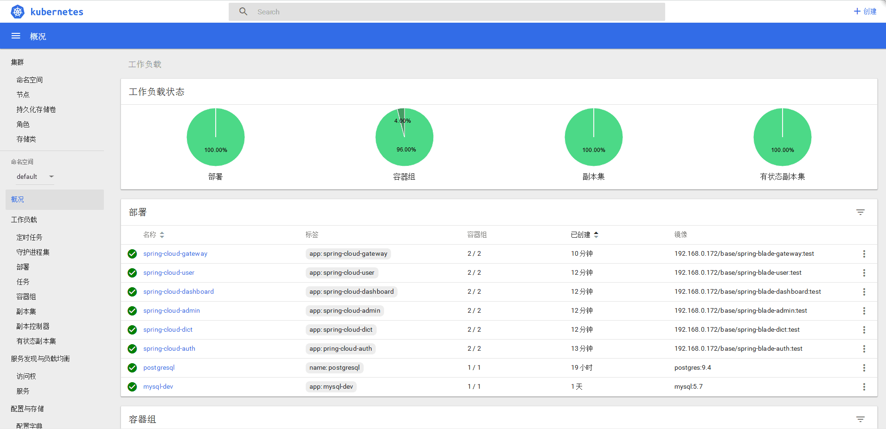

## 简介
> BladeX 是由一个商业级项目升级优化而来的SpringCloud微服务架构，采用Java8 API重构了业务代码，完全遵循阿里巴巴编码规范。采用Spring Boot 2 、Spring Cloud Honxton 、Mybatis 等核心技术，同时提供基于React和Vue的两个前端框架用于快速搭建企业级的SaaS微服务系统平台。

## 官方地址
* 官网地址：[https://bladex.vip](https://bladex.vip)
* 技术社区：[https://sns.bladex.vip](https://sns.bladex.vip)
* 代码私库：[https://git.bladex.vip](https://git.bladex.vip)

## 演示地址
*   Saber-基于Vue：[https://saber.bladex.vip](https://saber.bladex.vip/)
*   Sword-基于React：[https://sword.bladex.vip](https://sword.bladex.vip/)
*   Archer-全能代码生成系统：[https://archer.bladex.vip](https://archer.bladex.vip/)

## 界面一览

