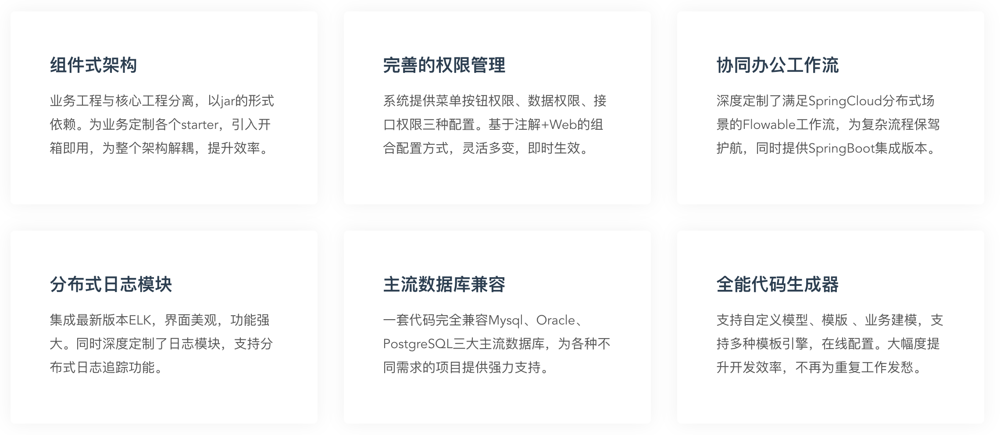
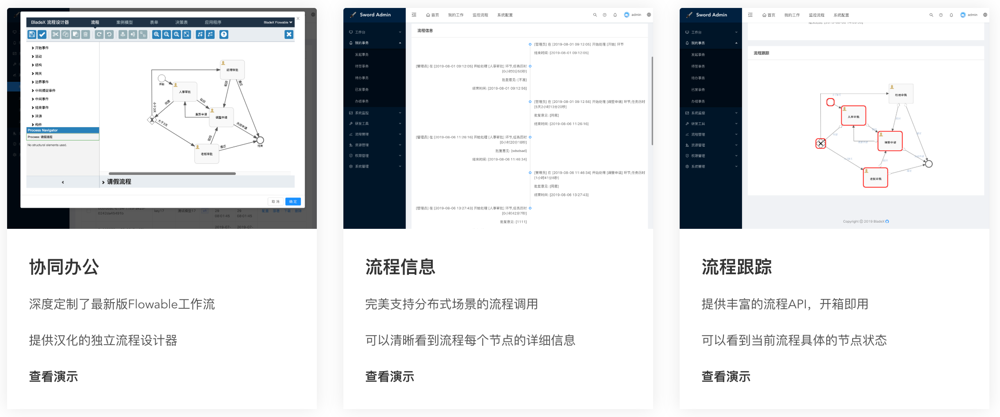
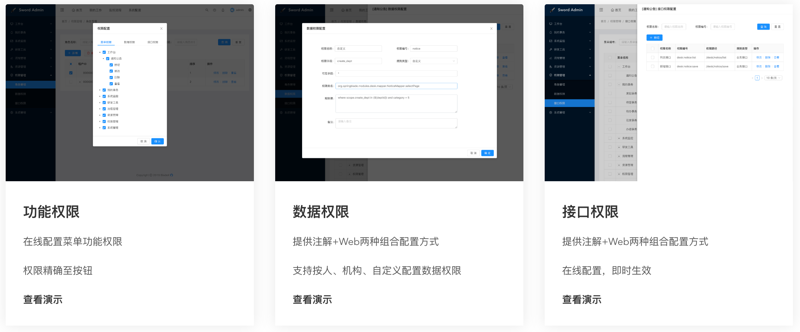
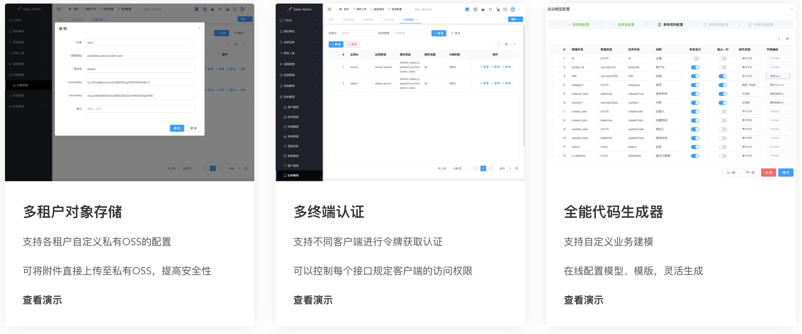

## BladeX特性

## BladeX主要功能一览

## BladeX核心功能一览
| 序号 | 主要特性 | 特性描述 |
| --- | --- | --- |
| 1 | 前后端分离 | 采用前后端分离模式，前端提供两套架构，Sword基于React，Saber基于Vue |
| 2 | 分布式单体式后端架构 | 提供两套后端架构，基于SpringCloud的分布式架构以及基于SpringBoot的单体式架构 |
| 3 | API完全兼容 | 两套后端架构与两套前端架构，共四套架构可以任意组合，所有API完全兼容 |
| 4 | 前后端代码生成 | 定制针对两套前端与后端的代码生成模板，轻松生成整个模块的前后端代码，减少重复工作量 |
| 5 | 组件化、插件化架构 | 针对功能深度定制各个starter，引入开箱即用，为整个架构解耦，提升效率 |
| 6 | Hoxton | SpringCloud整体版本升级至Hoxton |
| 7 | Nacos | 集成阿里巴巴的Nacos完成统一的服务注册与配置 |
| 8 | Sentinel | 集成Sentinel从流量控制、熔断降级、系统负载等多个维度保护服务的稳定性 |
| 9 | Dubbo | 完美集成Dubbo最新版，支持远程RPC调用 |
| 10 | 多租户系统 | 完整的SaaS多租户架构 |
| 11 | Oauth2 | 集成Oauth2协议，完美支持多终端的接入与认证授权 |
| 12 | 工作流 | 深度定制SpringCloud分布式场景的Flowable工作流，为复杂流程保驾护航。同时提供SpringBoot集成版本 |
| 13 | 独立流程设计器 | 提供独立的完全汉化的流程设计器，轻松定制流程模型 |
| 14 | 动态网关 | 集成基于Nacos的轻量级、高拓展性动态网关 |
| 15 | 动态聚合文档 | 实现基于Nacos的Swagger SpringCloud聚合文档 |
| 16 | 分布式文件服务 | 集成minio等优秀的第三方，提供便捷的文件上传与管理 |
| 17 | 多租户对象存储系统 | 在SaaS系统中，各租户可自行配置文件上传至自己的私有OSS |
| 18 | 权限管理 | 精心设计的权限管理方案，角色权限精确到按钮 |
| 19 | 动态数据权限 | 高度灵活的动态数据权限，提供注解+Web可视化两种配置方式，Web配置无需重启直接生效 |
| 20 | 动态接口权限 | 高度灵活的动态接口权限，提供注解+Web可视化两种配置方式，Web配置无需重启直接生效 |
| 21 | 多租户顶部菜单配置 | 提供给每个租户独立的顶部菜单配置模块，可以自定义顶部菜单切换 |
| 22 | 主流数据库兼容 | 一套代码完全兼容Mysql、Postgresql、Oracle三大主流数据库 |
| 23 | 动态网关鉴权 | 基于Nacos的动态网关鉴权，可在线配置，实时生效 |
| 24 | 全能代码生成器 | 支持自定义模型、模版 、业务建模，支持多种模板引擎，在线配置。大幅度提升开发效率，不再为重复工作发愁。 |
| 25 | Seata分布式事务 | 定制集成Seata，支持分布式事务，无代码侵入，不失灵活与简洁 |
| 26 | Turbine集群监控 | 集成Turbine集群监控，方便查看hystrix的实时状态 |
| 27 | Zipkin链路追踪 | 集成Zipkin分布式链路追踪，快速查找每个请求的调用链 |
| 28 | 分布式日志模块 | 集成7.x版本ELK，支持分布式日志追踪功能 |
| 29 | 钉钉监控告警 | 增强监控，微服务上下限集成钉钉告警 |
| 30 | 分布式任务调度 | 极简集成xxl-job，支持分布式任务调度功能 |
| 31 | 消息队列 | 完美集成Kafka、Rabbit、SpringCloud Stream等消息队列 |
| 32 | 分布式锁 | 基于Redisson封装的高性能、简单易用的分布式锁插件 |
| 33 | 更多功能即将到来 | BladeX持续开发中，敬请期待～ |
