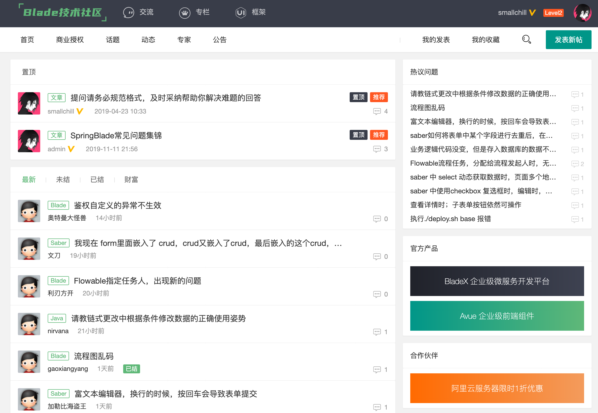

**1. 工程运行报错：java.lang.RuntimeException: Driver com.mysql.cj.jdbc.Driver claims to not accept jdbcUrl, ${blade.datasource.dev.url}**

答：这是因为nacos没有配置好，具体说明请看：[https://sns.bladex.vip/q-41.html](https://sns.bladex.vip/q-41.html)

  

**2.int类型的空字段返回的json值为-1**

答：框架针对null值做了统一序列化处理，具体说明请看：[https://sns.bladex.vip/q-100.html](https://sns.bladex.vip/q-100.html)

  

**3.Saber和Sword打包部署后无法访问**

答：需要部署至nginx并配置反向代理，具体说明请看：[https://sns.bladex.vip/q-184.html](https://sns.bladex.vip/q-184.html)

  

**4.接口返回未授权**

答：框架内部鉴权，需要增加Blade-Auth请求头，具体说明请看：

开源版：[https://www.kancloud.cn/smallchill/blade/913216](https://www.kancloud.cn/smallchill/blade/913216)

商业版：参考手册《OAuth2认证系统》章节

  

**5.如何对接口进行放行**

答：可根据对应配置进行鉴权放行，具体说明请看：[https://sns.bladex.vip/q-124.html](https://sns.bladex.vip/q-124.html)

注：商业版已实现网关鉴权，具体参考手册《鉴权配置》章节

  

**6.微信、XML格式的数据被过滤**

答：框架自带了xss防注入功能，需要配置放行，具体说明请看：[https://sns.bladex.vip/q-112.html](https://sns.bladex.vip/q-112.html)

  

**7.Swagger在生产环境无法使用**

答：为了保证接口文档的安全，禁用了生产环境的加载，具体说明请看：[https://sns.bladex.vip/q-39.html](https://sns.bladex.vip/q-39.html)

  

**8.框架的多数据源如何处理**

答：可以考虑插件 mybatis-plus-dynamicdatasource，具体说明请看：[https://sns.bladex.vip/q-74.html](https://sns.bladex.vip/q-74.html)

  

**9.框架如何使用读写分离**

答：可以使用数据库中间件 ShardingSphere，具体说明请看：[https://sns.bladex.vip/article-14953.html](https://sns.bladex.vip/article-14953.html)

  

**10. OAuth2用密码模式授权返回错误信息为Full authentication is required to access this resource**

答：可能出现的问题有很多种，具体说明请看：

[https://sns.bladex.vip/q-51.html](https://sns.bladex.vip/q-51.html)

[https://sns.bladex.vip/q-265.html](https://sns.bladex.vip/q-265.html)

  

**11.前端列表返回的主键最后两位变成了0**

答：long类型的主键长度过长，到前端js精度缺失，具体说明请看：[https://sns.bladex.vip/q-344.html](https://sns.bladex.vip/q-344.html)

  

**12.eclipse下启动遇到问题，配置文件没有自动生成**

答：使用了java spi机制，eclipse有些情况下支持不好，只能用常规的方式解决，具体说明请看：[https://sns.bladex.vip/q-116.html](https://sns.bladex.vip/q-116.html)

  

**13.运行单元测试报错**

答：blade启动引用到了环境变量，需要使用自定义的注解，具体说明请看：[https://sns.bladex.vip/q-352.html](https://sns.bladex.vip/q-352.html)

  

**14.node-sass安装失败**

答：环境影响会导致多种问题，具体可以按照这个帖子排查：[https://www.jianshu.com/p/92afe92db99f](https://www.jianshu.com/p/92afe92db99f)

  

**15.项目运行提示 no available server to connect**

答：系统集成了seata分布式事务，需要启动对应服务，具体说明请看：[https://sns.bladex.vip/q-619.html](https://sns.bladex.vip/q-619.html)

  

**16.不同包名如何配置mybatis、feign**

答：需要做包名扫描，具体说明请看：[https://sns.bladex.vip/q-630.html](https://sns.bladex.vip/q-630.html)

  

**17.登录提示“未获得用户的角色信息”**

答：一般是boot、cloud混合启动后导致的问题，也有可能是老版本升级的问题，具体说明请看：[https://sns.bladex.vip/q-632.html](https://sns.bladex.vip/q-632.html)

  

**18.bladex无法下载maven私服的jar包**

答：有时候maven配置会导致这个问题，具体说明请看：[https://sns.bladex.vip/q-762.html](https://sns.bladex.vip/q-762.html)

  

**19.IDEA开启多服务批量启动**

答：开启后可以方便批量启动，具体说明请看：[https://sns.bladex.vip/q-765.html](https://sns.bladex.vip/q-765.html)

  

**20.Avue如何进行表单字段自定义动态赋值**

答：需要对绑定的值域进行操作，具体说明请看：[https://sns.bladex.vip/q-781.html](https://sns.bladex.vip/q-781.html)

  

**21.Windows平台部署失败，nacos配置读取失败**

答：win平台的字符编码问题导致，具体说明请看：[https://sns.bladex.vip/q-875.html](https://sns.bladex.vip/q-875.html)

  

**22.前端工程IE不兼容**

答：这是个老生常谈的问题，具体说明请看：[https://sns.bladex.vip/q-872.html](https://sns.bladex.vip/q-872.html)

  

**23.webstorm不识别vue-cli内的@符号**

答：需要进行配置，具体说明请看：[https://sns.bladex.vip/q-881.html](https://sns.bladex.vip/q-881.html)

  

**24.BladeX相关项目说明**

答：做了具体说明，为大家解惑，具体请看：[https://sns.bladex.vip/q-888.html](https://sns.bladex.vip/q-888.html)

  

**25.Avue表格样式错层**

答：需要做一下对齐，具体请看：[https://sns.bladex.vip/q-897.html](https://sns.bladex.vip/q-897.html)

  

**26.新建用户分配了权限，但是有些菜单点击提示未授权并返回到了登录页**

答：这是系统的安全机制，有些接口设定了只有超管、管理员才能访问，具体请看：[https://sns.bladex.vip/q-1033.html](https://sns.bladex.vip/q-1033.html)

**27.postman快速导入json配置文件来调用oauth2接口**

答：不少用户在调用oauth2接口的时候都会出错，现在导出配置文件，可直接调用，具体请看：[https://sns.bladex.vip/article-14982.html](https://sns.bladex.vip/article-14982.html)

**28\. 字典封存是什么意思**

答：字典封存的具体解答请看：[https://sns.bladex.vip/q-1270.html](https://sns.bladex.vip/q-1270.html)

**29\. 内外网注册到Nacos联调**

答：需要做ip外网映射以及启动指定ip，具体请看：[https://sns.bladex.vip/q-1233.html](https://sns.bladex.vip/q-1233.html)

****30\. java.lang.NoClassDefFoundError: com/baomidou/mybatisplus/generator/config/ITypeConvert****

答：根据不同的开发环境，会有不同的表现结果，具体请看：[https://sns.bladex.vip/q-1350.html](https://sns.bladex.vip/q-1350.html)

**31\. org.springframework.http.converter.HttpMessageConversionException: JSON conversion problem: Invalid UTF-8 middle byte 0xd0**

答：服务器编码问题导致，具体请看：[https://sns.bladex.vip/q-1391.html](https://sns.bladex.vip/q-1391.html)

  

**32\. Invalid bound statement (not found): org.springblade.core.mp.mapper.BladeMapper.selectOne**

答：自定义了包名没有做扫描导致的问题，具体请看：[https://sns.bladex.vip/q-1373.html](https://sns.bladex.vip/q-1373.html)

**33\. 远程调用Feign譬如返回IPage、INode会直接进入FallBack**

答：消费者端进行返回数据序列化导致的错，具体请看：[https://sns.bladex.vip/q-1512.html](https://sns.bladex.vip/q-1512.html)

  

**34\. org.mybatis.spring.MyBatisSystemException: nested exception is org.apache.ibatis.exceptions.PersistenceException: ### Error querying database.  Cause: org.springframework.jdbc.BadSqlGrammarException: PreparedStatementCallback; bad SQL grammar \[select resource\_code, scope\_column, scope\_field, scope\_type, scope\_value from blade\_scope\_data where scope\_class = ? and id in (select scope\_id from blade\_role\_scope where scope\_category = 1 and role\_id in ())\]**

答：一般是没有分配token，或者没有给用户分配角色，具体请看：[https://sns.bladex.vip/q-1595.html](https://sns.bladex.vip/q-1595.html)

  

**35. org.springframework.beans.factory.BeanDefinitionStoreException: Failed to process import candidates for configuration class \[org.springblade.gateway.GateWayApplication\]; nested exception is java.io.FileNotFoundException: class path resource \[org/springframework/web/servlet/config/annotation/WebMvcConfigurer.class\] cannot be opened because it does not exist**

答：gateway是webflux，不可引入web，具体请看：[https://sns.bladex.vip/q-1583.html](https://sns.bladex.vip/q-1583.html)

  

**36\. Saber部署不在根目录，有一个前缀，部署后访问资源404**

答：需要在vue.config.js进行配置，具体请看：[https://sns.bladex.vip/q-1493.html](https://sns.bladex.vip/q-1493.html)

  

**37. Mybatis-Plus逻辑删除、自动填充拓展**

答：有一些注意点，具体请看：[https://sns.bladex.vip/q-1395.html](https://sns.bladex.vip/q-1395.html)，[https://sns.bladex.vip/q-1394.html](https://sns.bladex.vip/q-1394.html)

**38\. 日志系统调用流程**

答：主要通过Spring-Event进行解耦，具体流程请看：[https://sns.bladex.vip/q-1657.html](https://sns.bladex.vip/q-1657.html)

  

**39\. Saber内网部署图标不显示**

答：Saber默认连接了在线的图标库，若需要部署到内网环境，具体请看：[https://sns.bladex.vip/q-1768.html](https://sns.bladex.vip/q-1768.html)

  

**40\. GateWay映射服务原理**

答：有一些注意点，具体请看：[https://sns.bladex.vip/q-1771.html](https://sns.bladex.vip/q-1771.html)

**41. 数据大屏应用搭建流程**

答：有较多用户有这个疑问，具体请看：https://sns.bladex.vip/article-14988.html

**42. Saber安装出错**

答：一般是本机环境缺失导致，具体请看：https://sns.bladex.vip/q-1825.html

**42. Docker构建字体慢**

答：需要配置加速镜像，具体请看：https://sns.bladex.vip/q-3090.html

**43. 部署在centos后，隔一段时间上传文件报错**

答：需要额外加一段配置以防止临时目录被清空，具体请看：https://sns.bladex.vip/article-14995.html

**44. RPC failed curl 92 HTTP/2 stream 0 was not closed cleanly: PROTOCOL_ERROR**

答：git上传文件容量或http版本导致的问题，具体请看：https://sns.bladex.vip/q-4131.html

**45. 前端部署后缓存严重，无法自动刷新**

答：需要在nginx与webpack做些许配置，具体请看：https://sns.bladex.vip/q-4150.html

**46. 分库后数据权限获取不到表从而报错**

答：分库后数据权限表不在业务表，需要做额外配置，具体请看：https://sns.bladex.vip/q-591.html

**47. Saber自定义search表单后获取表单组件内容**

答：2.8.x版本后推荐使用新版API，具体请看：https://sns.bladex.vip/q-4370.html

**48. Mybatis-Plus更新方法updateById如何让null字段生效**

答：有三种方式，具体请看：https://sns.bladex.vip/q-4409.html

**49. Saber内baseUrl的用法**

答：默认使用反向代理配置，若需要baseUrl配置请看：https://sns.bladex.vip/q-4292.html

**50. Saber同一路由不同参数访问的刷新问题**

答：需要做watch监听，具体请看：https://sns.bladex.vip/q-4494.html

**51. adoptopenjdk/openjdk8-openj9:alpine-slim 镜像报错**

答：官方会实时更新，有时候的确会出问题，可以指定tag版本解决，具体请看：https://sns.bladex.vip/q-4608.html

**52. SpringBoot版本如何配置静态资源**

答：需要配置resource以及接口放行，具体请看：https://sns.bladex.vip/q-4623.html

**53. 多租户数据库隔离场景下定时任务切换数据源的问题**

答：需要使用dynamic-datasource自带工具类，自定义租户id来切换数据源，具体请看：https://sns.bladex.vip/q-5045.html

**54. 更多解决方案请访问技术社区查找：[https://sns.bladex.vip](https://sns.bladex.vip)**
