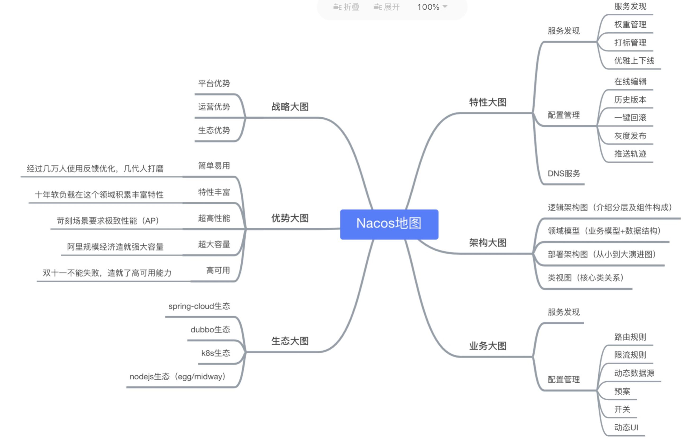
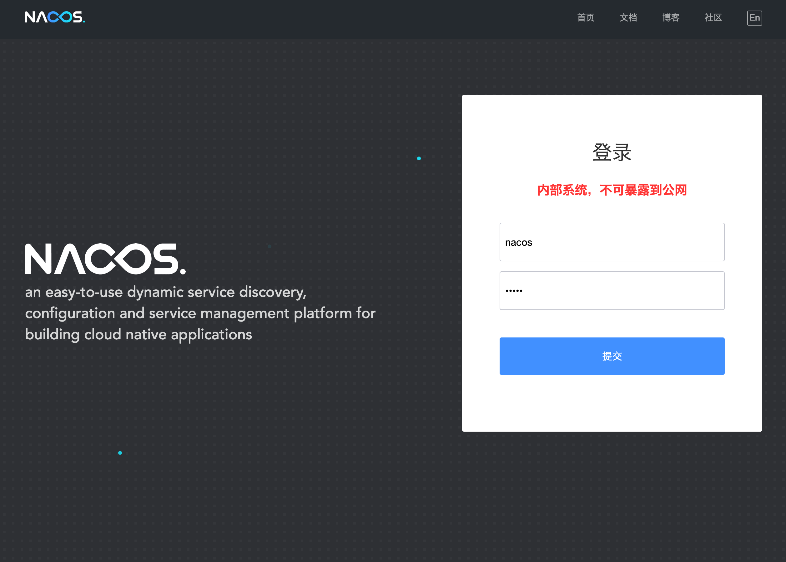
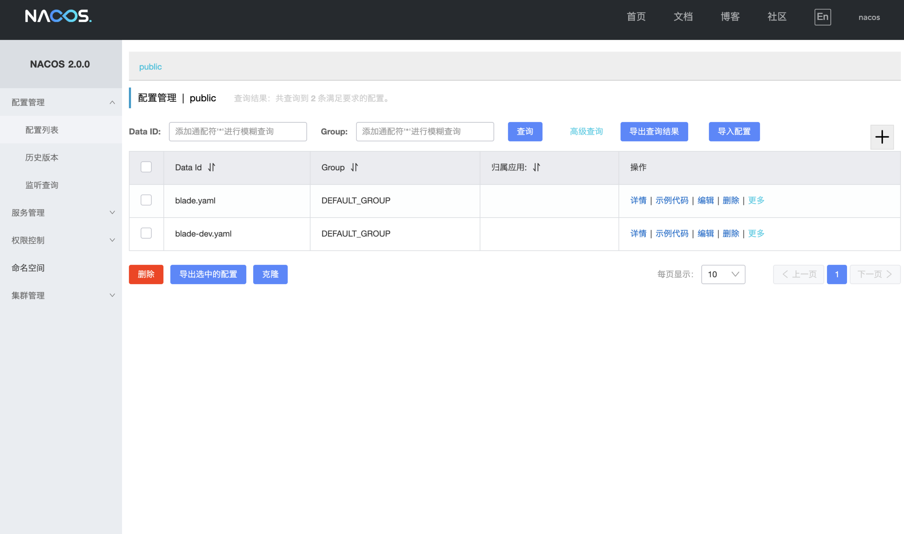

## 概念

Nacos是阿里巴巴开源的一款支持服务注册与发现，配置管理以及微服务管理的组件。用来取代以前常用的注册中心（zookeeper , eureka等等），以及配置中心（spring cloud config等等）。Nacos是集成了注册中心和配置中心的功能，做到了二合一。

## Nacos安装

#### 1.编译安装

* 参考官方文档：https://nacos.io/zh-cn/docs/quick-start.html
* 下载 2.x 版本的nacos

#### 2.Docker安装

* 拉取镜像：`docker pull nacos/nacos-server:v2.1.2`
* 运行镜像：`docker run --name nacos-standalone -e MODE=standalone -d -p 8848:8848 -p 9848:9848 -p 9849:9849 nacos/nacos-server:v2.1.2`

#### 3.访问地址

* 地址：http://localhost:8848/nacos

* 帐号密码都为：nacos

#### 4.注意点⚠️

- Nacos2.0版本相比1.X新增了gRPC的通信方式，需要增加对外开放2个端口。新增端口是在配置的主端口(server.port)基础上，进行一定偏移量自动生成。

- 客户端拥有相同的计算逻辑，用户如同1.X的使用方式，配置主端口(默认8848)，通过相同的偏移量，计算对应gRPC端口(默认9848)。如果客户端和服务端之前存在端口转发，或防火墙时，需要对端口转发配置和防火墙配置做相应的调整。

  | 端口 | 与主端口的偏移量 | 描述                                                       |
  | ---- | ---------------- | ---------------------------------------------------------- |
  | 9848 | 1000             | 客户端gRPC请求服务端端口，用于客户端向服务端发起连接和请求 |
  | 9849 | 1001             | 服务端gRPC请求服务端端口，用于服务间同步等                 |

## Nacos界面

