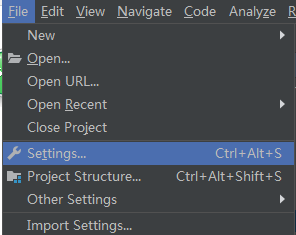
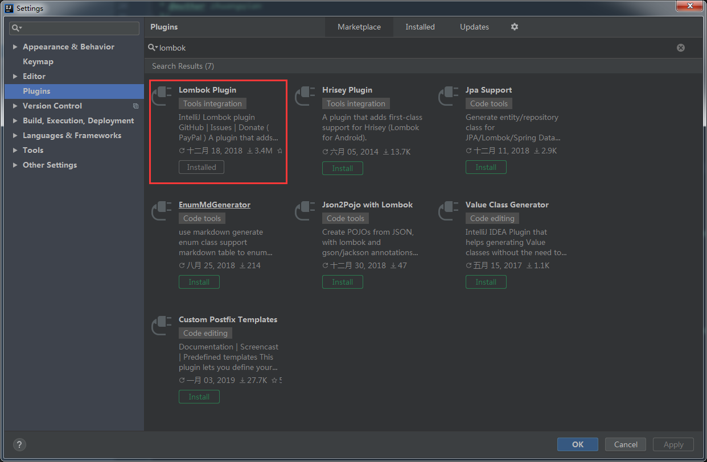
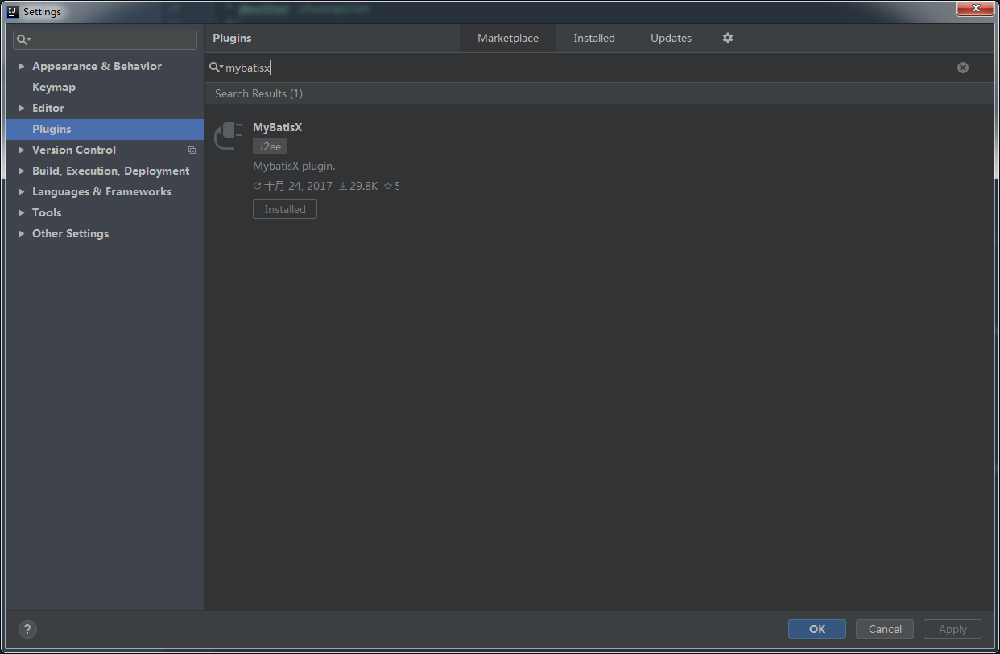

## 最后准备工作
 好了现在我们已经把基础环境都搞定，下面开始导入工程之前的最后准备工作：
* 首先后端开发非常推荐`IntelliJ IDEA` 官网：https://www.jetbrains.com/idea/
* 后续所有涉及到代码的模块都会以`IDEA`为例
* 导入工程之前要给`IDEA`安装Lombok插件和MybatisX插件

#### 插件安装
1. 选择`File->Settings`

2. 选择`Plugins`并搜索` Lombok`和`MybatisX`

3. 点击`Install`按钮
4. 重启`idea`生效

