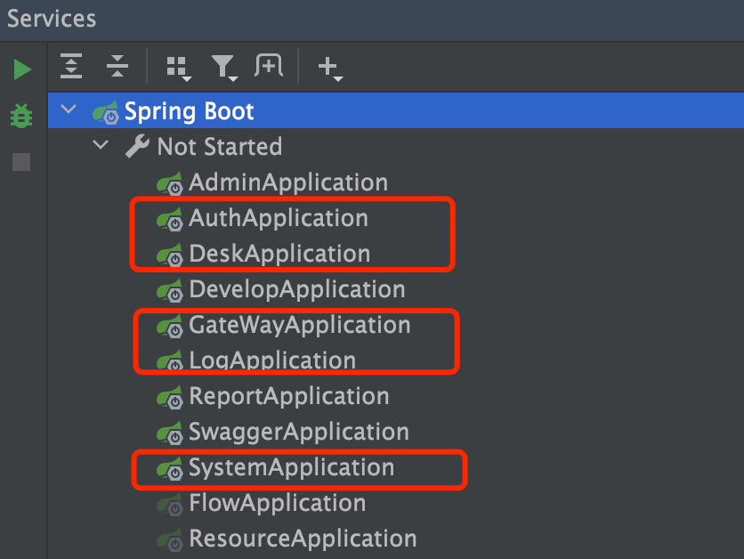
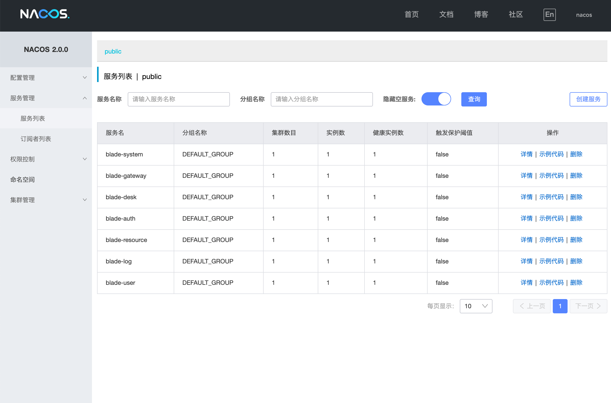
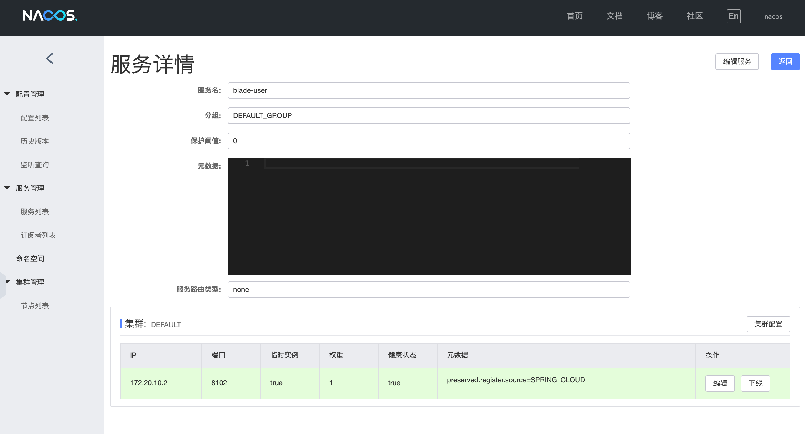
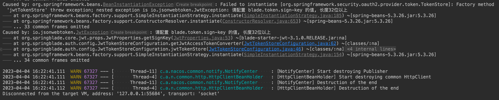

## 工程启动顺序
1. 先启动`redis`、`mysql`、`nacos`、`sentinel`等基础服务
2. 启动除`blade-gateway`之外的项目
3. 最后启动`blade-gateway`

## 启动开始
1. 批量启动红框内的基础服务，这是保证系统可以运行的最低要求服务

2. 启动完毕后可以尝试启动其他服务进行验证

## 验证服务是否启动成功
1. 打开nacos [http://localhost:8848/nacos](http://localhost:8848/nacos)， 若看到下图，则说明服务注册成功

2. 查看详情，可以看到服务处于正常状态，注册成功
     

3. 注意⚠️：若nacos配置后工程无法启动成功，那一定是有配置遗漏，具体注意点请看：https://sns.bladex.vip/q-41.html

4. 若`AuthApplication`报了如下错误则说明没有配置好`sign-key`的值，具体请见文档`1.3.2`章节

     
