## 模块介绍
框架的模块结构如下：
```
BladeX
├── blade-auth -- 授权服务提供
├── blade-common -- 常用工具封装包
├── blade-gateway -- Spring Cloud 网关
├── blade-ops -- 运维中心
├    ├── blade-admin -- 服务监控
├    ├── blade-develop -- 代码生成
├    ├── blade-flow -- 工作流
├    ├── blade-flow-design -- 工作流设计器 
├    ├── blade-log -- 日志模块
├    ├── blade-resource -- 资源模块
├    ├── blade-turbine -- 监控控制台
├    ├── blade-xxljob -- 分布式任务调度
├    ├── blade-xxljob-admin -- 分布式任务调度后端
├    └── blade-zipkin -- 分布式链路追踪
├── blade-service -- 业务模块
├    ├── blade-desk -- 工作台模块 
├    ├── blade-system -- 系统模块 
├    └── blade-user -- 用户模块 
├── blade-service-api -- 业务模块api封装
├    ├── blade-desk-api -- 工作台api 
├    ├── blade-dict-api -- 字典api 
├    ├── blade-scope-api -- 数据权限api 
├    ├── blade-system-api -- 系统api 
└──  └── blade-user-api -- 用户api 
```
日常开发中，我们用的最多的模块则是`blade-service`以及` blade-service-api`.
* ` blade-service`主要编写业务模块
* ` blade-service-api`主要为其他业务模块提供本模块的api

那么目的很明确了，要开发一个业务模块，我们就需要到`blade-service`以及` blade-service-api`中新建相关的代码啦！下面我们就开始重要的第一步：子工程的新建

## 新建子工程
0. **注意：服务创建大同小异，若使用的是Boot版本，直接在package内再建package即可，无需再建工程**
1. 在`blade-service`上右击依次选则 `New -> Module`
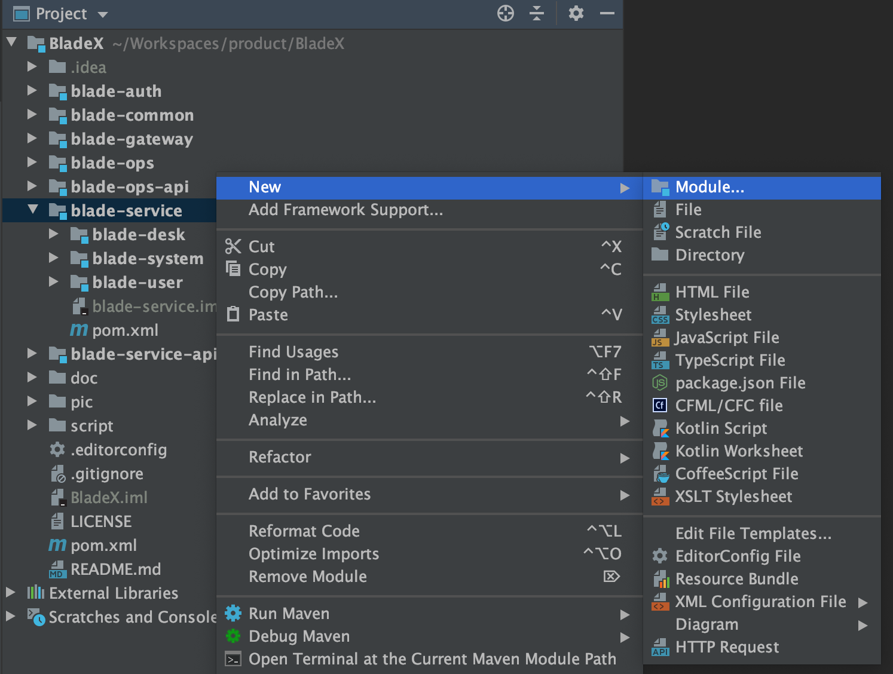
2. 在`New Module`界面选中左侧的`Maven`并且点击`Next`
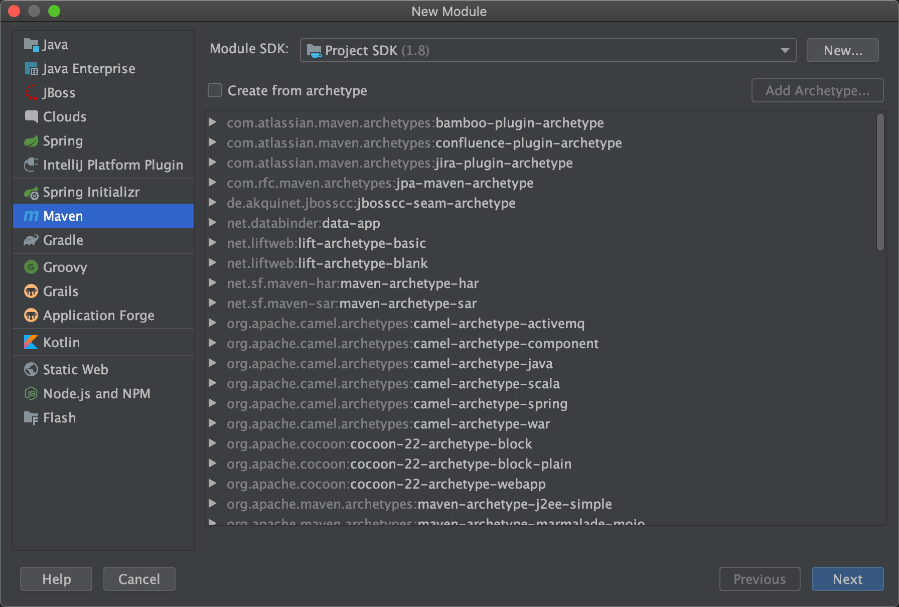
3. 接着我们可以给`ArtifactId`起个名，这里使用了`blade-demo`，parent选择`blade-service`(大家可以根据实际的业务模块命名)
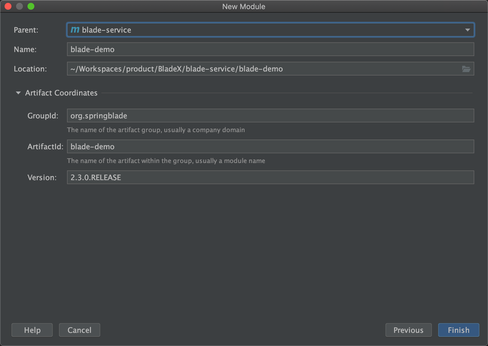
4. 点击`Finish`，并点击右下角的`Import Changes`，等待maven工程加载完毕
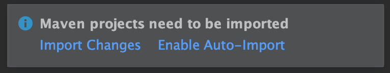
5. 我们以同样的方式在`blade-service-api`下新建`blade-demo-api`工程，最后效果如下
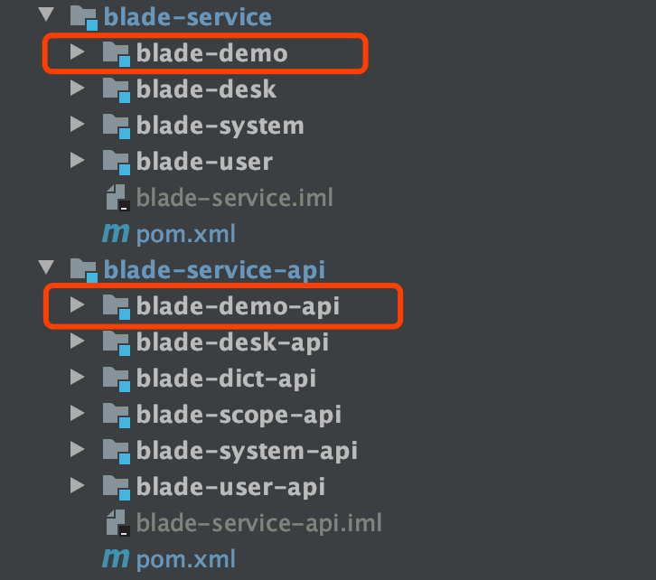

## 工程版本依赖设置
1. 打开`blade-demo-api`工程下的`pom.xml`设置基本信息
加上红框内的信息
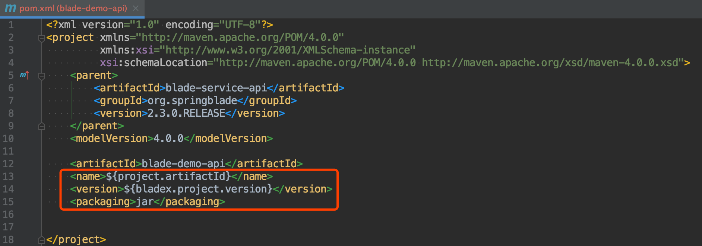
2. 打开`blade-demo`工程下的`pom.xml`设置基本信息
加上红框内的信息
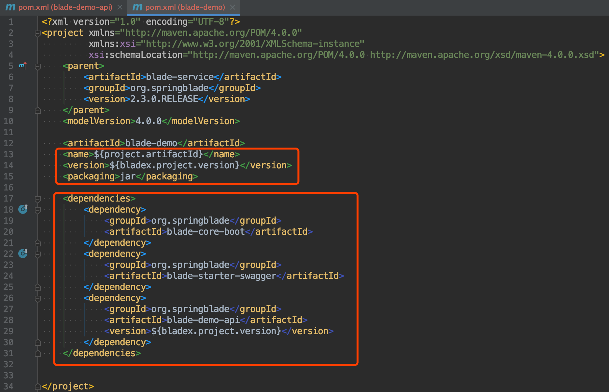
3. 以下依赖为刚刚新建的`blade-demo-api`工程，代码组成主要是entity，vo，dto，feign等模块
~~~xml
<dependency>
    <groupId>org.springblade</groupId>
    <artifactId>blade-demo-api</artifactId>
    <version>${bladex.project.version}</version>
</dependency>
~~~
4. 以下依赖为[Blade-Tool](https://github.com/chillzhuang/blade-tool.git)封装的模块启动依赖，只需引入一个，便解决了所有常用的配置
~~~xml
<dependency>
    <groupId>org.springblade</groupId>
    <artifactId>blade-core-boot</artifactId>
</dependency>
~~~
5. 以下依赖为[Blade-Tool](https://github.com/chillzhuang/blade-tool.git)封装的swagger模块依赖，引入后便可以使用swagger文档
~~~xml
<dependency>
    <groupId>org.springblade</groupId>
    <artifactId>blade-starter-swagger</artifactId>
</dependency>
~~~
6. BladeX核心依赖使用了bom架构，将所有固定的版本统一管理，自动依赖，无需再配置bladex-tool内的版本，所以`blade-core-xxx` 、`blade-starter-xxx` 不需要加`version`，只需给刚新建的`blade-demo-api`加上`version`即可
7. 以上步骤操作完毕，请点击maven刷新按钮重新刷新构建，载入新建的工程。


## 工程配置
1. 参考`blade-desk`模块，将`resource`下的文件拷贝到`blade-demo`的`resources`文件夹下
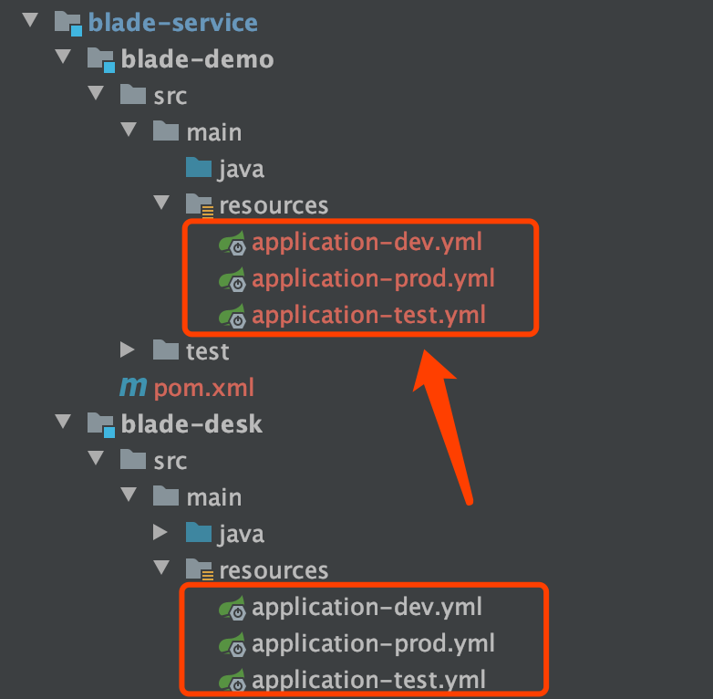
2. 修改下`application-dev.yml`下`server.port`的值为9101(可以定义为其他端口，但必须不冲突)
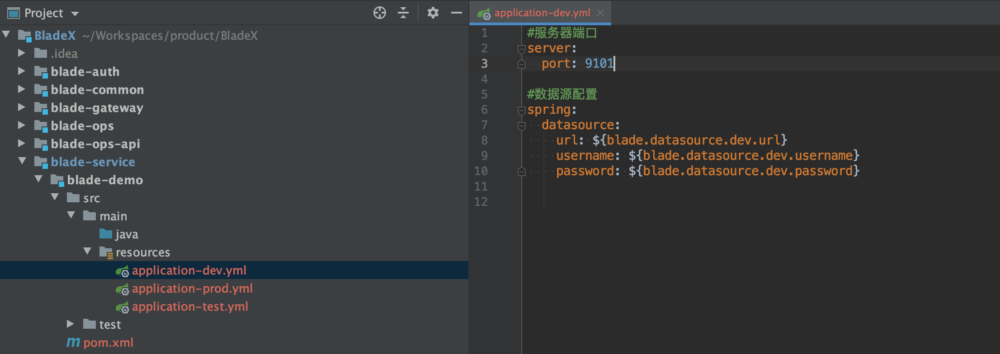
3. 在`blade-demo`的`java`包下新建`package`
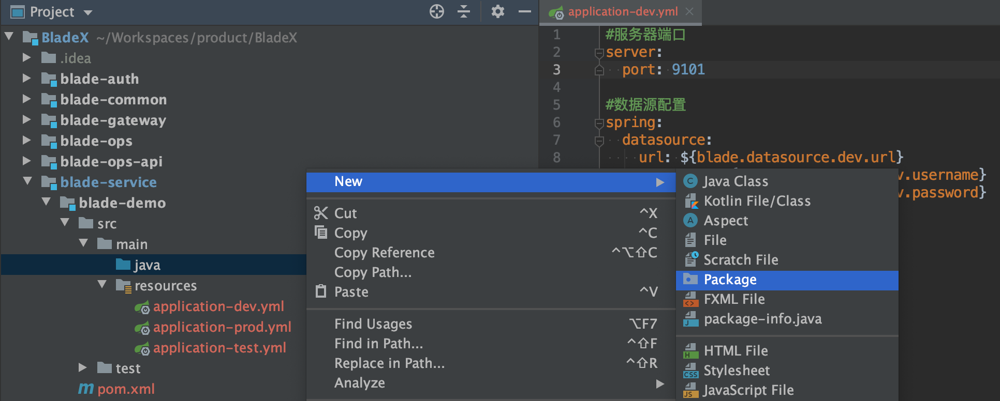
4. 推荐命名为`org.springblade.demo`
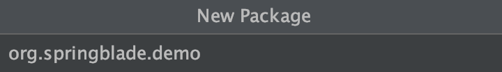
5. 参考`blade-desk`模块，将`DeskApplication`拷贝至刚新建的包下并重命名为`DemoApplication`
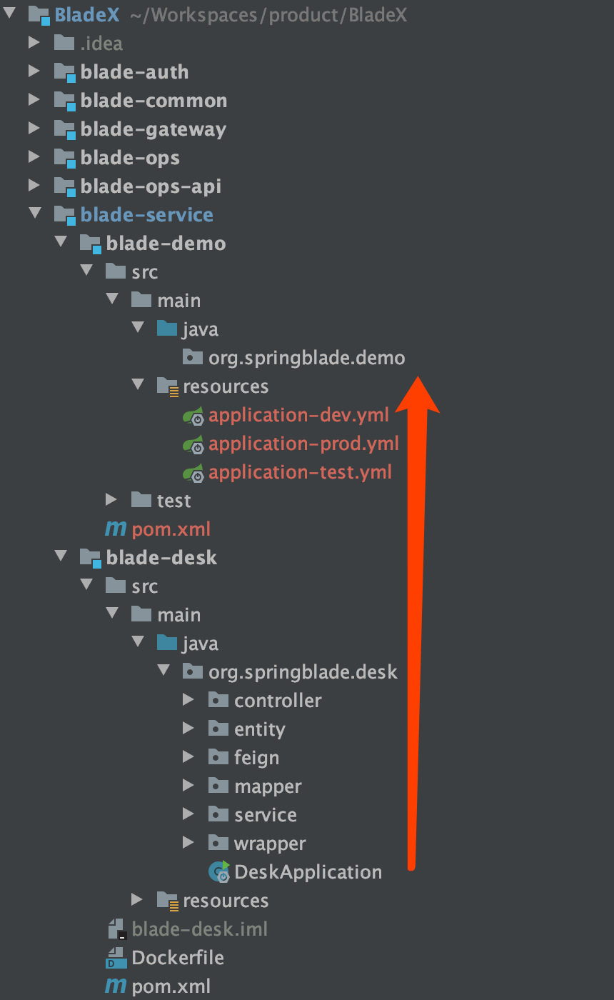
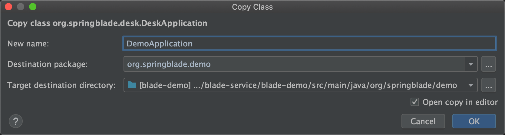
6. 修改对应代码(后续会详细介绍)

7. 为了让代码更加优雅，我们可以到`blade-common`模块的`LauncherConstant`下新建常量
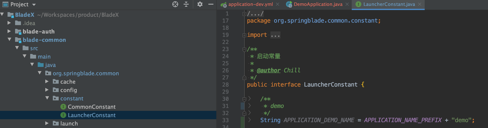
8. 再次修改`DemoApplication`
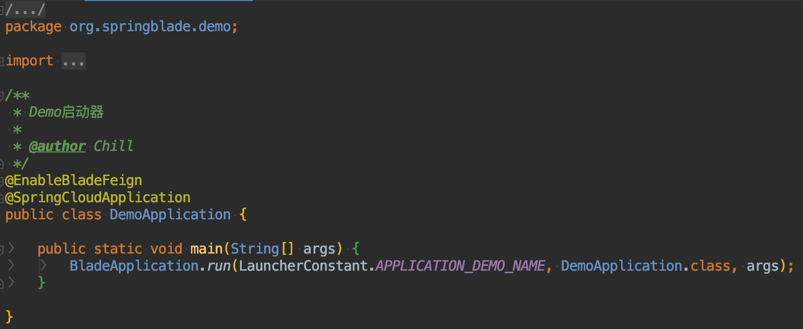
9. 右击`DemoApplication`启动，查看服务是否注册到了`Nacos`.
10. 我们先启动Demo服务，并访问 http://localhost:8848/nacos 查看效果
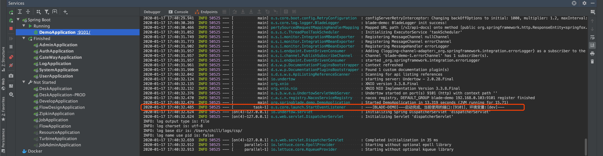
11. 如果我们看到blade-demo在注册列表中，说明一个新的微服务已经诞生！
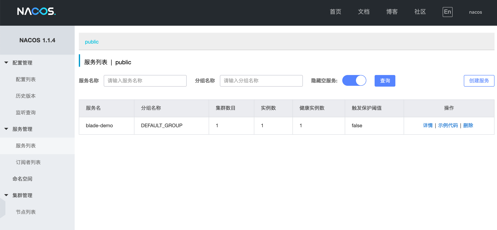
