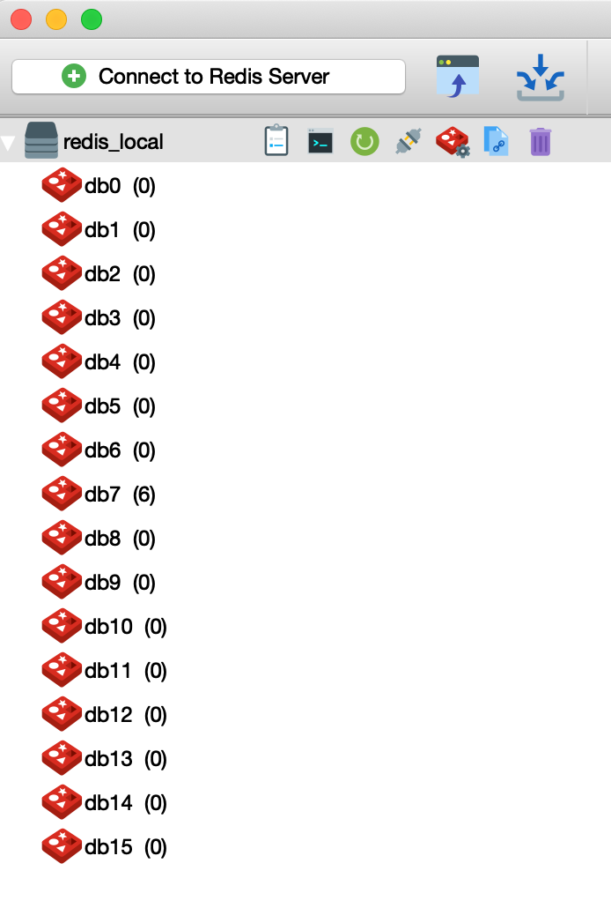
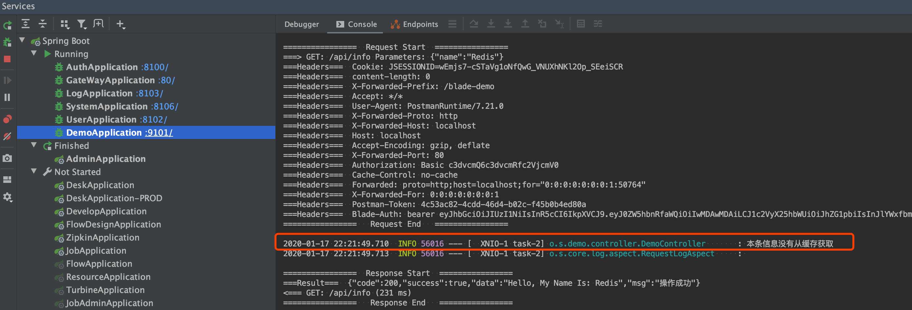
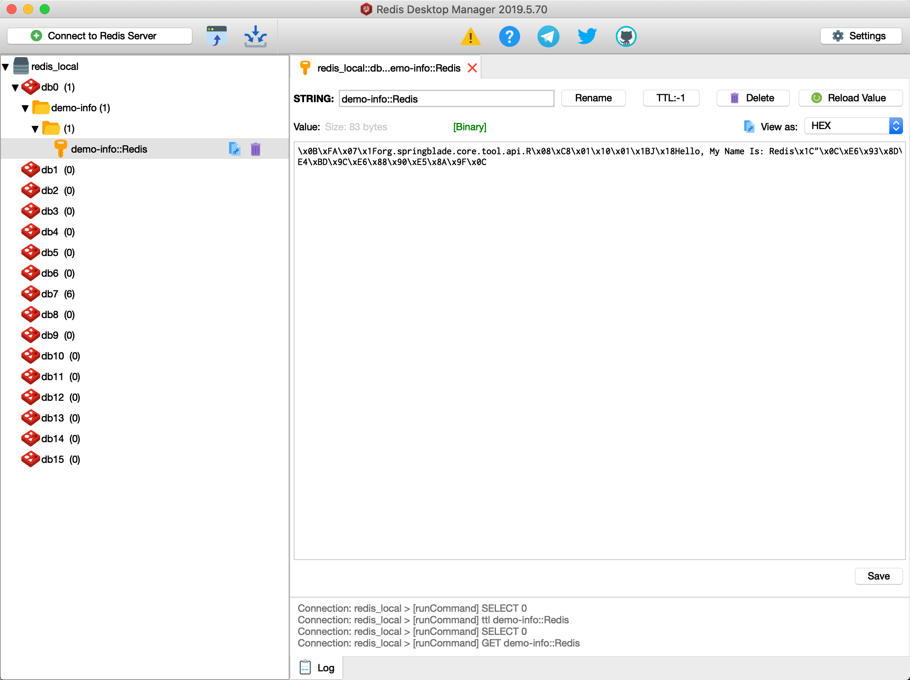
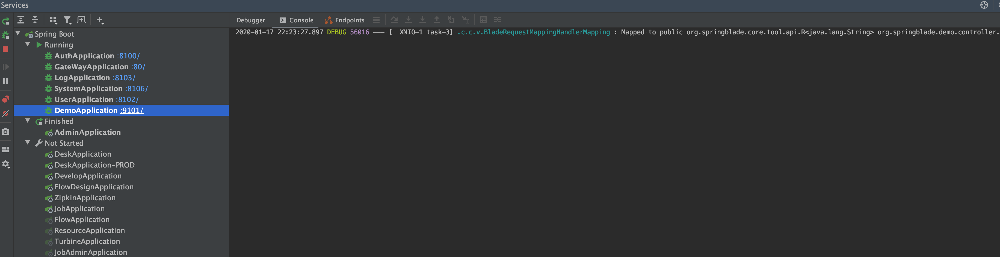
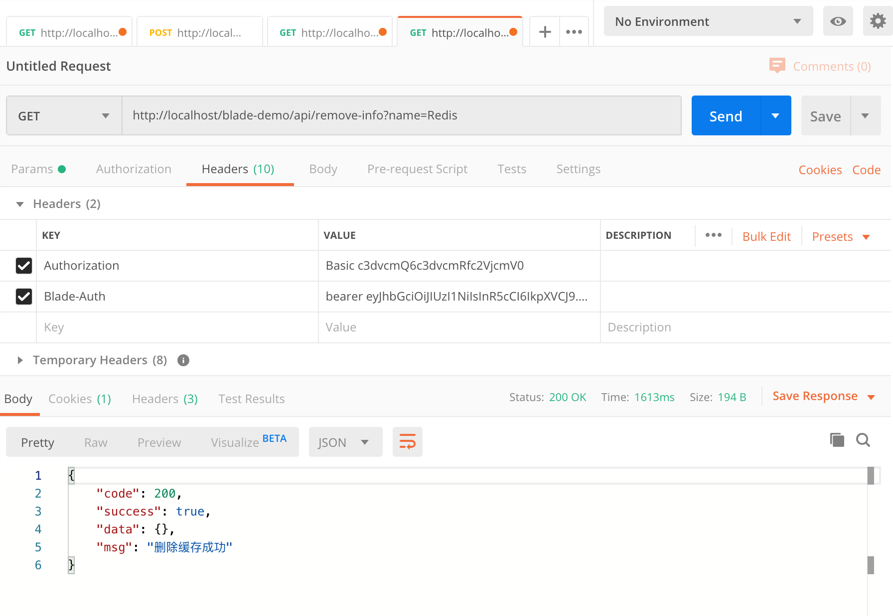
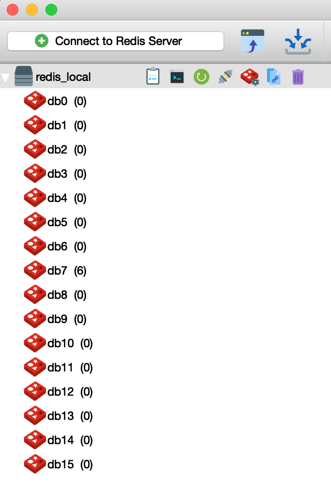
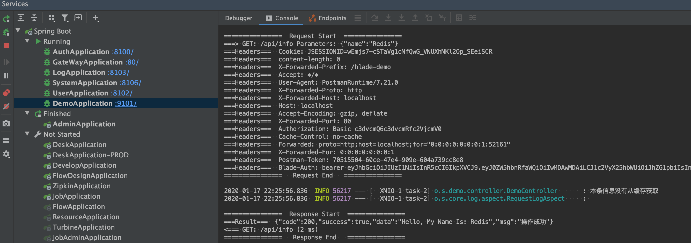
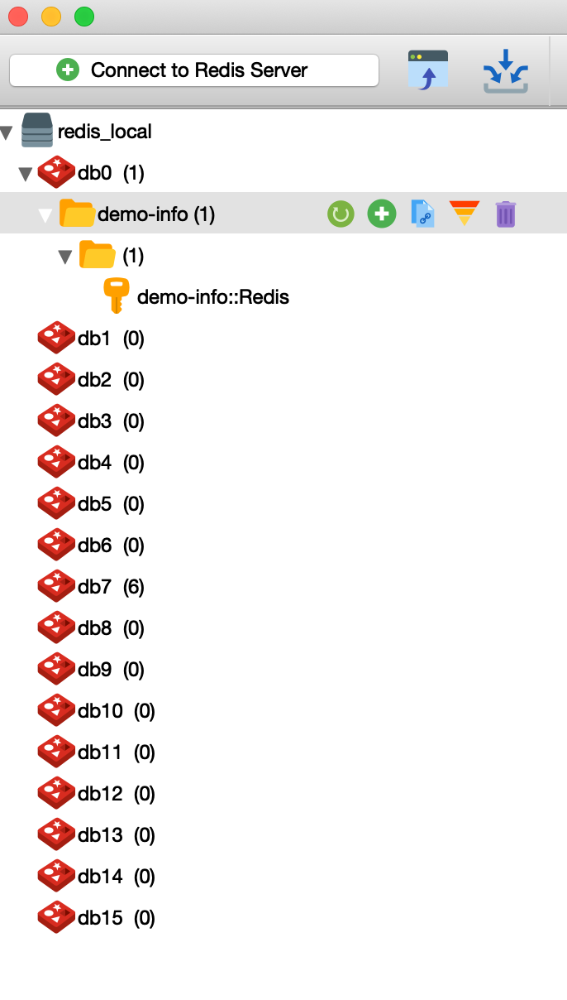

## 为什么需要缓存
* 对于数据库改动很少的数据，高频次的调用，会徒增数据库的压力。
* 从缓存中获取数据，比直接访问数据库获取要快很多。
* 直接访问一个已经存在的对象，要比从数据创建一个对象快。
* 缓存的架构发展很迅速，从本地缓存 到 集群缓存 再到 分布式缓存(数据网格)。
* 分布式系统一般会有一级缓存、二级缓存、要求更高些的会有三级缓存。
* 但要用好缓存并不是那么简单，我们还需要具有缓存穿透、缓存雪崩对应的解决方案。
* 本章只讲述Spring下使用缓存的方法，后续运维工程师可根据系统的实际业务情况来采用不同的缓存架构。

## 小提示
我们可以使用 Redis可视化工具`Redis Desktop Manager`来实时查看`redis`的使用情况

## 代码示例
### 添加读取缓存
~~~java
@Slf4j
@RestController
@RequestMapping("api")
public class DemoController {

   @GetMapping("info")
   @PreAuth("hasRole('administrator')")
   @Cacheable(cacheNames = "demo-info", key = "#name")
   public R<String> info(String name) {
      log.info("本条信息没有从缓存获取");
      return R.data("Hello, My Name Is: " + name);
   }

}

~~~

### 调用接口验证
1. 首先查看`Redis Desktop Manager`，是没有缓存的键值的
 
2. 调用接口并查看控制台，发现如下日志

3. 查看`Redis Desktop Manager`，发现多了一个键值，正是我们设置的

4. 再次调用接口，发现控制台再无日志输出，说明第二次以后的请求，缓存都从Redis取了。

5. 当低频更新的数据发生了变更，那么随之与他相关的缓存也需要删除，所以我们来看下移除缓存的写法。

### 移除缓存
~~~java
@Slf4j
@RestController
@RequestMapping("api")
public class DemoController {

   @GetMapping("info")
   @PreAuth("hasRole('administrator')")
   @Cacheable(cacheNames = "demo-info", key = "#name")
   public R<String> info(String name) {
      log.info("本条信息没有从缓存获取");
      return R.data("Hello, My Name Is: " + name);
   }

   @GetMapping("remove-info")
   @PreAuth("hasRole('administrator')")
   @CacheEvict(cacheNames = "demo-info", key = "#name")
   public R<String> removeInfo(String name) {
      return R.success("删除缓存成功");
   }

}
~~~
### 调用接口验证
1. 调用接口，并查看返回结果为`删除缓存成功`

2. 查看`Redis Desktop Manager`，发现缓存被移除
 
3.再次调用`info`接口，发现又如一开始，控制台打印了日志，并且Redis增加了键值

## 结尾语
好了，简单的缓存概念及其使用已经讲解完毕，更深一层的，我们可以查阅Spring的官方文档进行深入学习。
官方文档直达：https://docs.spring.io/spring/docs/current/spring-framework-reference/integration.html#cache
