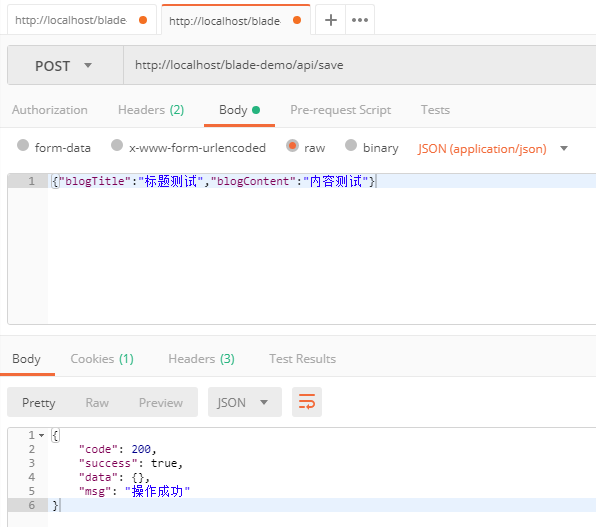
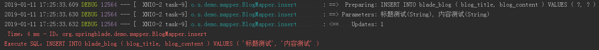
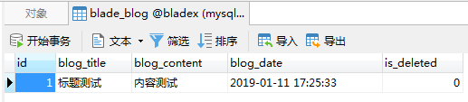
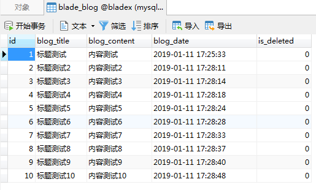

## 第一个新增API
1. 我们进入到`DemoController`，将`DemoService`注入进来
2. 很多小伙伴一般会写成这种形式，使用`@Autowired`注解
~~~java
@RestController
@RequestMapping("api")
public class DemoController {

   @Autowired
   private BlogService service;

}
~~~
3. 用上`Lombok`后，我们有更简约的写法，那就是在`DemoController `上增加注解`@AllArgsConstructor`
~~~java
@RestController
@RequestMapping("api")
@AllArgsConstructor
public class DemoController {

   private BlogService service;

}
~~~
4. 可能一个看不怎么出效果，那么我们对比下面两段代码
~~~java
public class DemoController {

   @Autowired
   private BlogService1 service1;

   @Autowired
   private BlogService2 service2;

   @Autowired
   private BlogService3 service3;

   @Autowired
   private BlogService4 service4;

}
~~~
~~~java
@AllArgsConstructor
public class DemoController {

   private BlogService1 service1;

   private BlogService2 service2;

   private BlogService3 service3;

   private BlogService4 service4;

}
~~~
5. 新建一个新增接口
~~~java
/**
 * 新增
 */
@PostMapping("/save")
public R save(@RequestBody Blog blog) {
   return R.status(service.save(blog));
}
~~~
6. 使用Posman调用API，查看接口返回为操作成功 （需要先鉴权）

7. 查看控制台，发现打印出了sql的相关信息

8. 查看数据库，已然有了我们刚提交的数据
 
9. 为了后续方便测试，我们多新增几条数据，最后库表中数据如下

