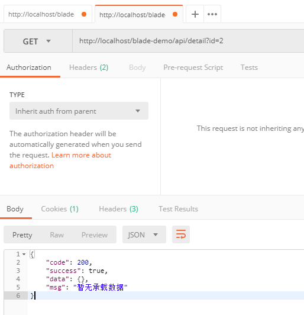
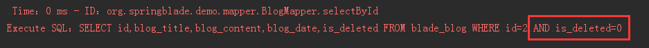
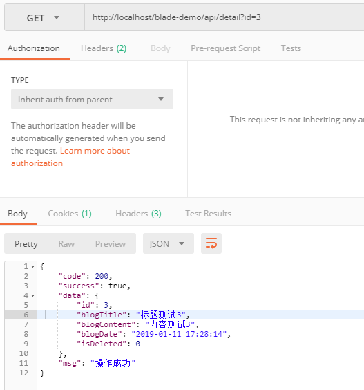

## 步骤

1. 新建一个详情接口
~~~java
/**
 * 详情
 */
@GetMapping("/detail")
public R<Blog> detail(Integer id) {
   Blog detail = service.getById(id);
   return R.data(detail);
}
~~~
2. 使用Posman调用API，查询下我们刚刚逻辑删除的数据，发现没有数据返回

3. 查看下控制台打印的sql，发现mybatis-plus已经帮我们默认把逻辑判断加上了，非常方便，以后开发程序员就不需要再去关心逻辑字段的状态值了。

4. 我们再用Posman调用API，查看下`id`为`3`的数据，返回成功，非常完美。
 
