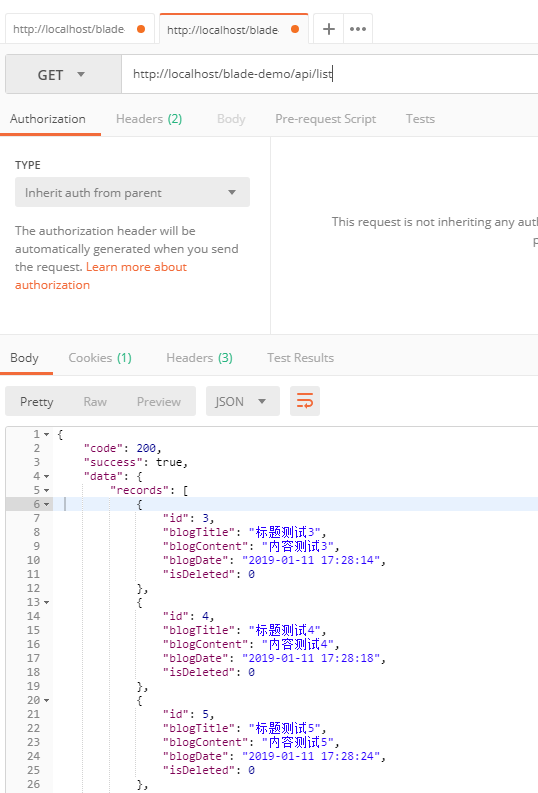
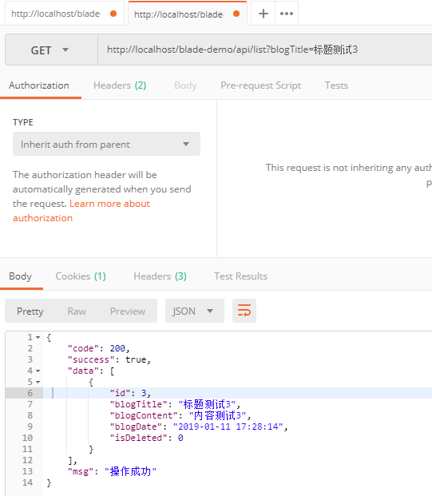
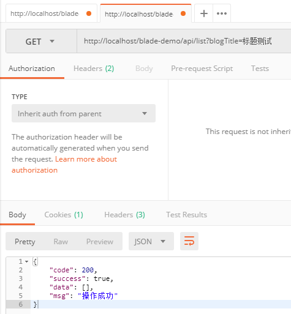
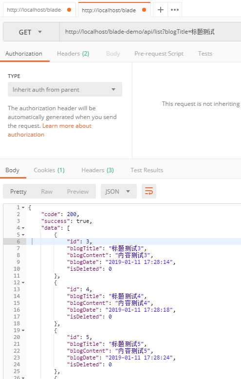
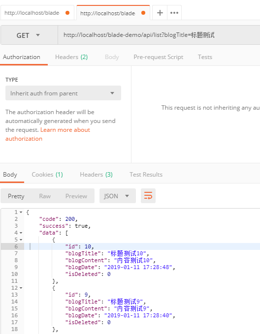

## 步骤
1. 新建查询多条接口
~~~java
/**
 * 查询多条
 */
@GetMapping("/list")
public R<List<Blog>> list() {
   List<Blog> list = service.list();
   return R.data(list);
}
~~~
2. 使用Posman调用API，查询返回结果

3. 这时候如果我们需要增加查询条件的话，可以看下面代码
~~~java
/**
 * 查询多条
 */
@GetMapping("/list")
public R<List<Blog>> list(Blog blog) {
   List<Blog> list = service.list(Wrappers.query(blog));
   return R.data(list);
}
~~~
4. 使用Postman调用API，查询返回结果，没问题

5. 我们再来测试下模糊查询，发现并不行，这种情况，我们需要自行定义规则

6. SpringBlade做了简单的封装(传入Map为模糊，传入Bean为等于)，代码修改如下
~~~java
/**
 * 查询多条
 */
@GetMapping("/list")
public R<List<Blog>> list(@RequestParam Map<String, Object> blog) {
   List<Blog> list = service.list(Condition.getQueryWrapper(blog, Blog.class));
   return R.data(list);
}
~~~
7. 查看接口返回，模糊查询成功

8. 当然，`QueryWrapper`有更多的用法，比如我们可以将他转换为`lambda`模式，并且按时间倒序排序
 ~~~java
/**
 * 查询多条
 */
@GetMapping("/list")
public R<List<Blog>> list(@RequestParam Map<String, Object> blog) {
   List<Blog> list = service.list(Condition.getQueryWrapper(blog, 				   Blog.class).lambda().orderByDesc(Blog::getBlogDate));
   return R.data(list);
}
 ~~~
9. 查看接口返回，倒序排序成功

10. 更多用法请查阅官方文档：https://mp.baomidou.com/guide/wrapper.html
