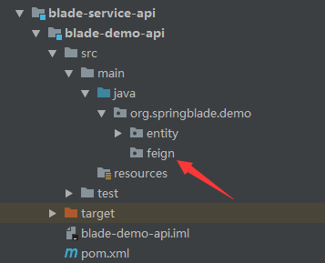
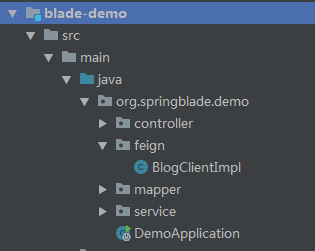
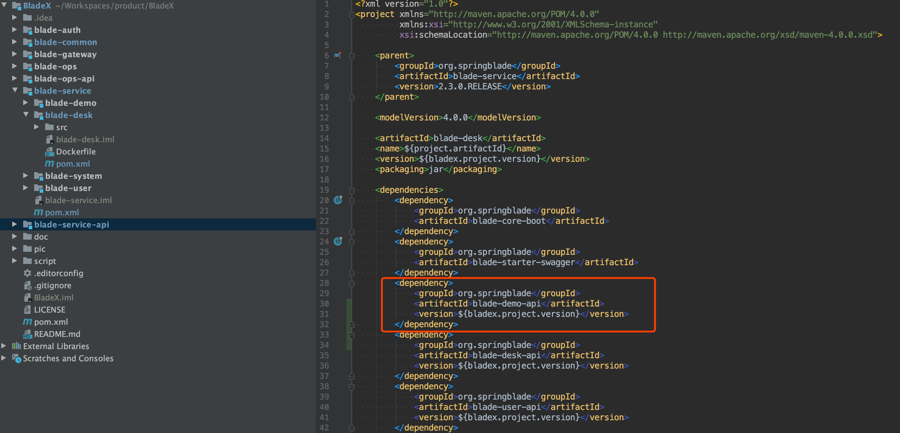
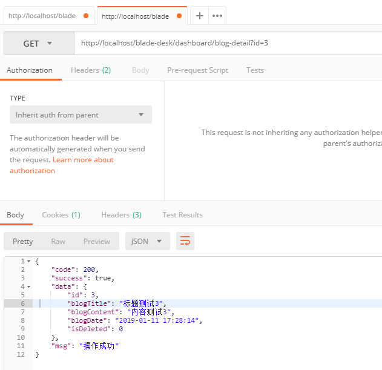
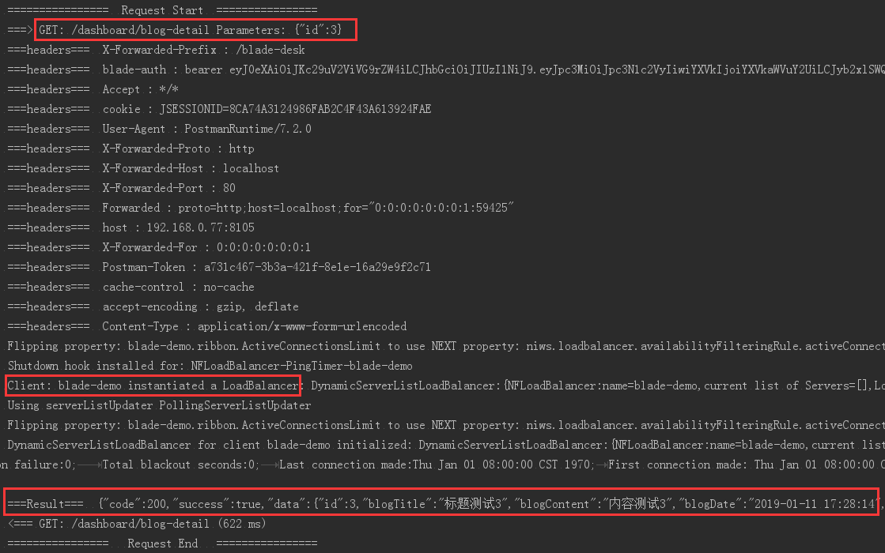

## 前言
* 在以往的单工程项目，所有代码都融合在一起，业务相互调用只需要引入共有的工具类或者对应模块的service。
* 但是到了微服务时代，已然不能使用这种方式，我们需要寻找新的解决方案。
* 若每个模块都把需要调用模块的service拷贝一份，那会令代码非常冗余，影响整个工程的健壮性。
* 稍大一些的系统，会分成多个库，比如用户库、订单库分开，订单服务想要取到用户的相关信息，由于不能连接到用户的库，所以无法直接新建数据库查询以达到目的。
* 这个时候，远程调用方案出现，订单服务只需调用用户服务的API，就可以获取所需信息，非常方便。
* 我们下面来学习，如何使用SpringCloud的Feign来进行微服务远程调用。

## Feign简介
Feign是一种声明式、模板化的HTTP客户端。在Spring Cloud中使用Feign, 我们可以做到使用HTTP请求远程服务时能与调用本地方法一样的编码体验,开发者完全感知不到这是远程方法,更感知不到这是个HTTP请求。

 ## 代码示例
1. 我们以`blade-demo`中的服务为例，让我们的`blade-desk`可以调用到`blade-demo`的API
2. 在`blade-demo-api`工程中创建一个新的`package`， `feign`

3. 在`package`，`feign`下创建一个接口类，命名为`BlogClient`
4. 增加如下代码
~~~java
package org.springblade.demo.feign;

import org.springblade.common.constant.CommonConstant;
import org.springblade.core.tool.api.R;
import org.springblade.demo.entity.Blog;
import org.springframework.cloud.openfeign.FeignClient;
import org.springframework.web.bind.annotation.GetMapping;
import org.springframework.web.bind.annotation.RequestParam;

@FeignClient(
   //定义Feign指向的service-id
   value = CommonConstant.APPLICATION_DEMO_NAME 
)
public interface BlogClient{

   /**
    * 接口前缀
    */
   String API_PREFIX = "/api/blog";

   /**
    * 获取详情
    *
    * @param id 主键
    * @return
    */
   @GetMapping(API_PREFIX + "/detail")
   R<Blog> detail(@RequestParam("id") Integer id);

}

~~~
5. 返回`blade-demo`，增加feign的实现类`BlogClientImpl`

6. 增加代码如下，因为Feign本质上是HTTP客户端，所以我们创建的`BlogClientImpl`其实就是`SpringMVC`的`Controller`，所以需要加上`@RestController`注解。
~~~java
package org.springblade.demo.feign;

import lombok.AllArgsConstructor;
import org.springblade.core.tool.api.R;
import org.springblade.demo.entity.Blog;
import org.springblade.demo.service.BlogService;
import org.springframework.web.bind.annotation.GetMapping;
import org.springframework.web.bind.annotation.RestController;

@RestController
@AllArgsConstructor
public class BlogClientImpl implements BlogClient {

   private BlogService service;

   @Override
   @GetMapping(API_PREFIX + "/detail")
   public R<Blog> detail(Integer id) {
      return R.data(service.getById(id));
   }

}

~~~
7. 在`blade-desk`模块的`pom.xml`文件引入`blade-demo`的API包

8. 找到`DashboardController`，新增如下代码
~~~java
private BlogClient client;

@GetMapping("/blog-detail")
public R<Blog> blogDetail(Integer id) {
   R<Blog> result = client.detail(id);
   return result;
}
~~~
9. 启动`blade-desk`并使用Postman调用查看API远程调用成功

10. 我们再来看下控制台日志，请求先到了`/dashboard/blog-detail`，由于调用了`Feign`，程序又根据`Feign`的配置去查找名为`blade-demo`的服务，并调用对应方法，最后返回了所需数据，整个流程非常清晰

## 后话
* Feign调用我们已经走通，但是真实环境问题会很多，经常会有服务调用失败的情况。
* 应对这种场景，我们有没有什么好的解决方案？
* 下面我们来学习下`Hystrix 熔断机制`
