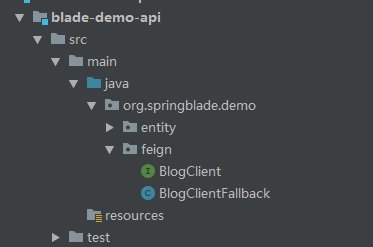
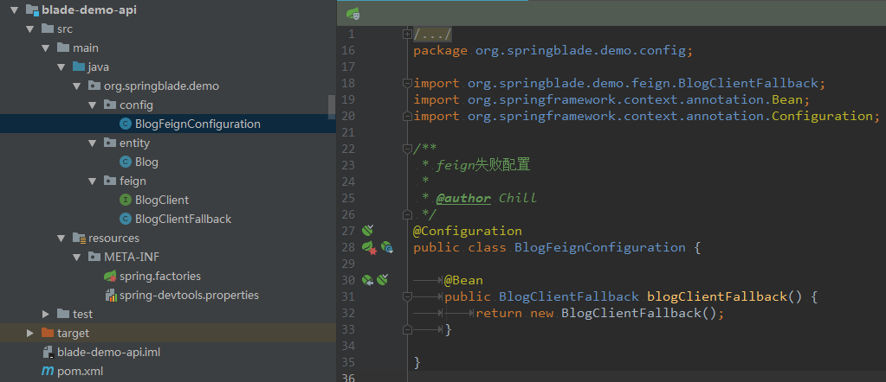
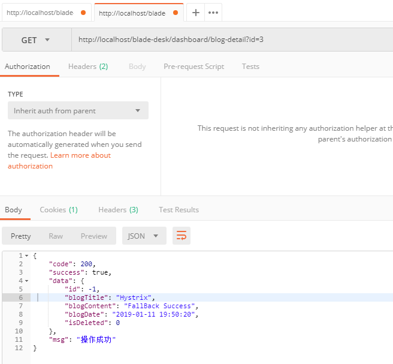

## Hystrix简介

* hystrix对应的中文名字是“豪猪”，豪猪周身长满了刺，能保护自己不受天敌的伤害，代表了一种防御机制。
* 这与hystrix本身的功能不谋而合，因此Netflix团队将该框架命名为Hystrix，并使用了对应的卡通形象做作为logo。
* 在一个分布式系统里，许多依赖不可避免的会调用失败，比如超时、异常等，如何能够保证在一个依赖出问题的情况下，不会导致整体服务失败，这个就是Hystrix需要做的事情。
* Hystrix提供了熔断、隔离、Fallback、cache、监控等功能，能够在一个、或多个依赖同时出现问题时保证系统依然可用。

## 代码示例
1. 在`blade-demo-api`中新建Hystrix类，命名为`BlogClientFallback`

2. 同样实现`BlogClient`接口，只是此时只需返回对应数据即可，不需要再定义为`Controller`
3. 代码如下
~~~java
package org.springblade.demo.feign;

import org.springblade.core.tool.api.R;
import org.springblade.demo.entity.Blog;

import org.springblade.core.tool.utils.DateUtil;

public class BlogClientFallback implements BlogClient {

   @Override
   public R<Blog> detail(Integer id) {
      Blog blog = new Blog();
      blog.setBlogTitle("Hystrix");
      blog.setBlogContent("FallBack Success");
      blog.setBlogDate(DateUtil.now());
      blog.setIsDeleted(0);
      return R.data(blog);
   }

}

~~~
4. 修改BlogClient，增加Hystrix配置
~~~java
@FeignClient(
   //定义Feign指向的service-id
   value = CommonConstant.APPLICATION_DEMO_NAME,
   //定义hystrix配置类
   fallback = BlogClientFallback.class
)
public interface BlogClient {

   /**
    * 接口前缀
    */
   String API_PREFIX = "/api/blog";

   /**
    * 获取详情
    *
    * @param id 主键
    * @return
    */
   @GetMapping(API_PREFIX + "/detail")
   R<Blog> detail(@RequestParam("id") Integer id);

}
~~~
5. 增加`FallBack`自动配置(**不新建配置，直接在BlogClientFallback类上加@Component注解也可以**)

6. 这时我们去`blade-demo`的`BlogClientImpl`模拟异常
~~~java
@RestController
@AllArgsConstructor
public class BlogClientImpl implements BlogClient {

   private BlogService service;

   @Override
   @GetMapping(API_PREFIX + "/detail")
   public R<Blog> detail(Integer id) {
      int cnt = 100 / 0;
      return R.data(service.getById(id));
   }

}
~~~
7. 使用Postman调用API查看，发现Hystrix配置生效

## 结束语
* 开发初探的教程就到这儿了，想必有一些开发经验的小伙伴会很容易上手，掌握了这些基础核心，日后勤看文档，多深入学习，相信大家都能很轻松的完成绝大部分开发任务了。
* 下面一章，让我们来学习 `开发进阶`，会逐步讲一些架构级别的知识点或一些高级用法。
