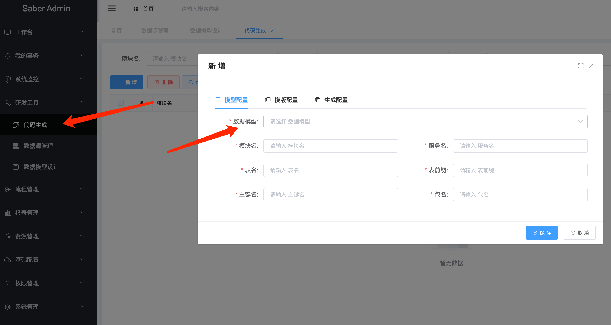
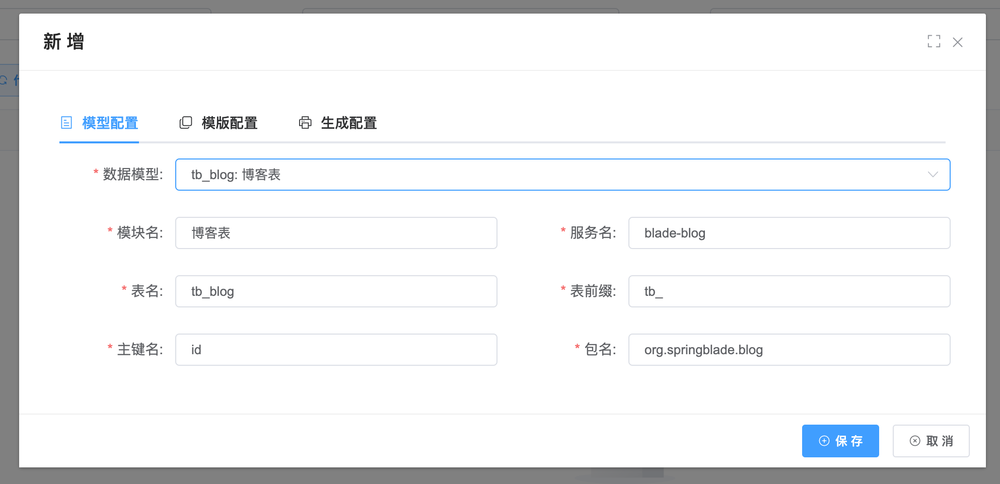
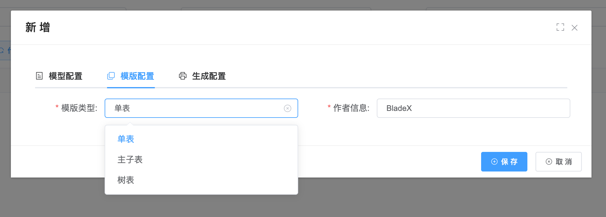
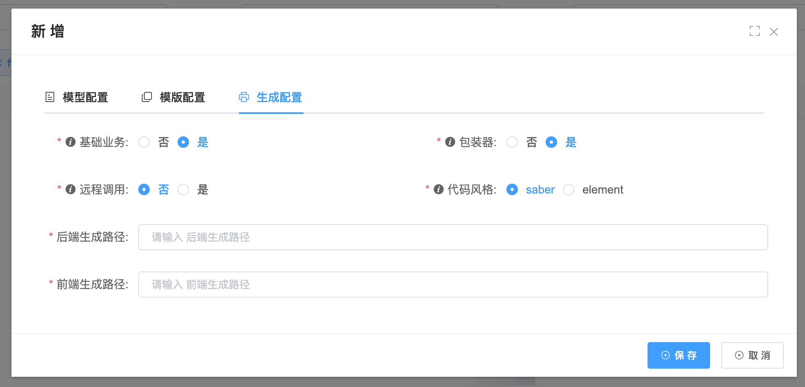
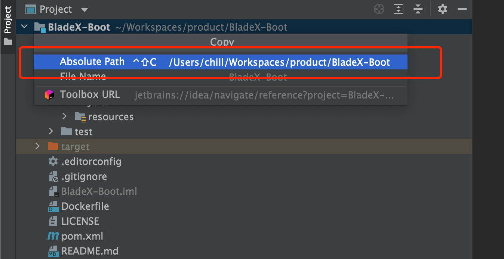

## 基础生成配置

1. 代码生成的第一个配置，便是进行模型绑定，绑定之后，代码生成器就会知道当前需要生成的是哪一个表，哪些字段有哪些属性。

   

2. 选择好模型后，会把下面的表单自动填入，大家如果有额外的需要，可以手动修改

   

3. 模版类型目前支持3种，后续会增加更多的模版，具体效果可以看下述章节

   

4. 生成配置主要定义了业务代码的类型以及生成路径的绝对地址，我们可以直接从代码工程内拷贝根目录，这样就直接一步到位了

   

   

5. 下面对每个字段进行详细解释

   *   数据模型：模型设计中的单个模型，可以获取到表的详细信息以及字段属性的详细信息
   *   模块名：用于指定配置的名称，对代码生成不产生实际效果
   *   服务名：生成后，controller对应的前缀，以及分割`-`符号后面的字符串作为前端的分包名
   *   表名：用于代码生成所对应的表名称
   *   表前缀：生成实体类的时候，忽略掉的前缀，若不配置，则`tb_blog`表生成的实体为`TbBlog`，若配置了`tb_`为前缀，则生成的实体为Blog
   *   主键名：表的主键名称
   *   包名：生成后端代码所在的包
   *   基础业务：如果选择是，则实体会继承`BaseEntity`，带有上一章红框的基础业务字段
   *   包装器：在某些复杂的模块，会用到`VO`和`Wrapper`，如果选择是则会自行生成
   *   远程调用：选择是否需要feign的代码生成
   *   代码风格：选择生成saber还是element
   *   后端生成路径：后端工程的根目录
   *   前端生成路径：前端工程的根目录