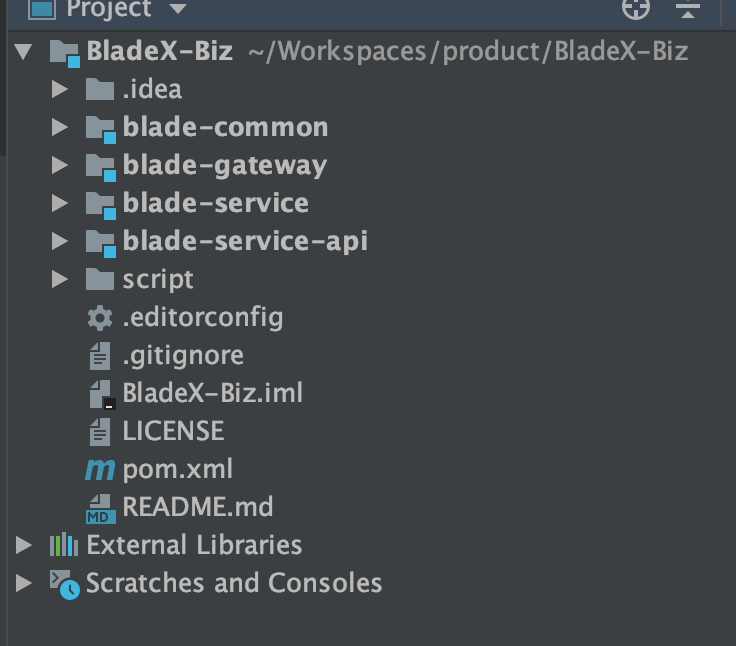
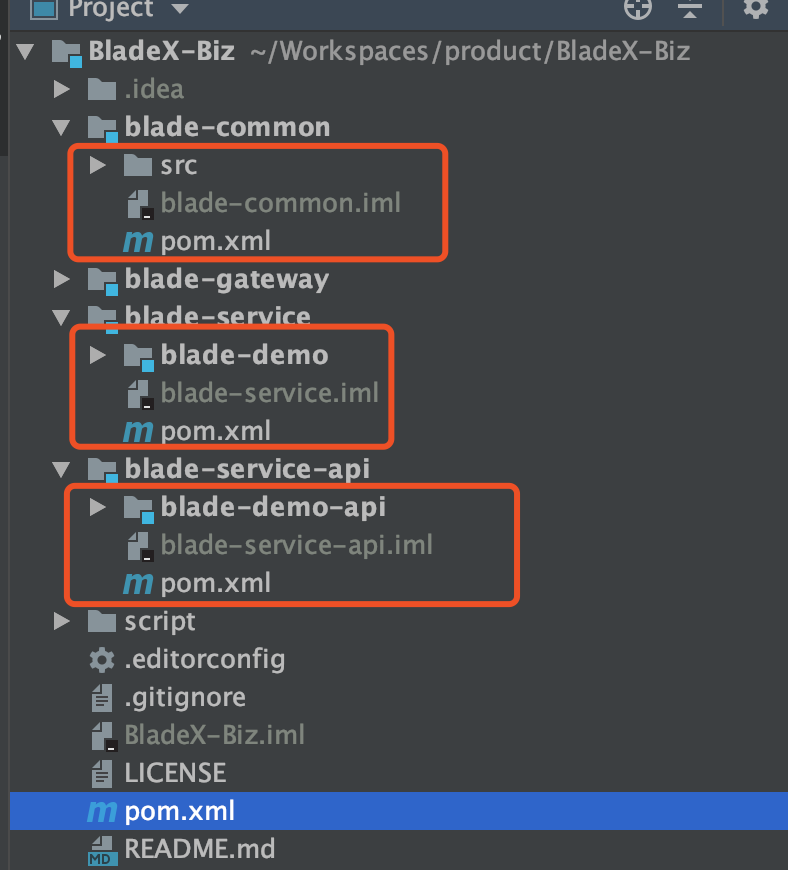

## 通用业务工程BladeX-Biz介绍
* bladex-biz专门设计用于业务工程开发
* 目的是与主工程bladex的代码分离
* 适用于多团队协作开发多子系统的综合平台
* 方便后续bladex更新，减轻升级负担

## bladex-biz的解惑
* bladex-biz中的blade-gateway与bladex中的blade-gateway一模一样。到这里也许有小伙伴会提问，bladex-biz的初衷是什么？为何需要两个gateway？
* 一般使用到微服务，都会是比较大的项目，可能多个团队同时开发多套子系统
* 这时候如果一个团队将系统全部写在核心工程bladex里，显然是不明智的选择，这样会给未来项目管理、代码验收带来较大阻力
* 正确的做法是：核心主工程bladex单独起来，不做改动，只跟随官方主分支更新；每个子系统单独新建工程，将业务代码写入bladex-biz中（当然这是要重命名成各个子系统的）。最后多个子系统汇总到git的一个组织内，这样点进去就能看到这个综合平台内有多少个子系统了。分工明确，代码管理也方便
* 至于每个bladex-biz工程配置一个gateway，是非常必须的。这样gateway可以选择是调用注册在公共nacos的服务还是本机nacos的服务，非常灵活，方便进行调试。
* 针对与多人同时开发一个服务并需要断点调试的情况，也可以通过**Loadbalancer组件**来完美解决，具体配置请看 5.19章节

## 老版本系统如何迁移
1.  进入私服下载bladex-biz工程：[https://git.bladex.vip/blade/BladeX-Biz](https://git.bladex.vip/blade/BladeX-Biz)
2. 倒入bladex-biz工程

3. 将业务代码迁移至blade-service和blade-service-api中，将工程封装代码迁移至blade-common中
4. 这样便可将自身的业务代码与bladex核心工程完全隔离

5. bladex-biz中的blade-common模块为工程通用封装，业务以依赖的形式将其引入，大家可以看作是公共的业务封装工具包
