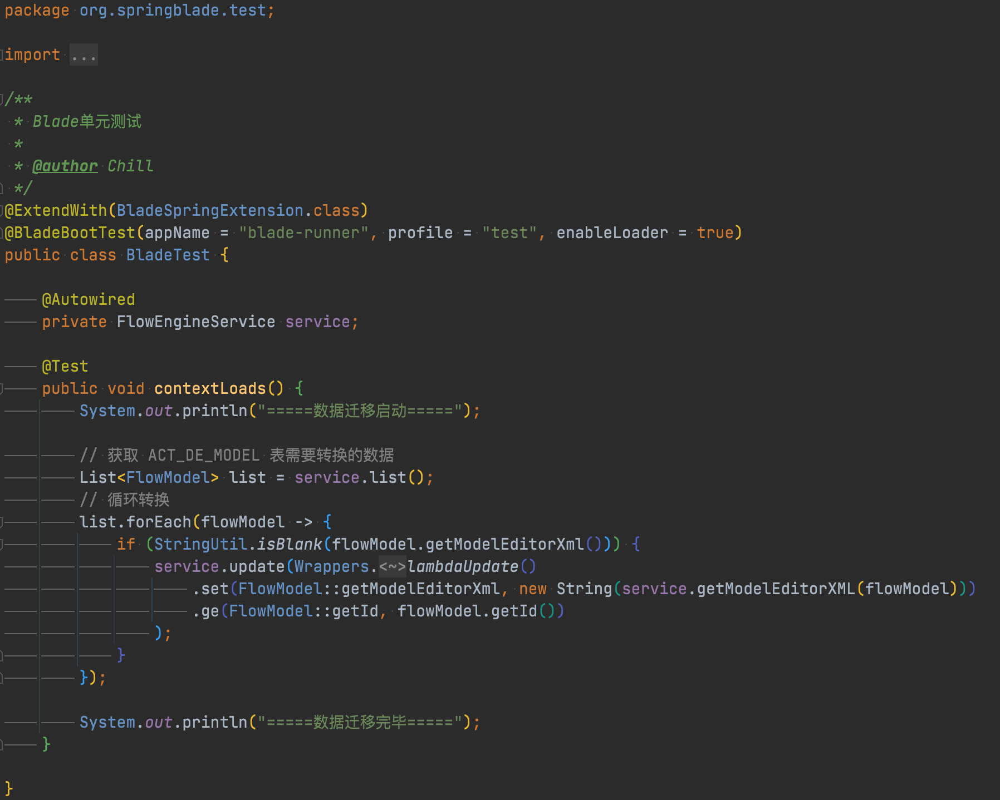
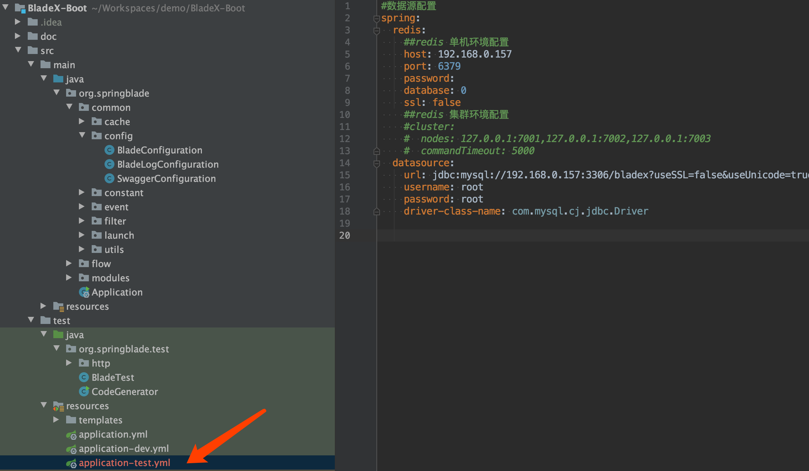
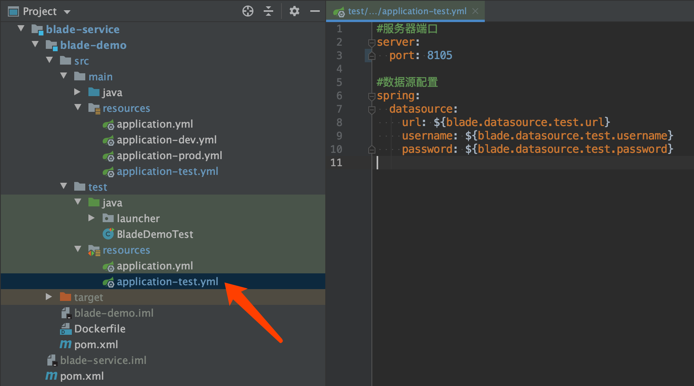
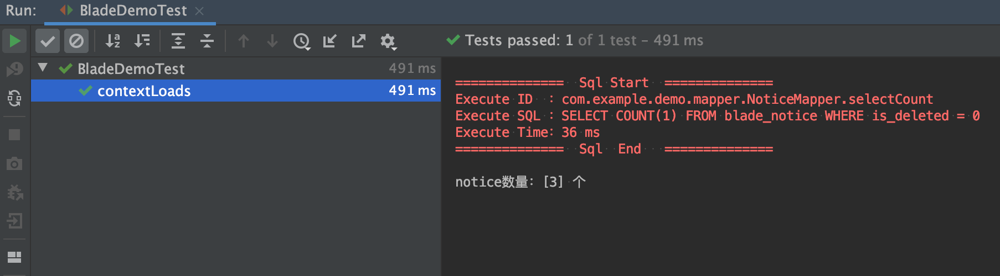
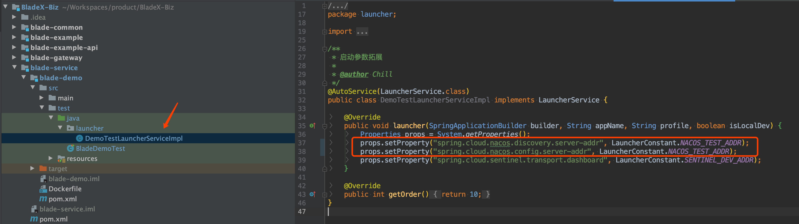
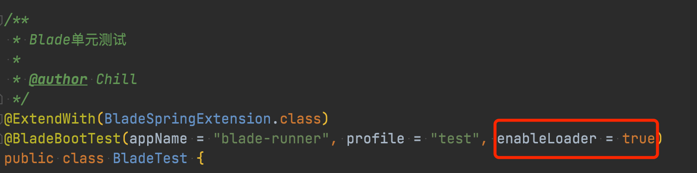

## 说明
>由于BladeX重写拓展了SpringBoot的启动器，内部设定了环境变量。所以用SpringBoot自带的单元测试方法也是会失效的。这种情况搭配BladeX定制的单元测试便可以正常使用

## 如何使用
1. 工程引入blade-core-test依赖
~~~xml
<dependency>
    <groupId>org.springblade</groupId>
    <artifactId>blade-core-test</artifactId>
    <scope>test</scope>
</dependency>
~~~
2. 创建单元测试类，并加上相关注解

4. 其中`@ExtendWith(BladeSpringExtension.class)`指定了定制的启动器
6. 其中`@BladeBootTest(appName = "blade-runner", profile = "test", enableLoader = true)`指定了工程名、环境变量、是否启用loader

## 如何运行
1. 在运行单元测试之前，我们需要先做好配置文件的安排
2. 由于我们配置的是test环境，所以要用到test对应到配置文件
3. 如果使用的是SpringBoot版本，则到test的resources包内新建applicaiton-test.yml

4. 如果使用的是SpringCloud版本。除了创建application-test.yml，还需要到nacos创建blade-test.yaml的配置，并修改好对应的数据库、redis配置

5. 现在我们运行单元测试查看运行结果，发现运行成功，日志打印也正确无误

## 配置环境变量
* 单元测试若配置test环境，要连接到test环境的nacos时，需要进行参数指定
* 在test包目录下增加对应的LauncherService来指定参数，并且enableloader设置为true

