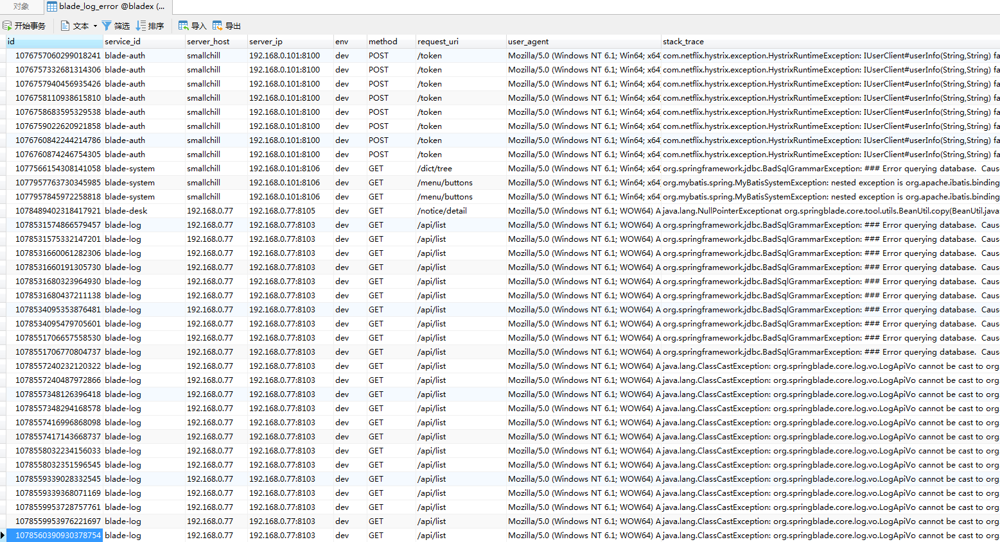
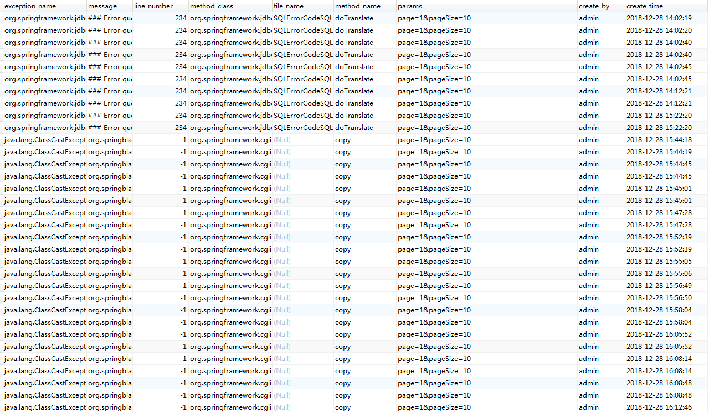

## 实现思路
### 全局统一异常
* 使用`@RestControllerAdvice`，捕获异常后统一返回封装好的格式。
* 异常分成两种：已知异常与未知异常，未知异常是着重需要关注的，所以会将未知异常入库，方便排查
* 以下为全局异常核心代码
~~~java
@Slf4j
@Order
@Configuration
@ConditionalOnWebApplication(type = ConditionalOnWebApplication.Type.SERVLET)
@ConditionalOnClass({ Servlet.class, DispatcherServlet.class })
@RestControllerAdvice
public class BladeRestExceptionTranslator {

   @ExceptionHandler(ServiceException.class)
   @ResponseStatus(HttpStatus.BAD_REQUEST)
   public R handleError(ServiceException e) {
      log.error("业务异常", e);
      return R.fail(e.getResultCode(), e.getMessage());
   }

   @ExceptionHandler(SecureException.class)
   @ResponseStatus(HttpStatus.UNAUTHORIZED)
   public R handleError(SecureException e) {
      log.error("认证异常", e);
      return R.fail(e.getResultCode(), e.getMessage());
   }

   @ExceptionHandler(Throwable.class)
   @ResponseStatus(HttpStatus.INTERNAL_SERVER_ERROR)
   public R handleError(Throwable e) {
      log.error("服务器异常", e);
      //发送服务异常事件
      ErrorLogPublisher.publishEvent(e, UrlUtil.getPath(WebUtil.getRequest().getRequestURI()));
      return R.fail(ResultCode.INTERNAL_SERVER_ERROR, (Func.isEmpty(e.getMessage()) ? ResultCode.INTERNAL_SERVER_ERROR.getMessage() : e.getMessage()));
   }

}

~~~
* 大家可以看下最后几行的 `ErrorLogPublisher.publishEvent`方法，可以看出，该方法使用了Spring的Event事件驱动，进行解耦。异步操作日志的收集、入库等。代码如下
~~~java
/**
 * 异常信息事件发送
 *
 * @author Chill
 */
public class ErrorLogPublisher {

   public static void publishEvent(Throwable error, String requestUri) {
      HttpServletRequest request = WebUtil.getRequest();
      LogError logError = new LogError();
      logError.setRequestUri(requestUri);
      if (Func.isNotEmpty(error)) {
         logError.setStackTrace(Exceptions.getStackTraceAsString(error));
         logError.setExceptionName(error.getClass().getName());
         logError.setMessage(error.getMessage());
         StackTraceElement[] elements = error.getStackTrace();
         if (Func.isNotEmpty(elements)) {
            StackTraceElement element = elements[0];
            logError.setMethodName(element.getMethodName());
            logError.setMethodClass(element.getClassName());
            logError.setFileName(element.getFileName());
            logError.setLineNumber(element.getLineNumber());
         }
      }
      LogAbstractUtil.addRequestInfoToLog(request, logError);
      Map<String, Object> event = new HashMap<>(16);
      event.put(EventConstant.EVENT_LOG, logError);
      SpringUtil.publishEvent(new ErrorLogEvent(event));
   }

}
~~~
* 跟踪到 `SpringUtil.publishEvent(new ErrorLogEvent(event));`
* 查看 `ErrorLogEvent`代码
~~~java
/**
 * 错误日志事件
 *
 * @author Chill
 */
public class ErrorLogEvent extends ApplicationEvent {

   public ErrorLogEvent(Map<String, Object> source) {
      super(source);
   }

}
~~~
* 对应错误日志处理`ErrorLogListener `代码
~~~java
/**
 * 异步监听错误日志事件
 *
 * @author Chill
 */
@Slf4j
@AllArgsConstructor
public class ErrorLogListener {

   private final ILogClient logService;
   private final ServerInfo serverInfo;
   private final BladeProperties bladeProperties;

   @Async
   @Order
   @EventListener(ErrorLogEvent.class)
   public void saveErrorLog(ErrorLogEvent event) {
      Map<String, Object> source = (Map<String, Object>) event.getSource();
      LogError logError = (LogError) source.get(EventConstant.EVENT_LOG);
      LogAbstractUtil.addOtherInfoToLog(logError, bladeProperties, serverInfo);
      logService.saveErrorLog(logError);
   }

}
~~~
* 到了`ErrorLogListener `其实就可以进行拓展了，可以像现在这样，直接调用日志接口入库，也可以集成消息队列，提高性能。最终，我们可以到数据库中看到如下数据

* 错误产生在哪个服务名，服务的环境，服务的ip，服务的host，异常堆栈详情，异常类，异常所在方法，所在行数，传的参数，操作人，操作时间等等信息一目了然。
* 简单的几处代码，如若集成消息队列或redis，我相信足以满足轻量级微服务架构的需求。

### API日志
* 自动生成错误日志的讲完了，我们需要根据注解主动生成日志。
* 对于这一类我们一般使用AOP来实现功能，切到对应注解后，获取当前请求的信息，然后再通过Event异步入库
* AOP代码如下
~~~java
/**
 * 操作日志使用spring event异步入库
 *
 * @author Chill
 */
@Slf4j
@Aspect
public class ApiLogAspect {

   @Around("@annotation(apiLog)")
   public Object around(ProceedingJoinPoint point, ApiLog apiLog) throws Throwable {
      //获取类名
      String className = point.getTarget().getClass().getName();
      //获取方法
      String methodName = point.getSignature().getName();
      // 发送异步日志事件
      long beginTime = System.currentTimeMillis();
      //执行方法
      Object result = point.proceed();
      //执行时长(毫秒)
      long time = System.currentTimeMillis() - beginTime;
      //记录日志
      ApiLogPublisher.publishEvent(methodName, className, apiLog, time);
      return result;
   }

}
~~~
* 注解代码如下
~~~java
/**
 * 操作日志注解
 *
 * @author Chill
 */
@Target(ElementType.METHOD)
@Retention(RetentionPolicy.RUNTIME)
@Documented
public @interface ApiLog {

   /**
    * 日志描述
    *
    * @return {String}
    */
   String value() default "日志记录";
}

~~~
* 日志发送器代码如下
~~~java
/**
 * API日志信息事件发送
 *
 * @author Chill
 */
public class ApiLogPublisher {

   public static void publishEvent(String methodName, String methodClass, ApiLog apiLog, long time) {
      HttpServletRequest request = WebUtil.getRequest();
      LogApi logApi = new LogApi();
      logApi.setType(BladeConstant.LOG_NORMAL_TYPE);
      logApi.setTitle(apiLog.value());
      logApi.setTime(String.valueOf(time));
      logApi.setMethodClass(methodClass);
      logApi.setMethodName(methodName);
      LogAbstractUtil.addRequestInfoToLog(request, logApi);
      Map<String, Object> event = new HashMap<>(16);
      event.put(EventConstant.EVENT_LOG, logApi);
      SpringUtil.publishEvent(new ApiLogEvent(event));
   }

}
~~~
* 日志事件代码如下
~~~java
/**
 * 系统日志事件
 *
 * @author Chill
 */
public class ApiLogEvent extends ApplicationEvent {

   public ApiLogEvent(Map<String, Object> source) {
      super(source);
   }

}
~~~
* 日志监听器代码如下
~~~java
/**
 * 异步监听日志事件
 *
 * @author Chill
 */
@Slf4j
@AllArgsConstructor
public class ApiLogListener {

   private final ILogClient logService;
   private final ServerInfo serverInfo;
   private final BladeProperties bladeProperties;

   @Async
   @Order
   @EventListener(ApiLogEvent.class)
   public void saveApiLog(ApiLogEvent event) {
      Map<String, Object> source = (Map<String, Object>) event.getSource();
      LogApi logApi = (LogApi) source.get(EventConstant.EVENT_LOG);
      LogAbstractUtil.addOtherInfoToLog(logApi, bladeProperties, serverInfo);
      logService.saveApiLog(logApi);
   }

}
~~~
* 由此可见，思路其实同异常日志一致，都是获取请求相关信息后进行事件驱动解耦，异步将日志入库，若要增加其性能与并发能力，可以采用集成消息队列或者Redis，相信这些都难不倒大家

