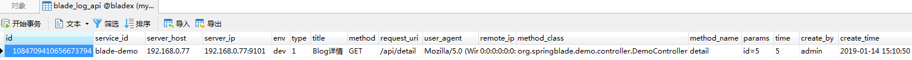
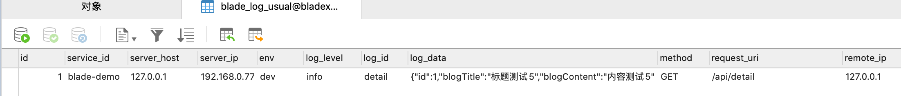
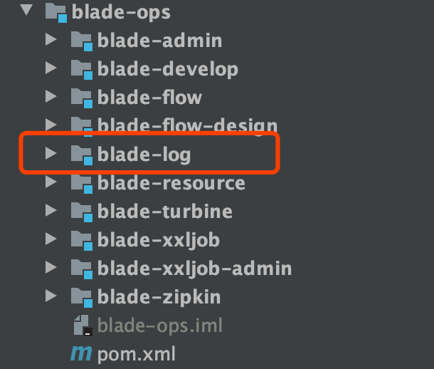

## 如何使用自定义API日志
* 下面我们使用`blade-demo`中的一个API接口来测试下API日志
* 增加`@ApiLog`注解，代码如下
~~~java
/**
 * 详情
 */
@ApiLog("Blog详情")
@GetMapping("/detail")
@ApiOperation(value = "查看详情", notes = "传入主键")
public R<Blog> detail(@ApiParam(value = "主键值") @RequestParam Integer id) {
   Blog detail = service.getById(id);
   return R.data(detail);
}

~~~
* 重启服务后调用接口并查看数据库日志，可以看到，详细的日志信息都已经入库了

## 如何使用自定义通用日志
* 仍然找到上一小节提到的`blade-demo`中的API接口
* 注入`BladeLogger`类，并在`detail`接口内写入逻辑，代码如下
~~~java
@RestController
@AllArgsConstructor
@RequestMapping("blog")
@Api(value = "用户博客", tags = "博客接口")
public class NoticeController extends BladeController implements CacheNames {

   private IBlogService service;
   private BladeLogger logger;

   /**
    * 详情
    */
   @ApiLog("Blog详情")
   @GetMapping("/detail")
   @ApiOperation(value = "查看详情", notes = "传入主键")
   public R<Blog> detail(@ApiParam(value = "主键值") @RequestParam Integer id) {
      Blog detail = service.getById(id);
      logger.info("detail_test", JsonUtil.toJson(detail));
      return R.data(detail);
   }
}
~~~
* 重启服务后调用接口并查看数据库日志, 将会看到`blade_log_usual`已经有数据入库了

## 结尾语
为了保证日志系统的高可用，推荐将这三张表单独成一个库，同时将 `blade-log` 服务部署多份，这样就可以保证日志服务可长期稳定地提供保障
