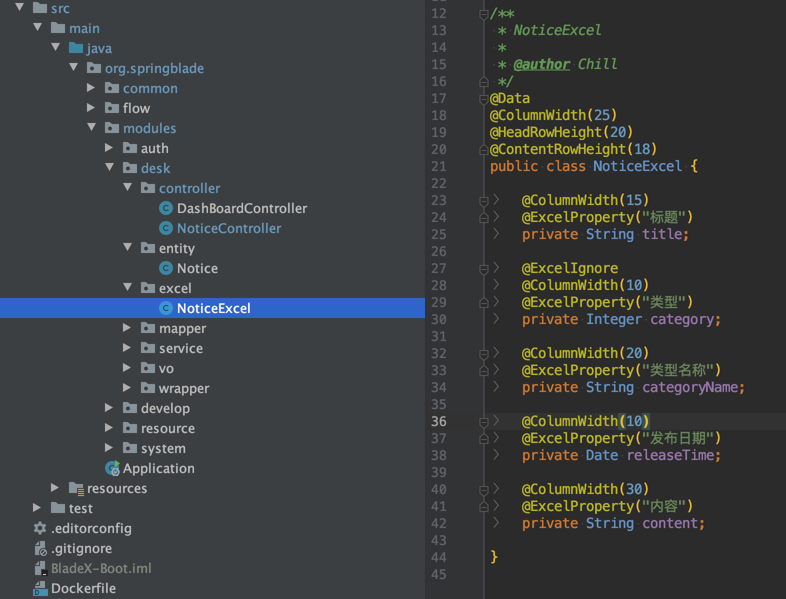

## Excel准备
1. 以Notice模块为例，基于官方文档，我们编写一个EasyExcel格式的bean
~~~java
@Data
@ColumnWidth(25)
@HeadRowHeight(20)
@ContentRowHeight(18)
public class NoticeExcel {

   @ColumnWidth(15)
   @ExcelProperty("标题")
   private String title;

   @ExcelIgnore
   @ColumnWidth(10)
   @ExcelProperty("类型")
   private Integer category;

   @ColumnWidth(20)
   @ExcelProperty("类型名称")
   private String categoryName;

   @ColumnWidth(10)
   @ExcelProperty("发布日期")
   private Date releaseTime;

   @ColumnWidth(30)
   @ExcelProperty("内容")
   private String content;

}
~~~

2. 为了方便调试，我们将对应的接口都配置放行，具体操作请看4.2章节
3. 针对EasyExcel，BladeX提供了轻量级的工具类ExcelUtil，具体代码如下，大家可以在阅读完官方文档后再阅读封装源码
~~~java
/*
 *      Copyright (c) 2018-2028, Chill Zhuang All rights reserved.
 *
 *  Redistribution and use in source and binary forms, with or without
 *  modification, are permitted provided that the following conditions are met:
 *
 *  Redistributions of source code must retain the above copyright notice,
 *  this list of conditions and the following disclaimer.
 *  Redistributions in binary form must reproduce the above copyright
 *  notice, this list of conditions and the following disclaimer in the
 *  documentation and/or other materials provided with the distribution.
 *  Neither the name of the dreamlu.net developer nor the names of its
 *  contributors may be used to endorse or promote products derived from
 *  this software without specific prior written permission.
 *  Author: Chill 庄骞 (smallchill@163.com)
 */
package org.springblade.core.excel.util;

import com.alibaba.excel.EasyExcel;
import com.alibaba.excel.read.builder.ExcelReaderBuilder;
import com.alibaba.excel.read.listener.ReadListener;
import com.alibaba.excel.util.DateUtils;
import lombok.SneakyThrows;
import org.apache.commons.codec.Charsets;
import org.springblade.core.excel.listener.DataListener;
import org.springblade.core.excel.listener.ImportListener;
import org.springblade.core.excel.support.ExcelException;
import org.springblade.core.excel.support.ExcelImporter;
import org.springframework.util.StringUtils;
import org.springframework.web.multipart.MultipartFile;

import javax.servlet.http.HttpServletResponse;
import java.io.BufferedInputStream;
import java.io.IOException;
import java.io.InputStream;
import java.net.URLEncoder;
import java.util.Date;
import java.util.List;

/**
 * Excel工具类
 *
 * @author Chill
 * @apiNote https://www.yuque.com/easyexcel/doc/easyexcel
 */
public class ExcelUtil {

   /**
    * 读取excel的所有sheet数据
    *
    * @param excel excel文件
    * @return List<Object>
    */
   public static <T> List<T> read(MultipartFile excel, Class<T> clazz) {
      DataListener<T> dataListener = new DataListener<>();
      ExcelReaderBuilder builder = getReaderBuilder(excel, dataListener, clazz);
      if (builder == null) {
         return null;
      }
      builder.doReadAll();
      return dataListener.getDataList();
   }

   /**
    * 读取excel的指定sheet数据
    *
    * @param excel   excel文件
    * @param sheetNo sheet序号(从0开始)
    * @return List<Object>
    */
   public static <T> List<T> read(MultipartFile excel, int sheetNo, Class<T> clazz) {
      return read(excel, sheetNo, 1, clazz);
   }

   /**
    * 读取excel的指定sheet数据
    *
    * @param excel         excel文件
    * @param sheetNo       sheet序号(从0开始)
    * @param headRowNumber 表头行数
    * @return List<Object>
    */
   public static <T> List<T> read(MultipartFile excel, int sheetNo, int headRowNumber, Class<T> clazz) {
      DataListener<T> dataListener = new DataListener<>();
      ExcelReaderBuilder builder = getReaderBuilder(excel, dataListener, clazz);
      if (builder == null) {
         return null;
      }
      builder.sheet(sheetNo).headRowNumber(headRowNumber).doRead();
      return dataListener.getDataList();
   }

   /**
    * 读取并导入数据
    *
    * @param excel    excel文件
    * @param importer 导入逻辑类
    * @param <T>      泛型
    */
   public static <T> void save(MultipartFile excel, ExcelImporter<T> importer, Class<T> clazz) {
      ImportListener<T> importListener = new ImportListener<>(importer);
      ExcelReaderBuilder builder = getReaderBuilder(excel, importListener, clazz);
      if (builder != null) {
         builder.doReadAll();
      }
   }

   /**
    * 导出excel
    *
    * @param response 响应类
    * @param dataList 数据列表
    * @param clazz    class类
    * @param <T>      泛型
    */
   @SneakyThrows
   public static <T> void export(HttpServletResponse response, List<T> dataList, Class<T> clazz) {
      export(response, DateUtils.format(new Date(), DateUtils.DATE_FORMAT_14), "导出数据", dataList, clazz);
   }

   /**
    * 导出excel
    *
    * @param response  响应类
    * @param fileName  文件名
    * @param sheetName sheet名
    * @param dataList  数据列表
    * @param clazz     class类
    * @param <T>       泛型
    */
   @SneakyThrows
   public static <T> void export(HttpServletResponse response, String fileName, String sheetName, List<T> dataList, Class<T> clazz) {
      response.setContentType("application/vnd.ms-excel");
      response.setCharacterEncoding(Charsets.UTF_8.name());
      fileName = URLEncoder.encode(fileName, Charsets.UTF_8.name());
      response.setHeader("Content-disposition", "attachment;filename=" + fileName + ".xlsx");
      EasyExcel.write(response.getOutputStream(), clazz).sheet(sheetName).doWrite(dataList);
   }

   /**
    * 获取构建类
    *
    * @param excel        excel文件
    * @param readListener excel监听类
    * @return ExcelReaderBuilder
    */
   public static <T> ExcelReaderBuilder getReaderBuilder(MultipartFile excel, ReadListener<T> readListener, Class<T> clazz) {
      String filename = excel.getOriginalFilename();
      if (StringUtils.isEmpty(filename)) {
         throw new ExcelException("请上传文件!");
      }
      if ((!StringUtils.endsWithIgnoreCase(filename, ".xls") && !StringUtils.endsWithIgnoreCase(filename, ".xlsx"))) {
         throw new ExcelException("请上传正确的excel文件!");
      }
      InputStream inputStream;
      try {
         inputStream = new BufferedInputStream(excel.getInputStream());
         return EasyExcel.read(inputStream, clazz, readListener);
      } catch (IOException e) {
         e.printStackTrace();
      }
      return null;
   }

}

~~~
