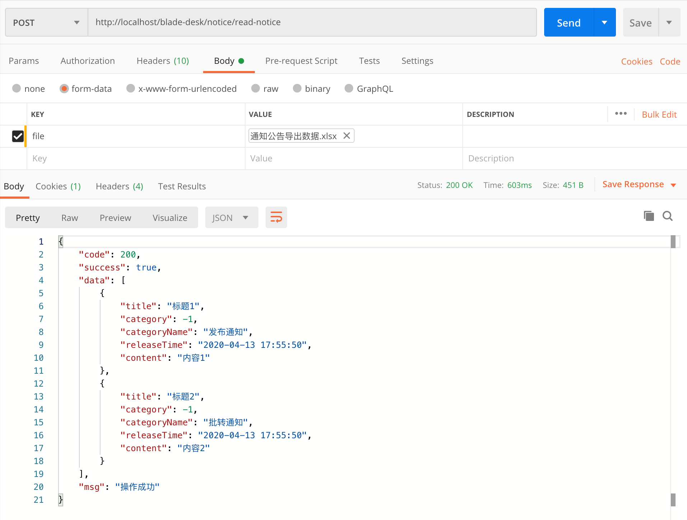
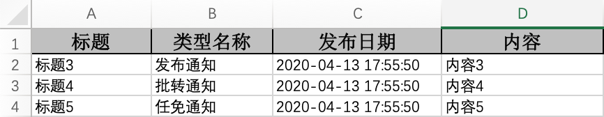
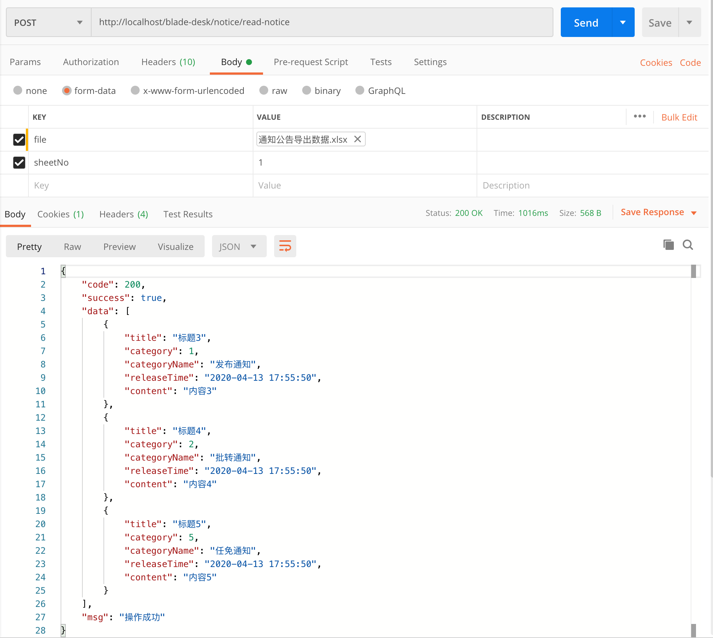
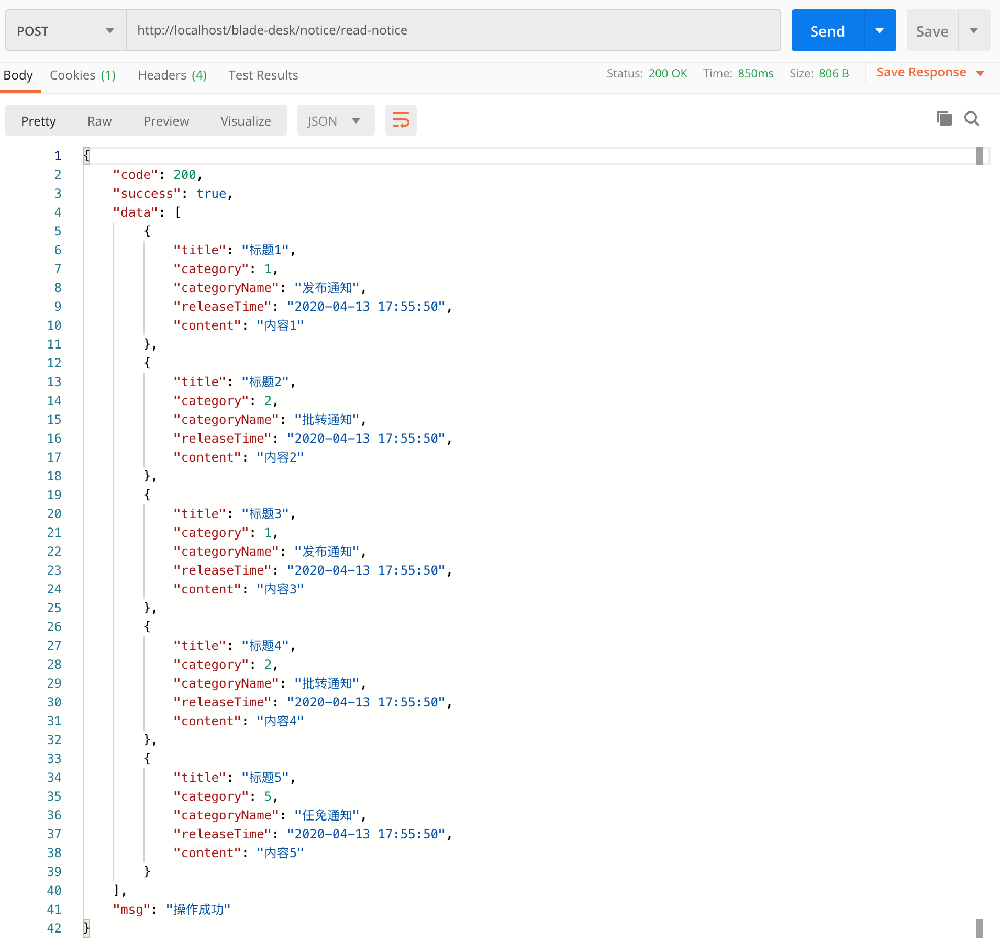

## Excel读取
### 一、开始尝试
1. 在`NoticeController`下新建接口 `readNotice`, 读取excel文件并返回list数据
~~~
@PostMapping("read-notice")
public R<List<NoticeExcel>> readNotice(MultipartFile file) {
   List<NoticeExcel> list = ExcelUtil.read(file, NoticeExcel.class);
   return R.data(list);
}
~~~
2. 使用postman调用接口并上传我们上一章节导出的excel文件，查看返回数据，发现数据正确，但是category为-1

3. 对数据进行优化，通过字典缓存，回插对应的字段值
~~~
@PostMapping("read-notice")
public R<List<NoticeExcel>> readNotice(MultipartFile file) {
   List<NoticeExcel> list = ExcelUtil.read(file, NoticeExcel.class);
   list.forEach(noticeExcel -> {
      String category = DictCache.getKey("notice", noticeExcel.getCategoryName());
      noticeExcel.setCategory(Func.toInt(category));
   });
   return R.data(list);
}
~~~
4. 重启服务再次调用，查看返回结果，category字段已经回插成功

### 二、拓展用法
1. 除此之外，工具类还支持指定sheet来进行数据读取，若不指定sheet则是读取所有sheet再返回List
2. 我们先改造下导出的excel，增加sheet，增加一行

4. 方法修改如下
~~~
@PostMapping("read-notice")
public R<List<NoticeExcel>> readNotice(MultipartFile file, Integer sheetNo) {
   List<NoticeExcel> list = ExcelUtil.read(file, sheetNo, NoticeExcel.class);
   list.forEach(noticeExcel -> {
      String category = DictCache.getKey("notice", noticeExcel.getCategoryName());
      noticeExcel.setCategory(Func.toInt(category));
   });
   return R.data(list);
}
~~~
4. 使用postman调用接口，指定sheet2(sheetNo从0开始，sheet2对应的就是1)，可以看到数据返回成功。

5. 去掉sheetNo字段，再次调用postman，可以看到返回了两个sheet的一共五条数据
~~~
@PostMapping("read-notice")
public R<List<NoticeExcel>> readNotice(MultipartFile file) {
   List<NoticeExcel> list = ExcelUtil.read(file, NoticeExcel.class);
   list.forEach(noticeExcel -> {
      String category = DictCache.getKey("notice", noticeExcel.getCategoryName());
      noticeExcel.setCategory(Func.toInt(category));
   });
   return R.data(list);
}
~~~

