## BladeX启动
1. 配置blade-report工程的数据源，默认与主工程一致
 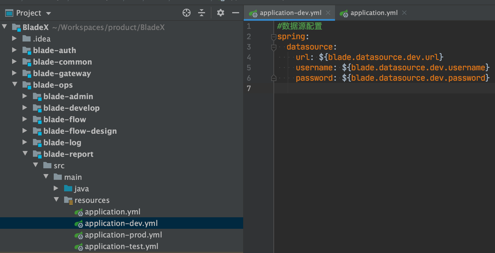
2. 启动ReportApplication
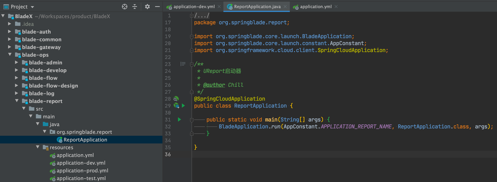
3. 看到如下日志则说明启动成功
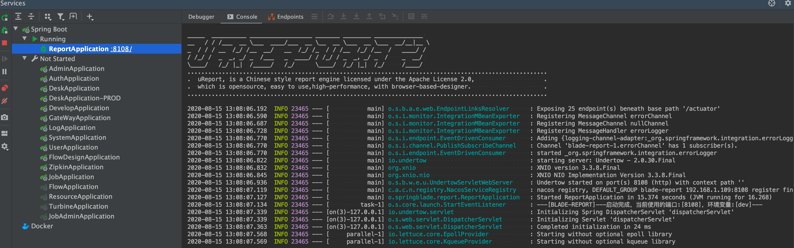
4. 访问:[http://localhost:8108/ureport/designer](http://localhost:8108/ureport/designer)，若看到如下界面则说明启动成功
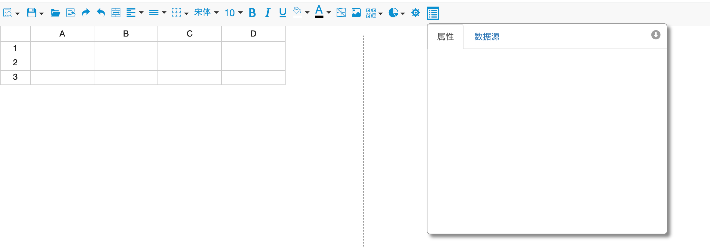

## BladeX-Boot启动
1. 开启报表配置
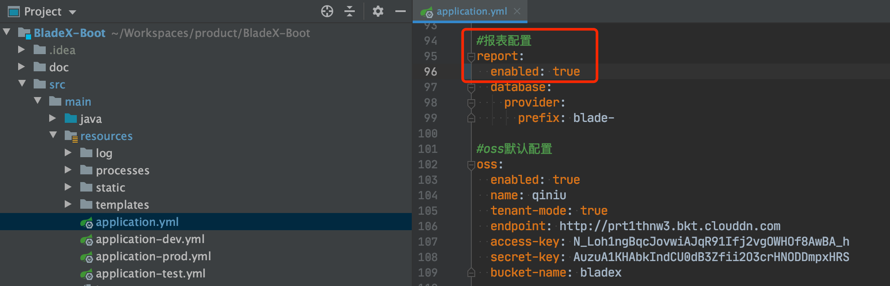
2. 启动Application
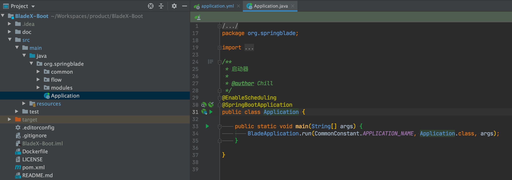
3. 看到如下日志则说明启动成功
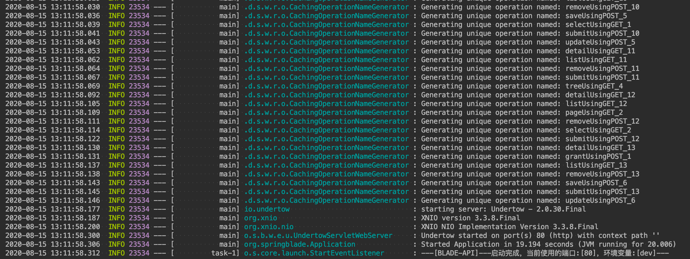
4. 访问:[http://localhost/ureport/designer](http://localhost/ureport/designer)，若看到如下界面则说明启动成功
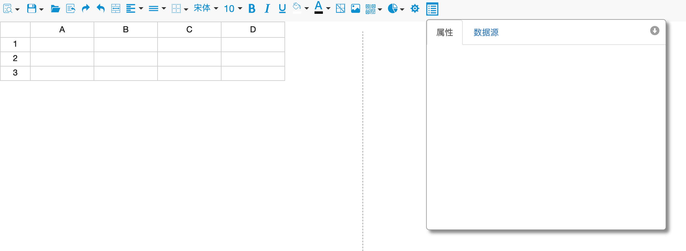

## 前端启动
1. 修改website.js的reportUrl值，注意两个版本的端口号
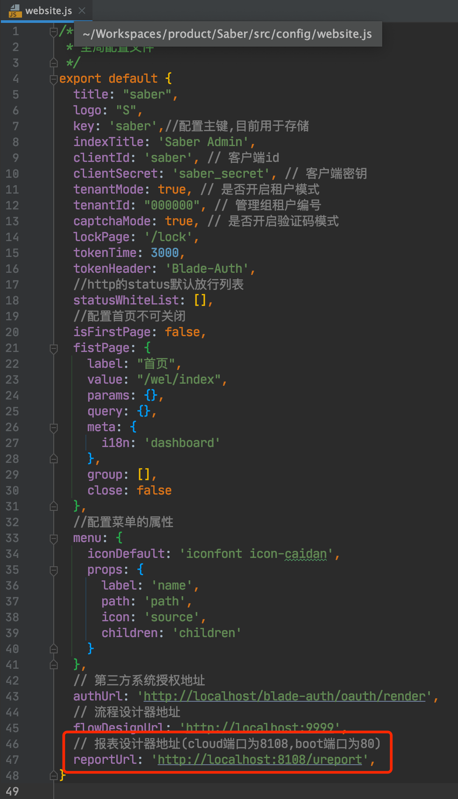

## 菜单配置
1. 修改报表配置和报表公告两个菜单的地址，注意两个版本的端口号
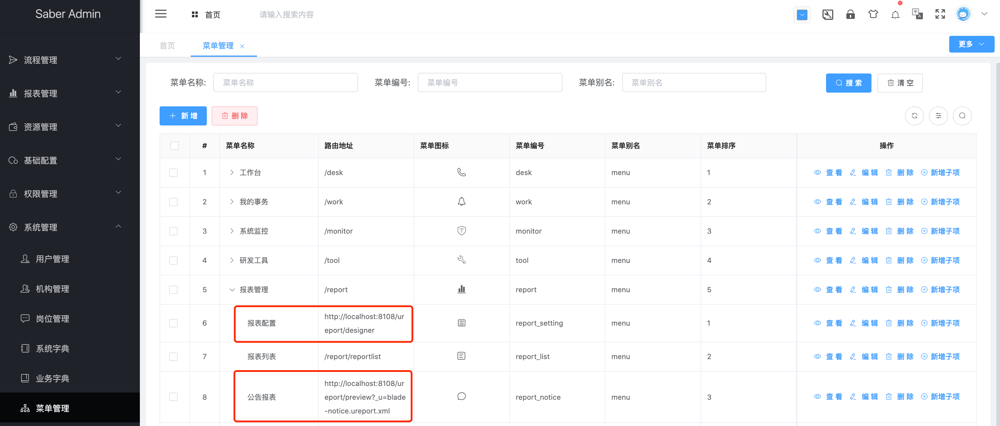
2. 刷新界面，访问报表配置，如果显示了界面则表示配置成功
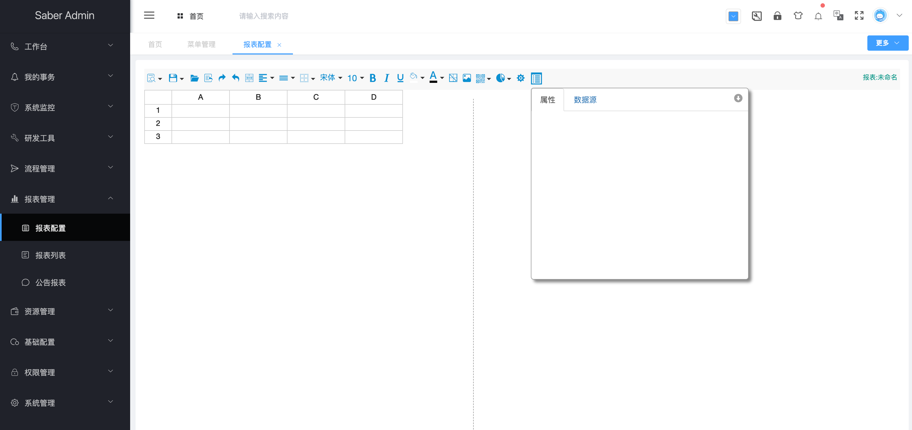
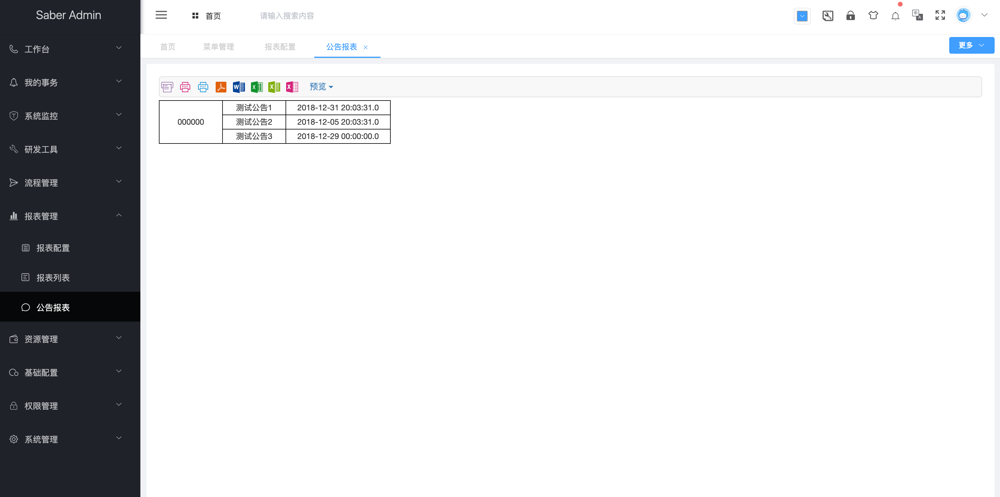

