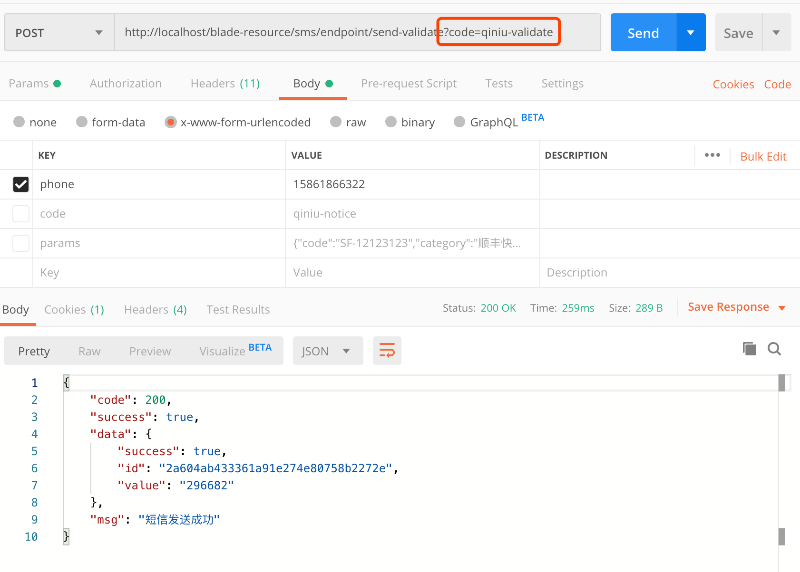

## 简介
* 多租户短信系统整合了不同的第三方sms服务，并统一成一个抽象接口
* 默认情况下，在SaaS系统中，每个租户使用系统配置的短信服务都会相互隔离互不影响
* 除此之外，用户也可以自定义配置属于自己的sms，这样发送的短信便是可以自己进行定义了
* 以上两种策略，大大的提高了每个租户短信服务的可定制化，提高了整个SaaS系统的灵活性。

## 如何使用
1. 进入`资源管理->短信配置`,新建sms对应的配置
2. 选择某一条数据进行`启用` 

3. 调用接口进行测试，查看返回与短信

4. 可以看到接口返回的值与短信收到的验证码完全一致

4. 由于我们选择的是验证码模板，可以调用验证接口查看接受的短信验证码是否可以验证通过
5. 输入接口返回的id和value值，调用接口校验，发现校验成功（注意⚠️：后续版本需要额外加上phone参数才可以正确校验）

6. 若是其他的模板不需要验证，那直接调用通用的发送接口便可以了

## 资源编号
1. Sms配置的`资源编号`字段，主要是为了可以在多个配置的情况下，不受`启用`状态影响，可以自由指定对应的配置来实现短信发送

2.  `启用` 可以看作是默认的sms短信配置，如果系统有多处地方要用到不同的配置，那么只需要在接口上多加一个参数`code`即可
3. 比如现在启用的是阿里云的配置
4. 现在修改接口，多传一个参数`code`为七牛的资源编号，可以看到返回的就是七牛的资源信息了
5. 由此一来，系统配置了多套sms后，在不同的场景就可以很自由地选择需要调用的sms配置从而调用不同的短信模板了

## 上传调试
1. 为了方便让大家快速测试配置的参数是否正确，bladex贴心地提供了针对配置的调试功能
2. 我们只需要在需要调试的那行配置，点击`调试按钮`即可
3. 选择阿里云短信的配置，自定义一个验证码，点击调试，可以看到手机收到的完全一致

## 统一入口
1. 多租户短信系统将单独起来，独立成一个服务，对外提供rest api进行调用
2. 对外提供服务的类路径如下：`org.springblade.resource.endpoint.SmsEndpoint`
3. 若有复杂场景需求，大家可以自行拓展增强相关功能

## 后记
* 通用发送接口推荐用于测试，不推荐用于生产环境，因为不小心泄露了，那容易被人钻漏洞从而薅羊毛
* 推荐调用不同场景的短信接口时，可以像SmsEndpoint一样，自定义对应的场景，写死相关参数值，这样就提高了安全等级
* 详细代码请看下图

