## 简介
Dubbo是一款高性能、轻量级的开源Java RPC框架，它提供了三大核心能力：面向接口的远程方法调用，智能容错和负载均衡，以及服务自动注册和发现。
## 官网
* 官网地址：[http://dubbo.apache.org/zh-cn/](http://dubbo.apache.org/zh-cn/)
* 文档地址：[http://dubbo.apache.org/zh-cn/docs/user/quick-start.html](http://dubbo.apache.org/zh-cn/docs/user/quick-start.html)
* 使用之前，请先完整过一遍官方文档

## 如何使用
1. 打开BladeX-Biz工程（因为BladeX核心框架使用的是Feign，所以Dubbo采用example的形式集成）
2. 我们先来看下一个dubbo服务完整的目录结构是怎样的
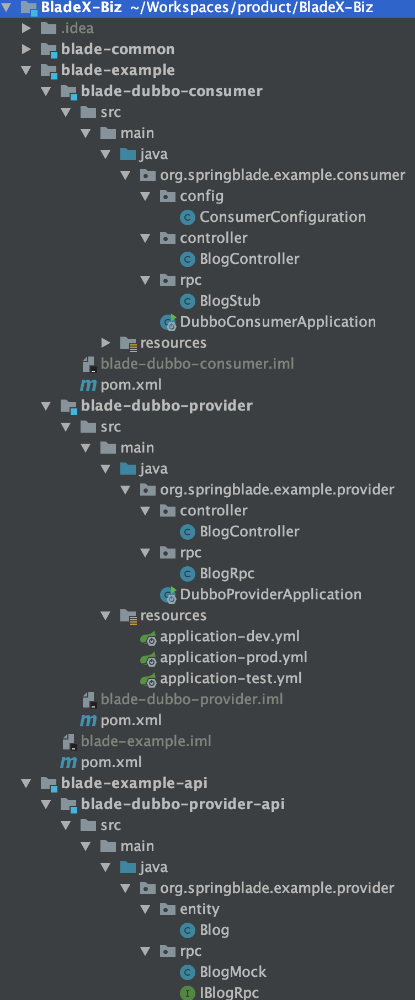
3. 可以看到，一共有3个模块，他们分工明确，具体代表意义如下：
* blade-dubbo-consumer（服务消费者，服务调用方）
* blade-dubbo-provider（服务生产者，服务提供方）
* blade-dubbo-provider-api（服务生产者api，提供消费者调用）
4. 编码流程
* 创建生产者api，定义RPC接口以及设计的entity、mock（可以粗略地看成是feign的fallback）
* 创建实体类
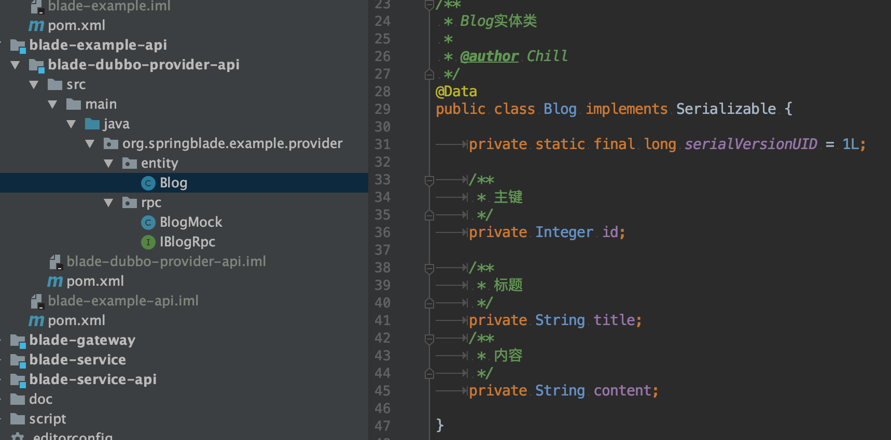
* 创建RPC接口类
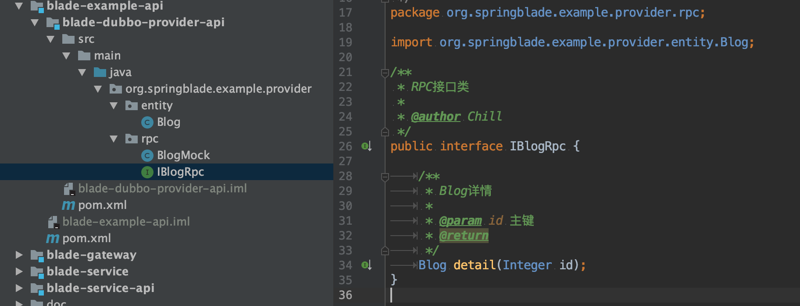
* 创建RPC的Mock类
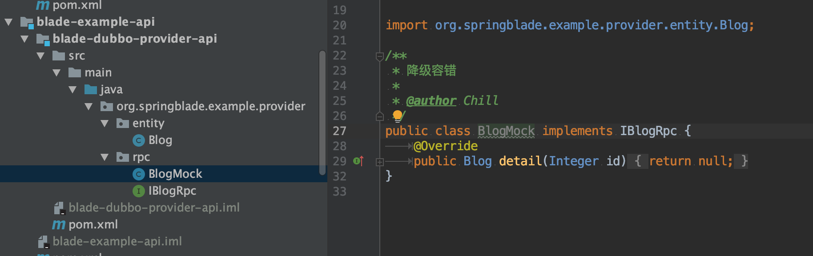
* 创建生产者服务，实现RPC接口
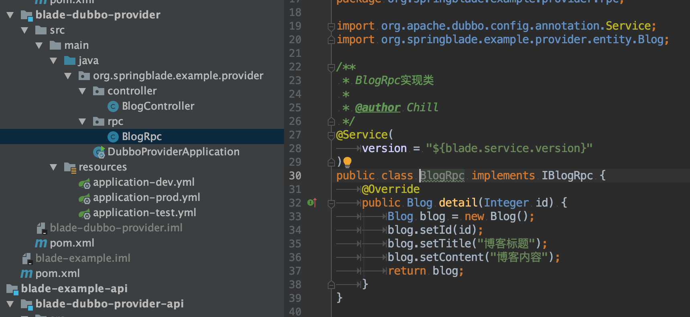
* 配置生产者dubbo协议端口
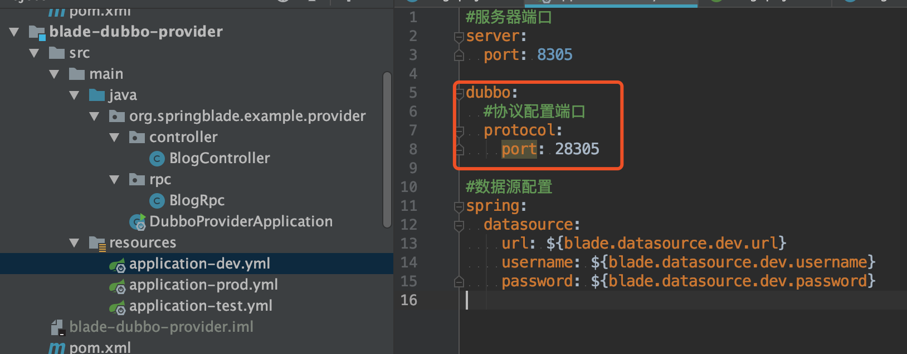
* dubbo通用配置已交由LauncherService统一配置，其他模块引入blade-common自动生效
* 创建消费者服务，并配置dubbo协议端口
* 创建本地存根（具体介绍请看：[http://dubbo.apache.org/zh-cn/docs/user/demos/local-stub.html](http://dubbo.apache.org/zh-cn/docs/user/demos/local-stub.html)）
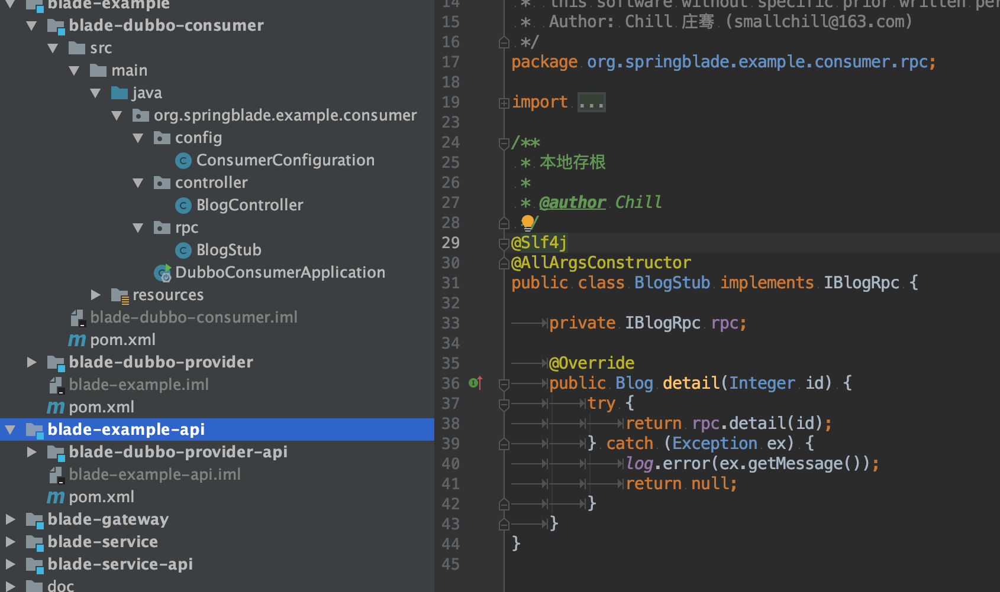
* 消费者服务暴露外部接口，并调用RPC
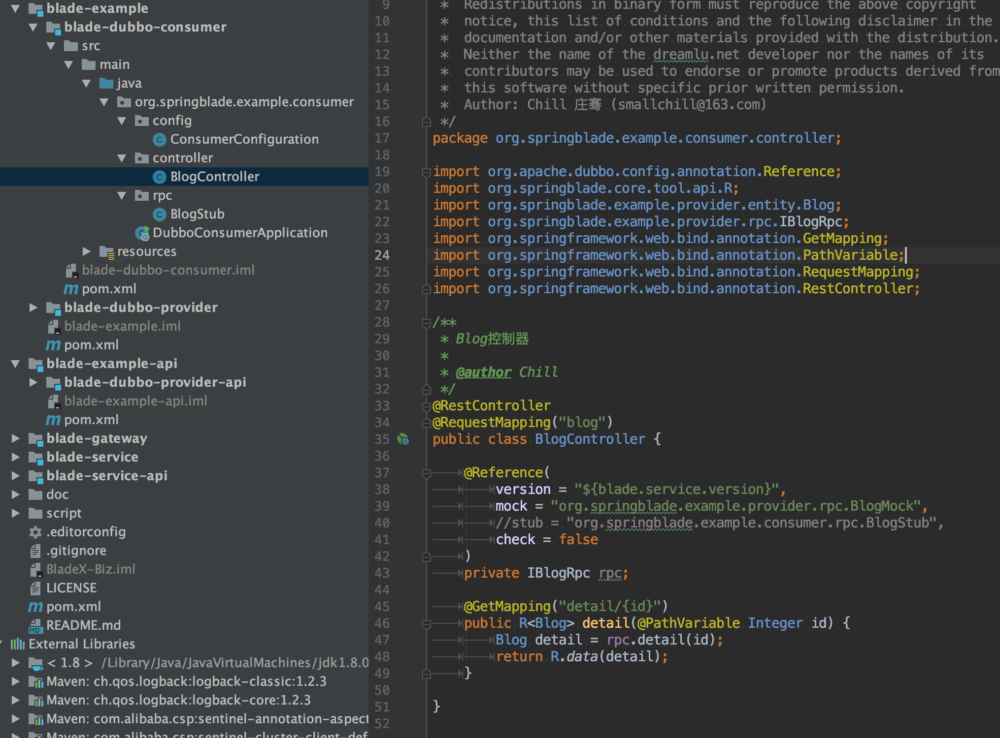
5. 启动gateway、provider、consumer三个服务，看到nacos已经注册成功
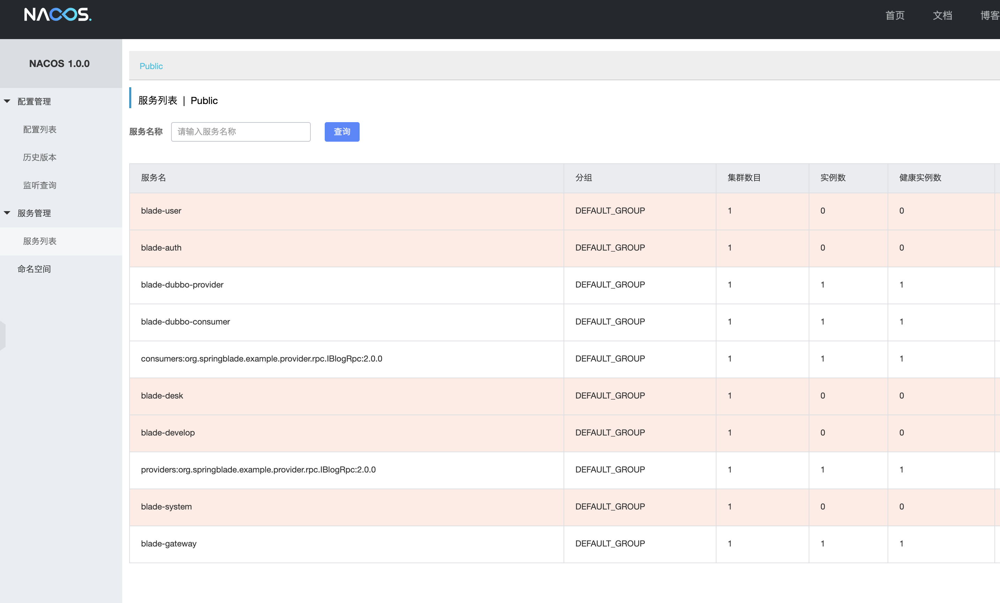
6. 访问消费者暴露的接口，发现RPC注入成功，同时也调用成功
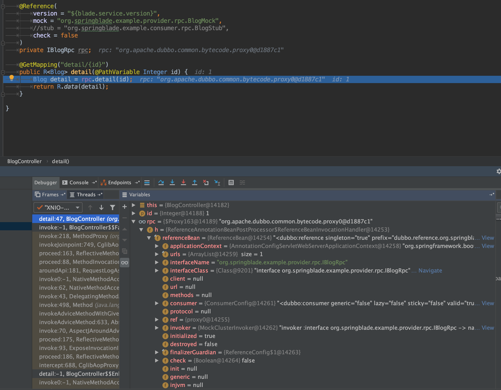
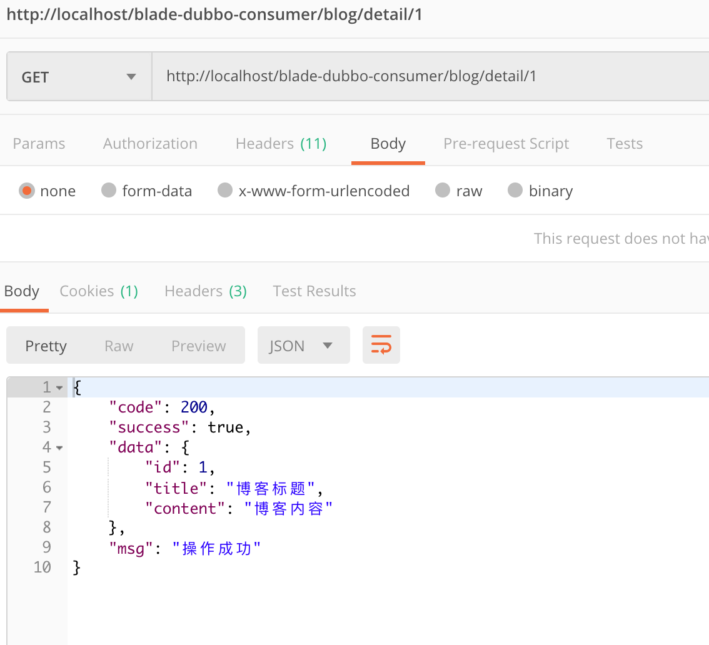

## 结尾语
一个基于Dubbo的RPC服务已经全部实现，剩下的就等大家在此基础上进行拓展了～

