## 前言
* gateway默认会将服务名作为路由地址，比如服务名为blade-desk，那么我们就可以通过`http://gateway/blade-desk/**`    进行请求转发
* 但是有些时候，我们需要对网关进行额外的配置，比如做个反向代理、转发服务名改为其他名称
* 这种情况，一般需要前往bootstrap.yml文件进行配置，可是这样带来的问题是每次修改都需要重新打包，可见这并不是一个可以采纳的解决方案
* 有没有可以不重新打包，不重启就能设置网关配置项的方案？动态网关的方案由此而来。

## 说明
* BladeX采用了基于Nacos定制轻量级、高拓展性的动态网关方案
* 配置文件将保存在Nacos中，若网关配置有改动，直接修改发布便可即时刷新

## 如何操作
1. 找到对应的配置文件
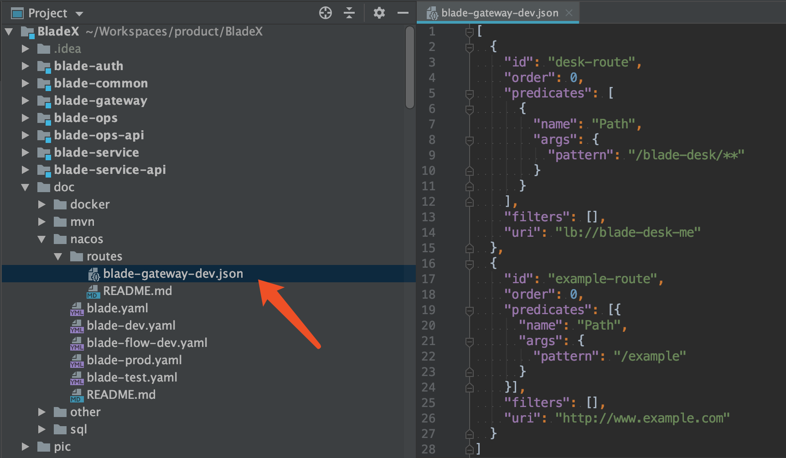
2. 到nacos添加对应配置(**如果有其他同名的服务注册，需要把order的值改成-1或者更小，否则无法转发到本地**)
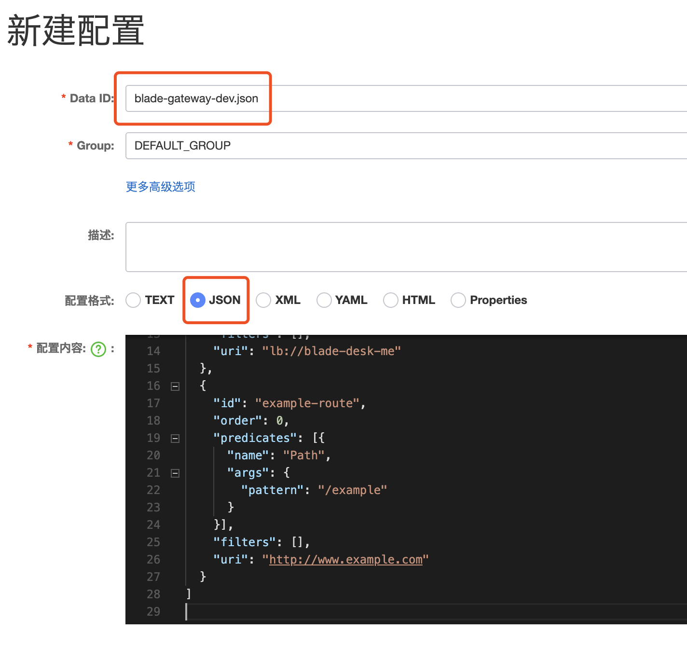
3. 启动blade-gateway以及blade-desk
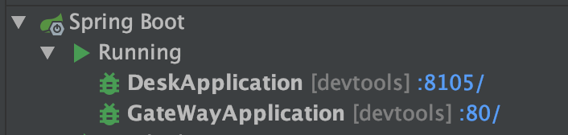
4. 访问 http://localhost/example
5. 发现反向代理配置成功

6. 这时候我们先访问下 http://localhost/test , 发现返回的是404
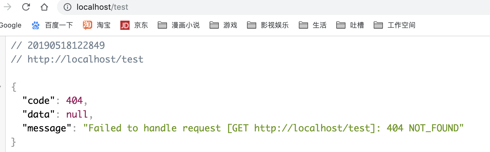
7. 前往nacos编辑配置，并保存
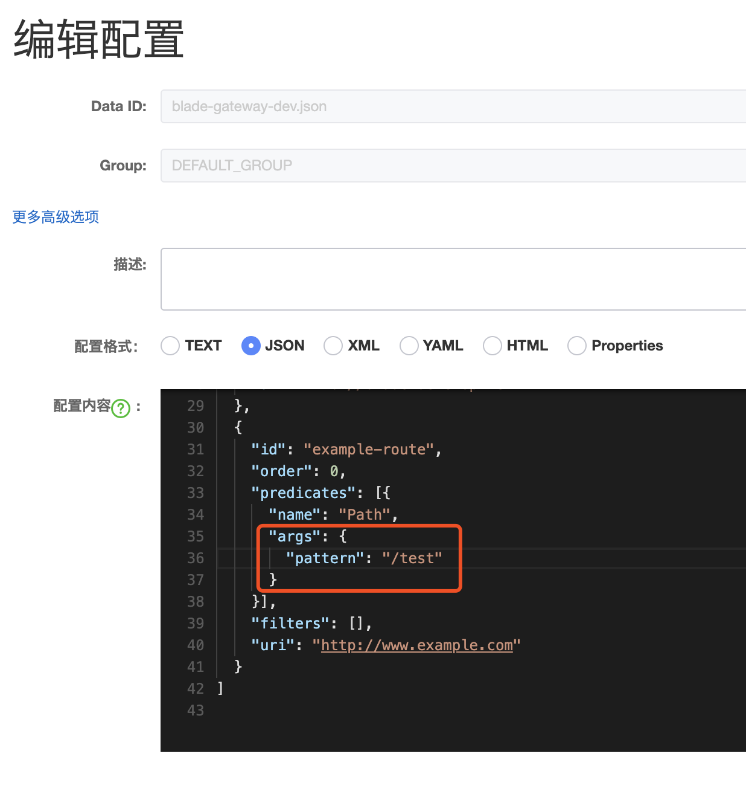
8. 不用重启gateway，再次访问 http://localhost/test 发现动态网关配置已经生效
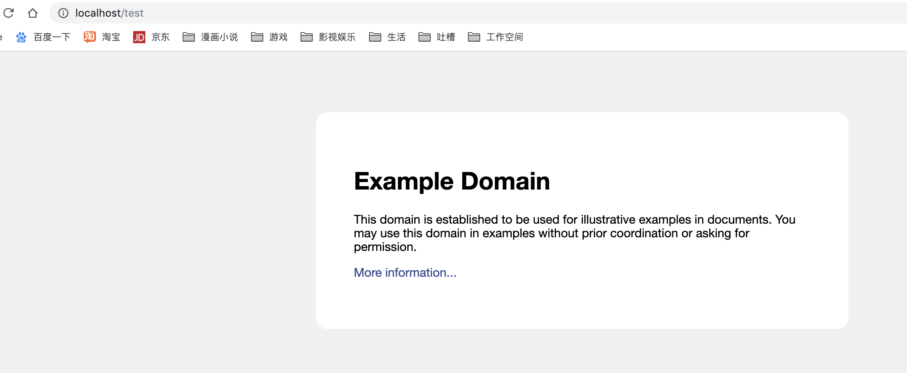

## 团队协作之动态网关
* 相信很多公司都会有共同的烦恼，那就是多个团队注册了多个同名的服务至公共的nacos服务器，这时候比如 blade-desk 服务就注册有七八个，gateway调用时会采用负载均衡算法，按照规则调用其中的某个服务
* 那么问题来了，如果其中某个人想对 blade-desk 进行调试，就会碰到问题，因为不知道什么时候负载均衡才能调用到自己本地的服务
* 这时候，动态网关便可以完美解决这类问题，不需要改代码只需要改动nacos即可满足需求
## 详细步骤
1. 首先修改自身 gateway 以及需要调试的服务名，一般我们会以自己的花名或英文名进行后缀命名区分。这样区分后，便不会与他人冲突，我们可以用gateway的反代指向属于自己的服务
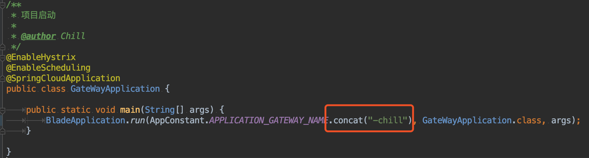
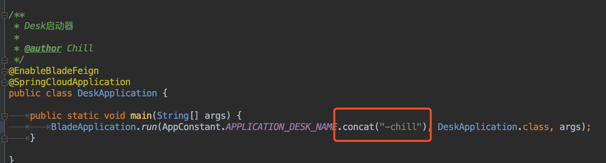
2. 当然，为了防止gateway的配置与他人冲突，我们也需要创建一份属于自己的gateway配置，到nacos创建 blade-gateway-chill-dev.json
 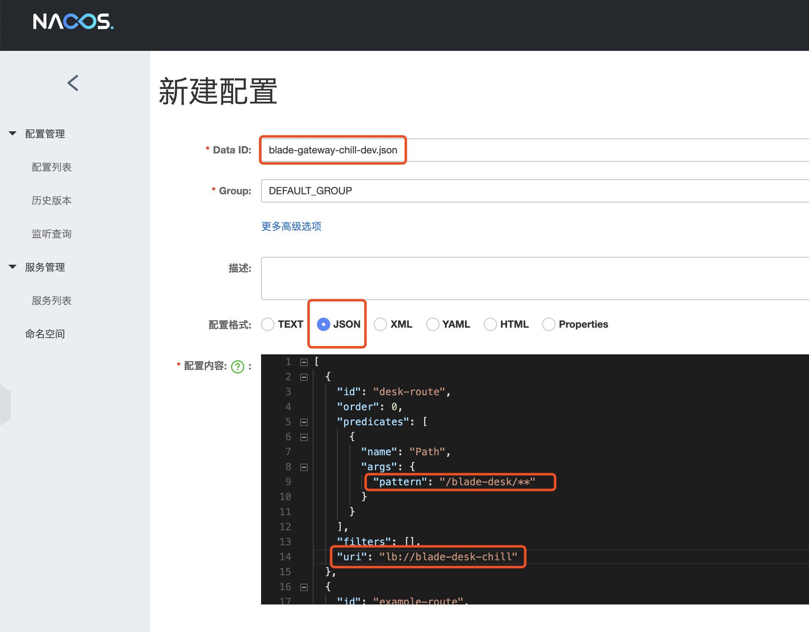
3. 重启发现带有自己英文名的gateway以及desk已经注册成功
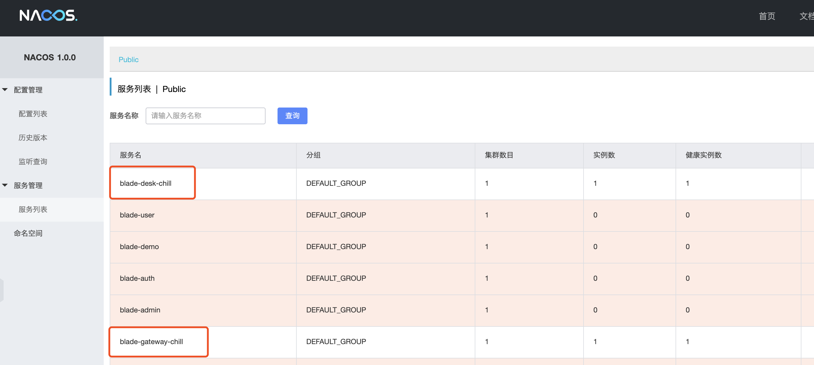
4. 测试新配置的反代已经成功
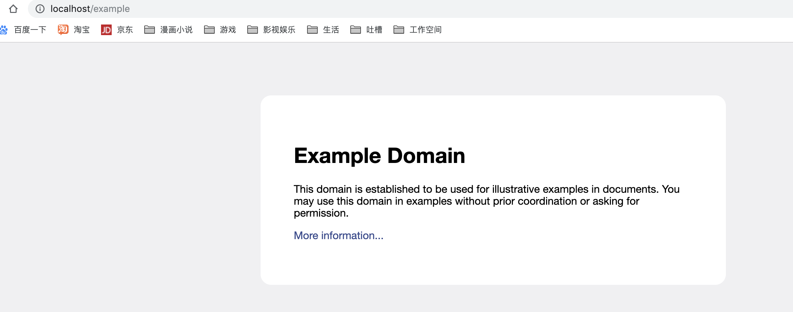
5. 测试desk原生服务名，发现成功
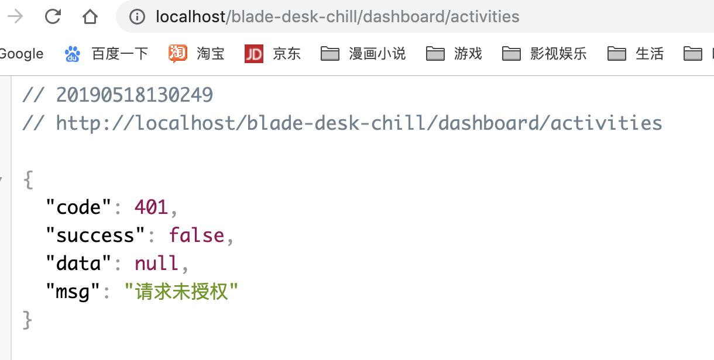
6. 但是返回是未授权，我们先在nacos配置将其放行，因为是授权放行生成的拦截器，所以有改动的时候，需要重启gateway
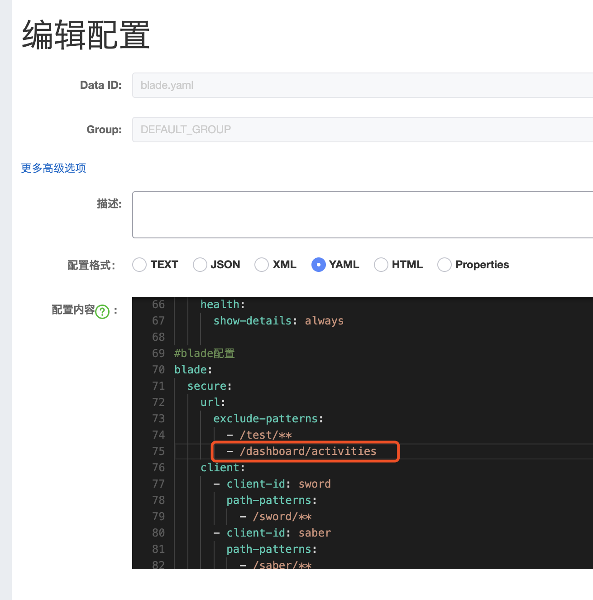
7. 放行后发现接口返回成功
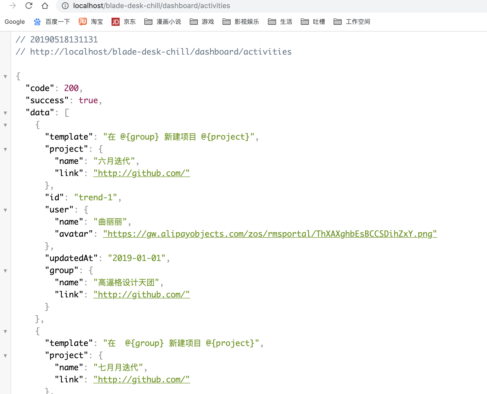
8. 将地址改为反代的通用地址，发现接口也正常返回，并且原生的blade-desk服务并没有开启，说明动态网关的配置成功。
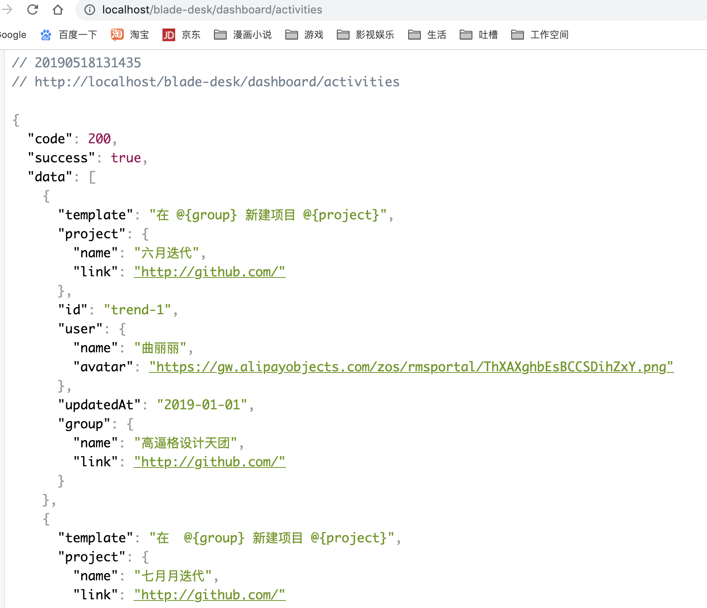

## 结尾语
* 动态网关非常实用，并且有更多的配置等待大家前往探索～
* 如此一来，借助动态网关+自定义服务，即可完美解决多团队共同注册服务的问题
* BladeX封装的动态网关参数为官方的`RouteDefiintion`类属性，所以并没有额外的学习成本，一切按照官方配置即可
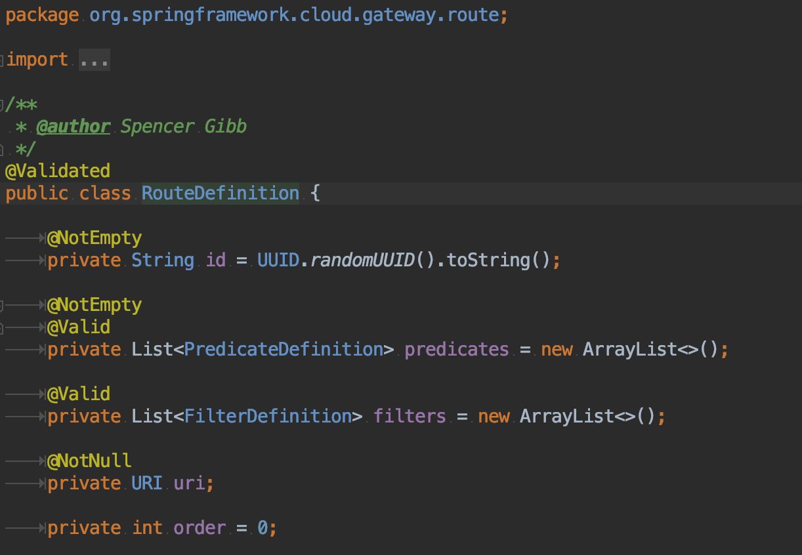
* 具体实现逻辑可参考：[http://springcloud.cn/view/412](http://springcloud.cn/view/412)
* 本地开发及服务与docker部署的服务相连通，可参考：[https://blog.whsir.com/post-2809.html](https://blog.whsir.com/post-2809.html)
