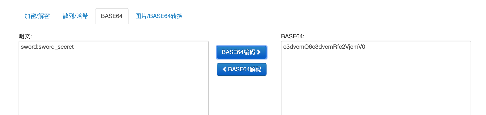
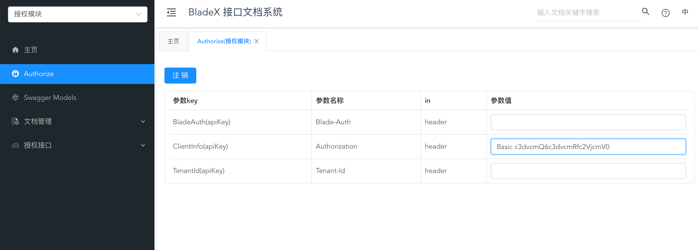
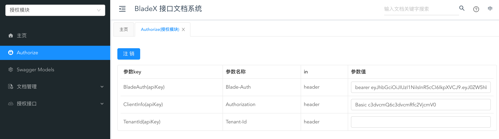
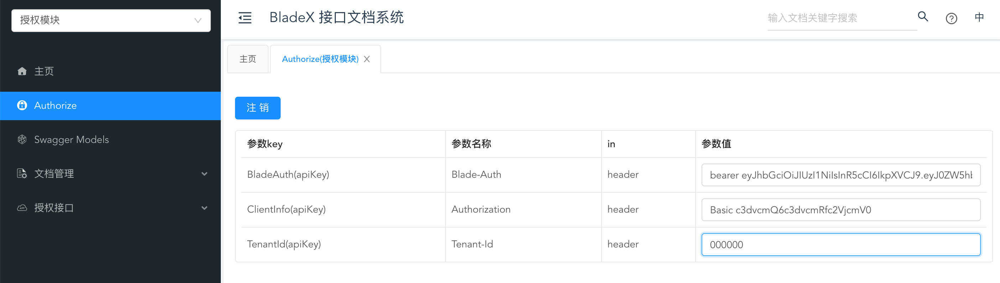
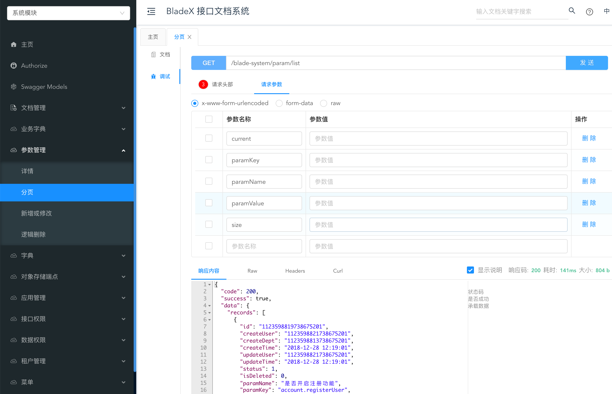
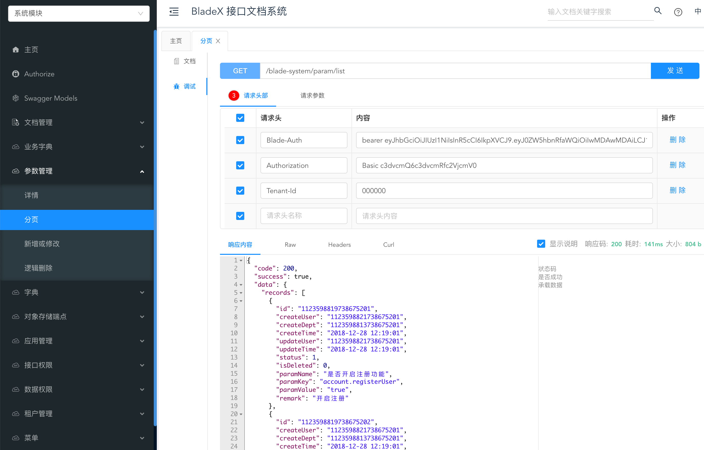

## 配置客户端
* 打开接口文档系统[http://localhost/doc.html](http://localhost/doc.html)，设置客户端认证的请求头。`（"c3dvcmQ6c3dvcmRfc2VjcmV0"为clientId:clientSecret串转换为的base64编码`  

* 点击左上角的`Authorize`，配置`Authorization`请求头

## 配置token
* 获取上一章节中调用`/oauth/token`接口返回的参数 `token_type` 和 `access_token`，将他们拼接起来并以逗号隔开
* 点击左上角的`Authorize`，配置`Blade-Auth`请求头
* 请求头对应的值为  `tokenType` + `' '` + `accessToken`

* 配置租户编号，这里我们设置为`000000`

## 配置生效
* 保存完毕后浏览器刷新，再打开对应的接口，这时候会发现接口直接调用成功

