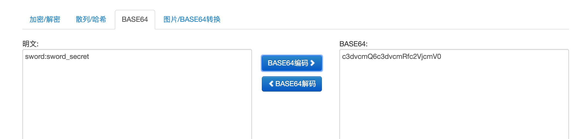
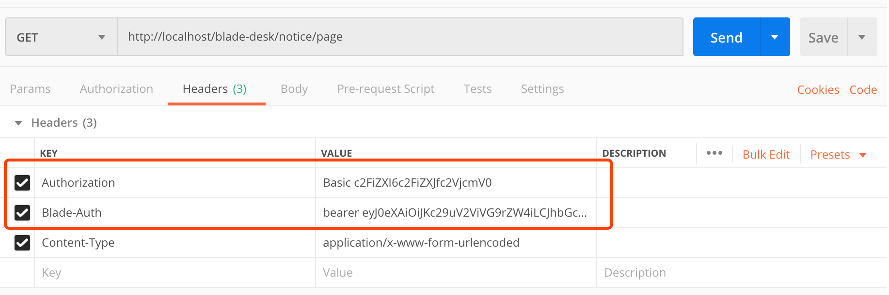

## 接口调用说明
* 上一章节的swagger是如此配置，其实后续用postman调用api接口的时候也是如此

## Authorization请求头获取
* 设置客户端认证的请求头，设置请求头为`Authorization`，请求头对应的值为`Basic c3dvcmQ6c3dvcmRfc2VjcmV0`
`（"c3dvcmQ6c3dvcmRfc2VjcmV0"为clientId:clientSecret串转换为的base64编码`  

## Blade-Auth请求头获取
* 获取上一章节中调用`/oauth/token`接口返回的参数 `token_type` 和 `access_token`，将他们拼接起来并以逗号隔开
* 配置`Blade-Auth`请求头，请求头对应的值为  `tokenType` + `' '` + `accessToken`

## Postman配置
* 打开postman，设置对应的请求头即可

