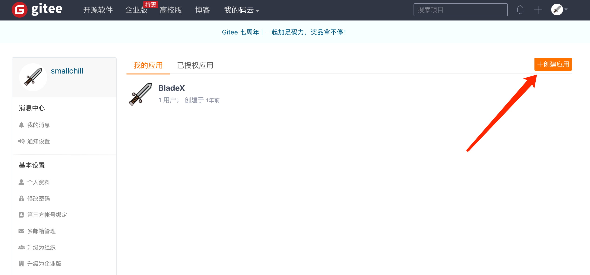
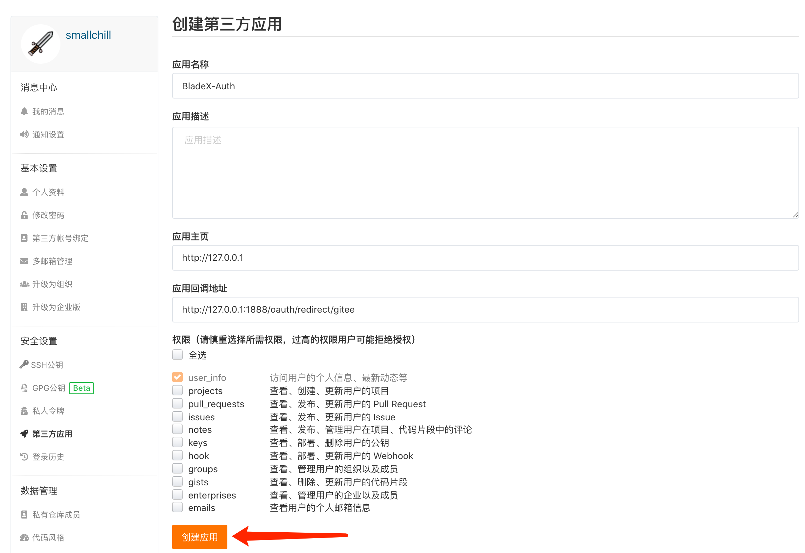
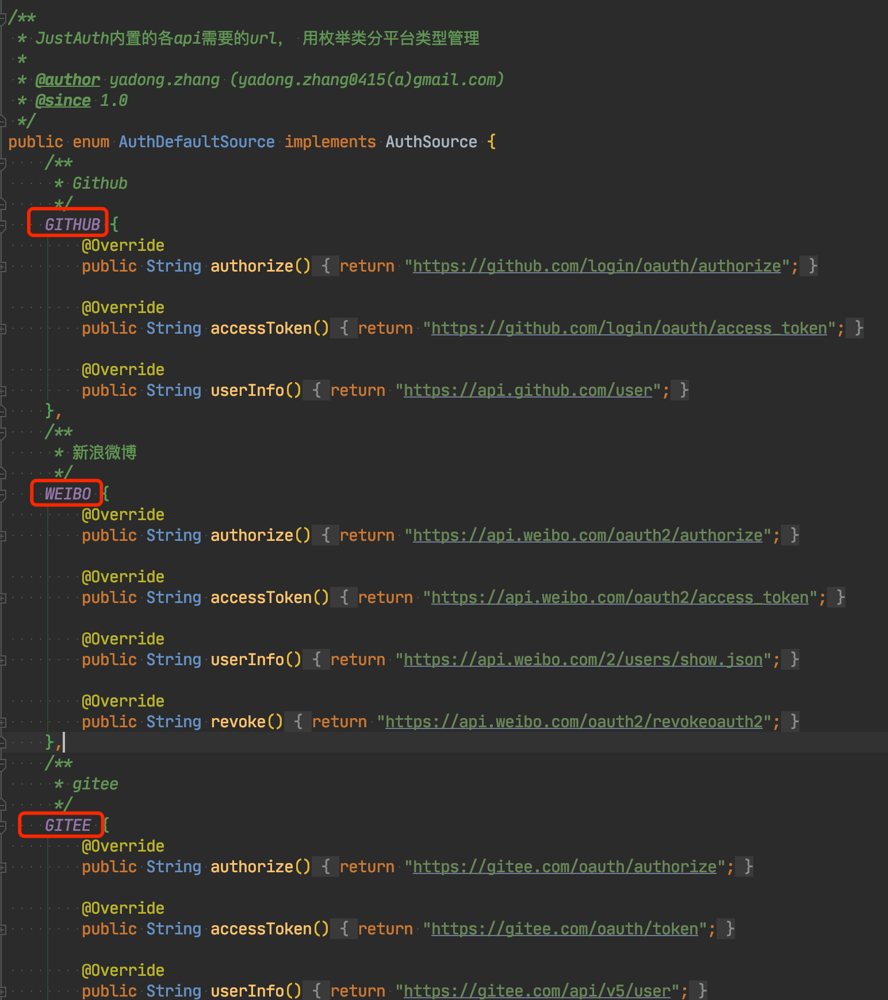
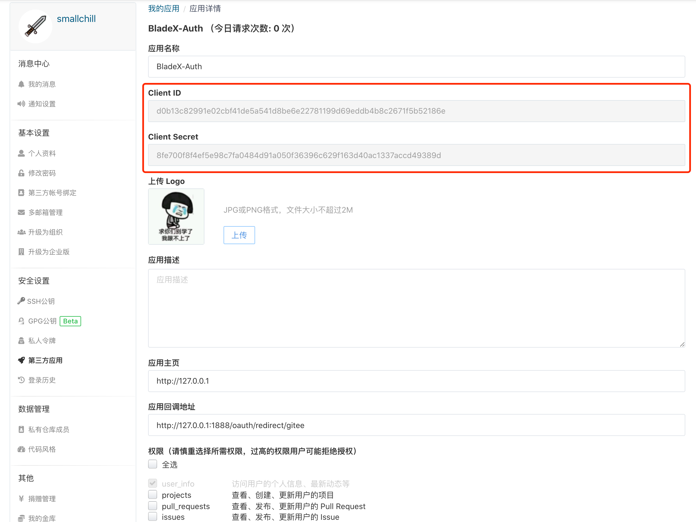

## 创建应用并获取Key
1. 登录Gitee : [https://gitee.com](https://gitee.com)
2. 进入第三方应用：[https://gitee.com/oauth/applications](https://gitee.com/oauth/applications)
3. 创建应用，填上所需的配置，重点为：应用回调地址


*   **应用名称**：填写自己的网站名称
*   **应用描述**： 填写自己的应用描述
*   **应用主页**： 填写自己的网站首页地址
*   **应用回调地址**： 【重点】该地址为用户授权后需要跳转到的自己网站的地址 
1）这里填写为 ( http://127.0.0.1:1888/oauth/redirect/gitee ) 
2）其中分为两部分，一部分为前缀：( http://127.0.0.1:1888 )，一部分为后缀( gitee )，中间的( /oauth/redirect )为固定
3）前缀为最终部署的前端地址，因为授权成功后会直接跳转到对应的前端，然后携带所需的参数，前端再进行解析并登录，所以这个地址不能出错
**注意：若部署在nginx，需要给这个回调地址加一段配置，否则会触发404，具体配置如下**
    ```
        location ^~ /oauth/redirect {
            rewrite ^(.*)$ /index.html break;
        }
    ```
    4）后缀需要与JustAuth内定义的Key相对应，一般填入Key小写。具体Key的枚举，请看：    [https://github.com/justauth/JustAuth/blob/master/src/main/java/me/zhyd/oauth/config/AuthDefaultSource.java](https://github.com/justauth/JustAuth/blob/master/src/main/java/me/zhyd/oauth/config/AuthDefaultSource.java)
5） 举个例子，若我们需要配置的是微博的第三方登录，那么回调地址就是 ( http://127.0.0.1:1888/oauth/redirect/weibo )

*   **权限**： 根据页面提示操作，默认勾选第一个就行
4. 以上信息输入完成后，点击确定按钮创建应用。创建完成后，点击进入应用详情页，可以看到应用的密钥等信息

5. 等到我们获取到clientId与clientSecret后，准备工作就结束了，接下来我们把他配置到BladeX中，看一下第三方登录是否生效
