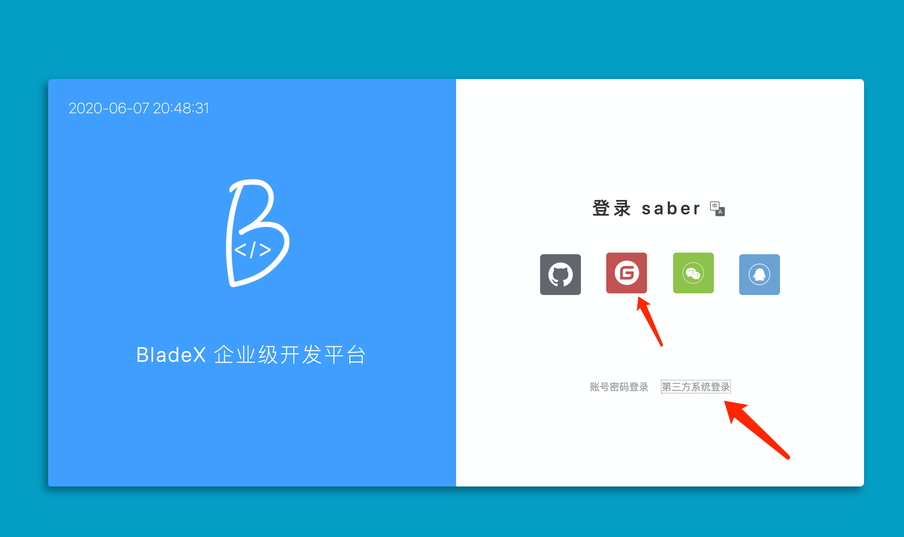
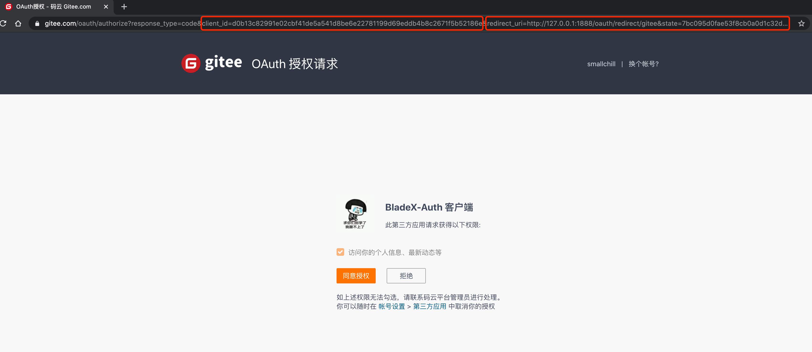
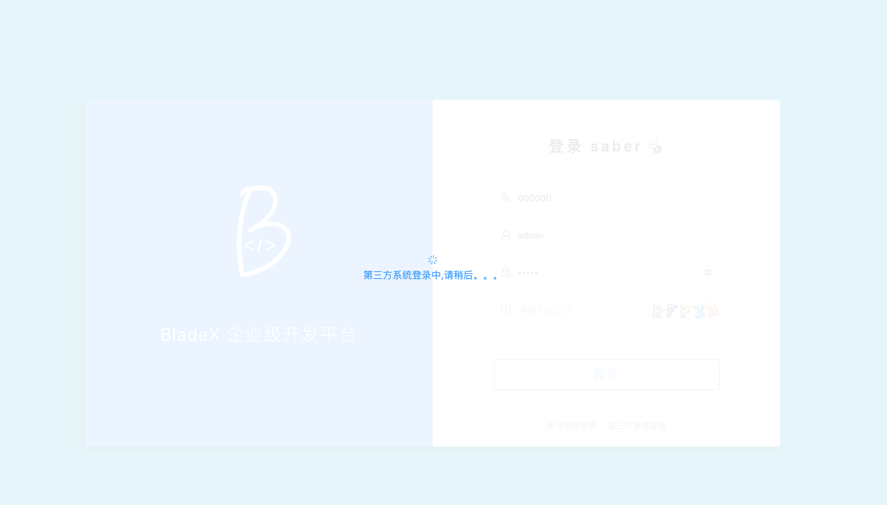
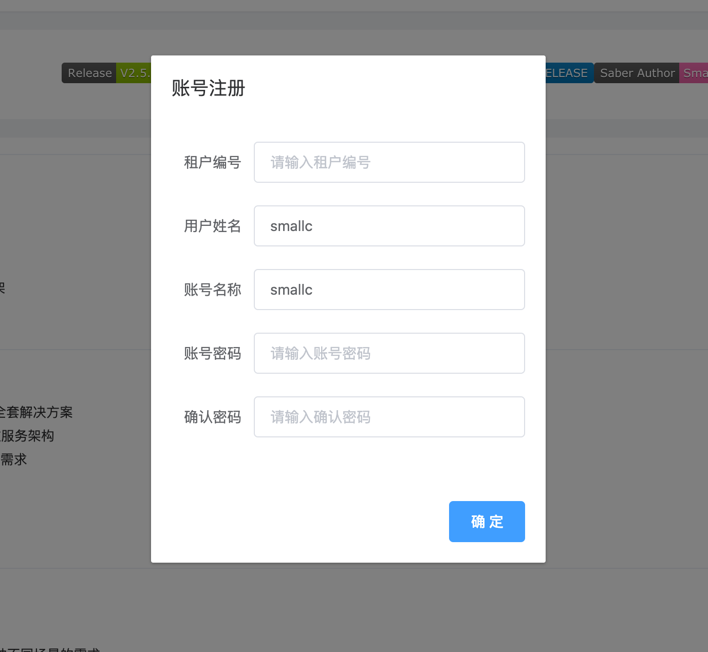
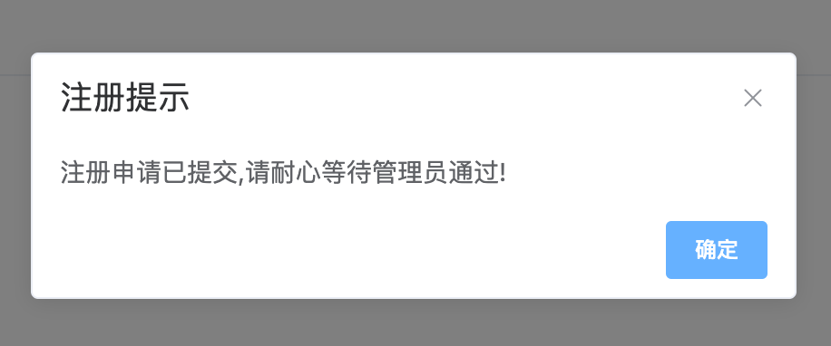
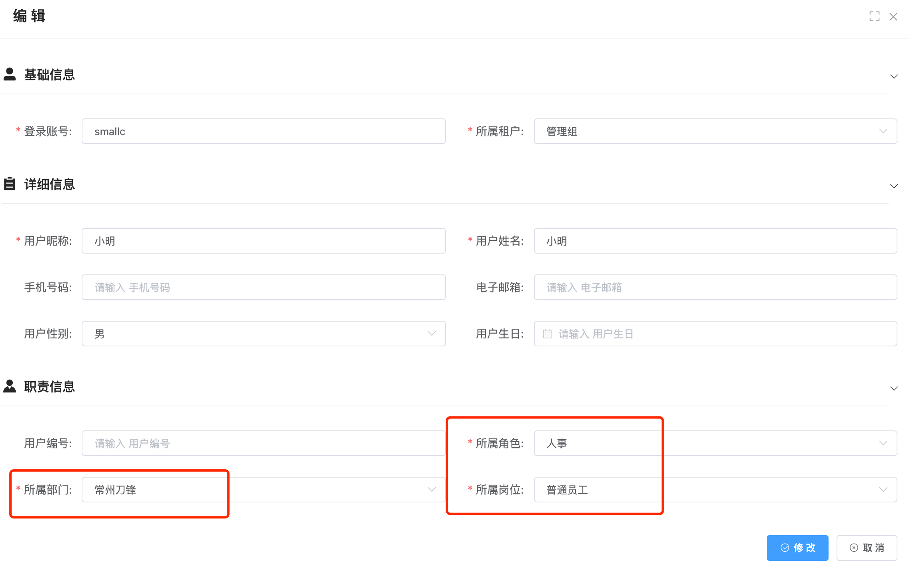
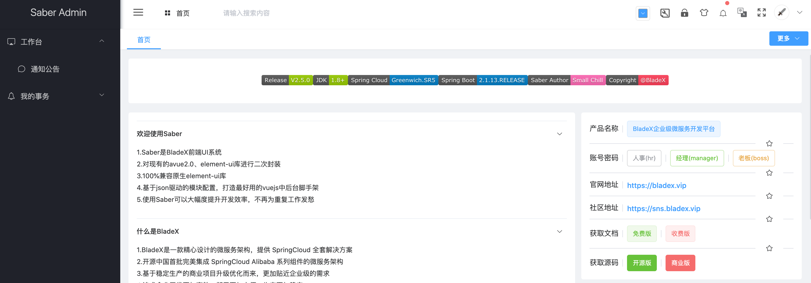
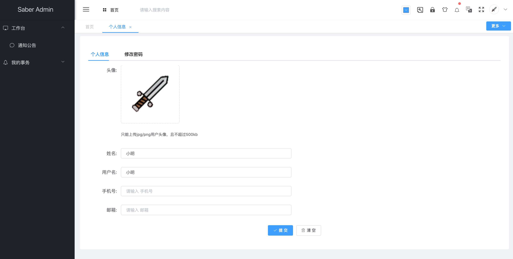
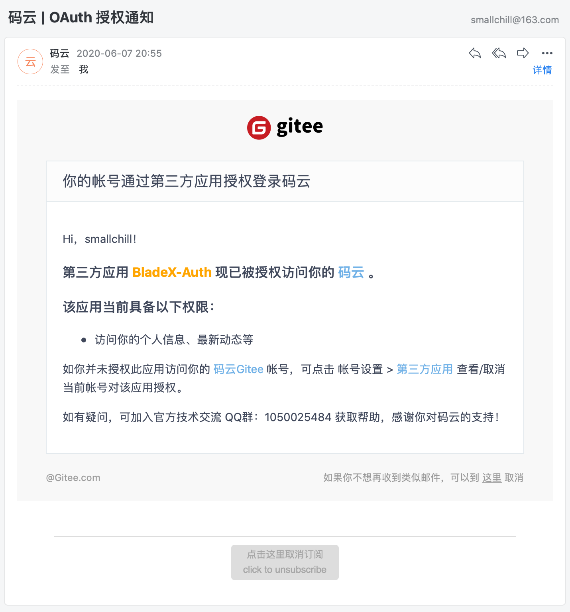

## 第三方系统登录详细操作流程
1. 启动前后端，访问前端首页

2. 点击跳转，可以看到，地址栏的clientId与我们刚刚配置的一致

3. 输入账号密码点击登录，同样可以看到，地址栏的信息与我们配置的一致

4. 点击同意授权，便会自动跳转会我们的前端系统，然后进行登录

5. 登录成功后BladeX会在后台检测该用户是否已经注册在系统内拥有自己的账号，若没有，第一次登录成功会弹出一个小框提供快速注册。（注：目前很多网站，使用第三方登录后，都会提示再注册一个账号或者使用手机+验证码的方式快速注册，否则只可以使用基础功能。这是常用的一个套路，因为这么做了就可以获取到用户的信息，提升用户粘性，若是手机注册，后续还可以发送营销短信，从商家的角度考虑，这无形中是一个非常省钱收益又大的功能。从用户角度考虑，只要营销不是太过分，都会默认接受。）（**如果采用租户+定制域名的方式部署，则系统会自动读取租户编号，快捷注册的时候不会再弹出。只有使用通用域名没有绑定租户的时候，才会弹出租户编号让用户自行选择注册再那个租户下，具体租户域名配置，请看文档5.2.2章节**）

6. 我们输入基本信息和账号密码，并点击提交，最后就会跳转回系统首页

7. 这时大家会发现，**注册成功后，再次点击gitee登录，会重新回到首页并无法登录**。因为我们现在的定位是后台管理系统，安全要求更高一些，必须要有指定的角色才可以登录。若大家不需要这么严格，可以自行简单修改逻辑，给第三方注册的用户默认分配一个guset角色，这样就可以登录查看最基础的菜单了。
8. 下面我们登录租户管理员，给刚注册的用户分配角色、部门、岗位，然后再进行登录测试

9. 提交后再次访问gitee三方登录，可以看到我们登录成功，菜单权限也与分配的角色一致

10. 因为我们刚刚快速注册了账号，那么除了第三方登录外，后续也可以直接使用账号来登录了，非常方便
11. 授权成功，我们会收到一份官方发过来的邮件，提示哪些应用被授权了

