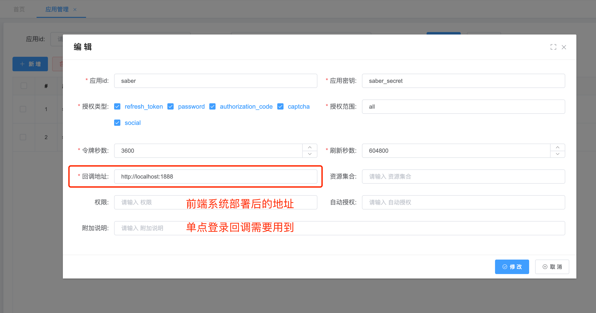
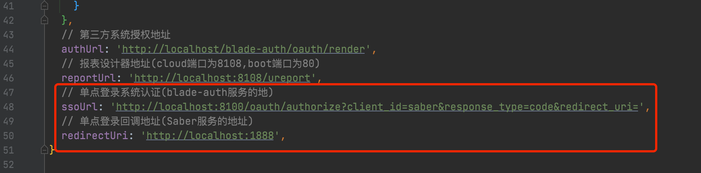

## 配置系统的回调地址

1. 前往`系统管理`->`应用管理` 配置好`回调地址`，同时必须勾上`授权类型`的`authorization_code`，Oauth2单点登录便是基于此模式开发

   * ⚠️ saber2版本地址格式为 http://localhost:1888
   * ⚠️ saber3版本地址格式为 http://localhost:2888/login

   

2. 前往Saber的`website.js`文件或者Sword的`defaultSetting.js`文件配置`ssoUrl`和`redirectUri`

   * `ssoUrl`的第一段`http://localhost:8100`是blade-auth服务部署后的地址，如果nginx做了映射则可写成`https://auth.xx.com`
   * 中间一段`/oauth/authorize?client_id=saber`中需要注意`client_id=saber`,这个值对应于`应用管理`的`应用id`字段
   * 最后一段`response_type=code&redirect_uri=`可以略过，采用默认即可
   * `redirectUri`这个值对应于`应用管理`的`回调地址`字段，注意⚠️：saber3版本的地址后面需要多加一个 `/login`

   

3. 当前端与数据库都配置完毕，便可以进行单点登录操作了

