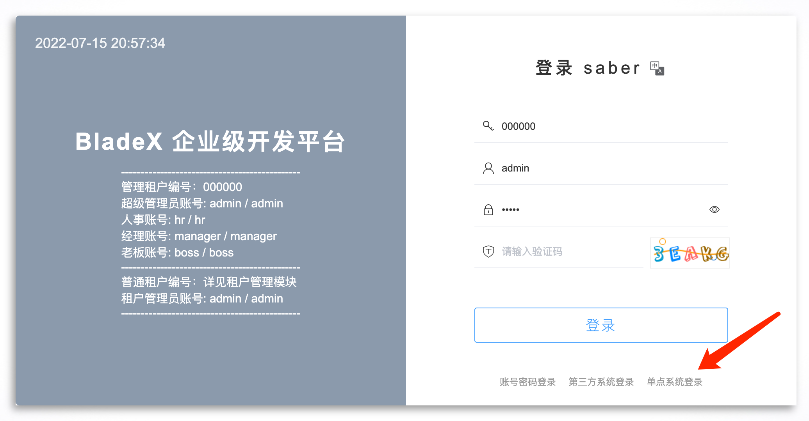
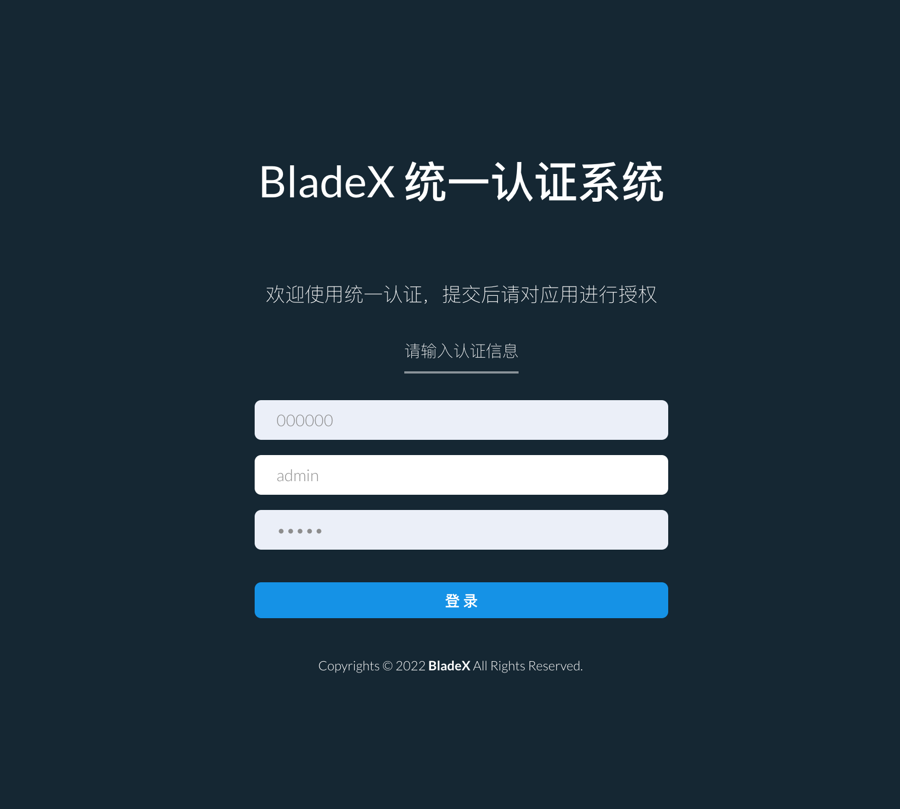
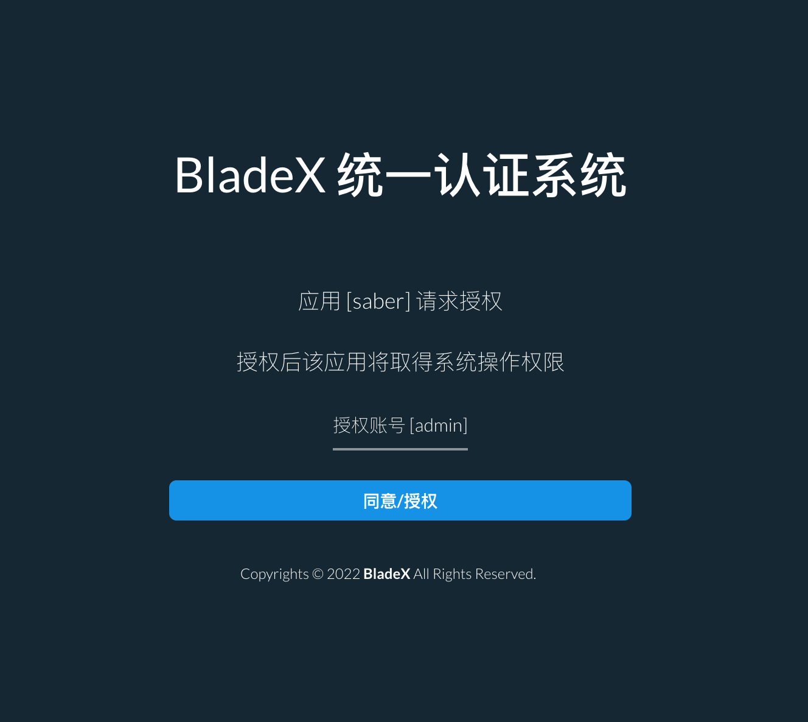
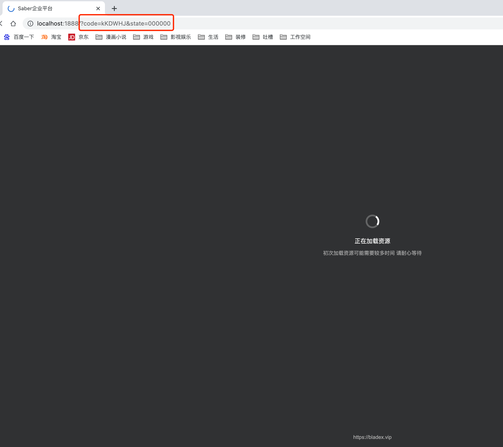
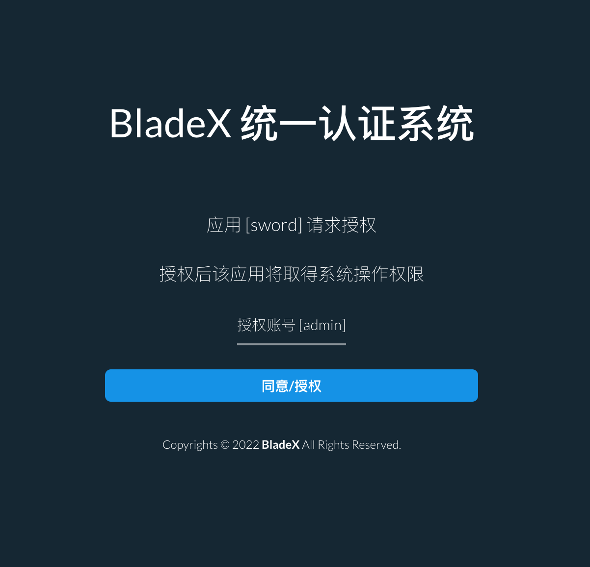

## 单点登录流程

1. 登录前端，点击单点登录

   

2. 输入租户ID(000000)、账号(admin)、密码(admin)

   

3. 验证通过后将会看到当前请求的应用名以及授权账号

   

4. 点击`同意/授权`按钮，系统就会跳转回应用的首页，回调地址会带上代表身份的两个参数

   

5. 这时打开Sword或者一个新的Saber系统，再点击单点登录，就会发现已经不用再输入账号密码了，直接点击授权便可以跳转登录

   

   