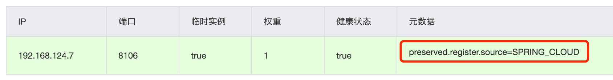
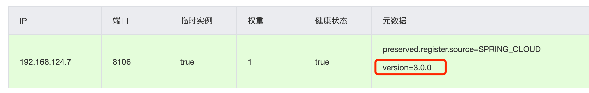
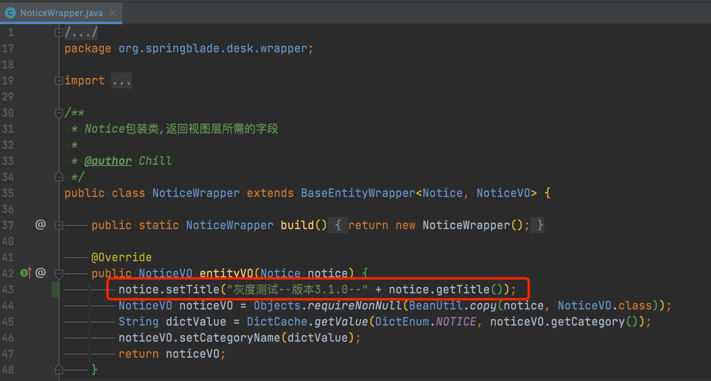
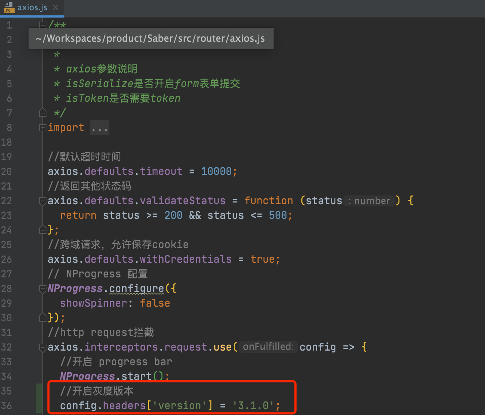
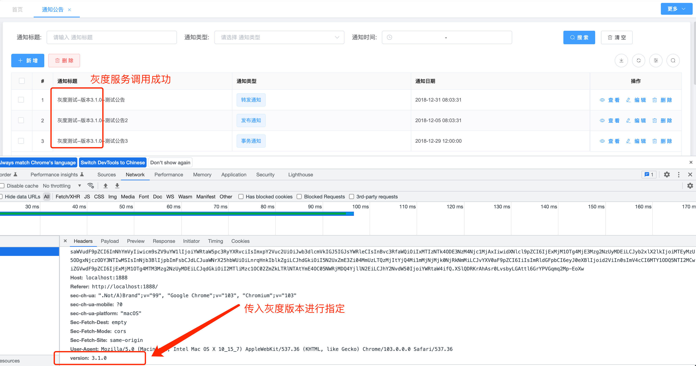

## 概念介绍

* 灰度发布（又名金丝雀发布）是指在黑与白之间，能够平滑过渡的一种发布方式。在其上可以进行A/B testing，即让一部分用户继续用产品特性A，一部分用户开始用产品特性B，如果用户对B没有什么反对意见，那么逐步扩大范围，把所有用户都迁移到B上面来。
* 灰度发布可以保证整体系统的稳定，在初始灰度的时候就可以发现、调整问题，以保证其影响度。
* 灰度期：灰度发布开始到结束期间的这一段时间，称为灰度期。


## 添加配置

1. 我们先看一下普通服务注册到nacos后的元数据，只有一个标注了来源为SpringCloud

   

2. 接着我们前往对应服务的配置文件`application-dev.yml`配置如下

   注意⚠️：**这个是启动级别配置，所以不可放到nacos配置读取，需要放到每个服务的application-xx.yaml或者LauncerService内**

   ```yaml
   blade:
     #多团队协作服务配置
     loadbalancer:
       #开启配置
       enabled: true
       #灰度版本
       version: 3.0.0
       #负载均衡优先调用的ip段
       prior-ip-pattern:
         - 192.168.0.*
         - 127.0.0.1
   ```

3. 再次启动服务，可以看到nacos的元数据多了一个version，正是我们配置的3.0.0

   

4. 如此一来，我们就可以自定义SpringCloud的负载均衡逻辑，根据version来查找符合条件的服务，那也就可以实现灰度服务的目的了


## 操作指南

### 一、后端

1. 打包多个springcloud微服务，标注不同的版本version并且启动，我们目前暂且简单指定3.0.0（把blade.loadbalancer.version注释，不注册版本则代表正式服务）和指定3.1.0（配置了blade.loadbalancer.version=3.1.0则代表灰度服务）

2. 这样就可以模拟3.0.0正式服务稳定生产的同时，灰度上线3.1.0新版本功能的场景

3. 为了区分服务，我们简单修改一下Notice模块，只有3.1.0版本才修改，等待后续灰度前端对接查看

   

### 二、前端

1. 前端也准备两套，一套正常部署代表正式服务，另外一套在http全局调用的模块统一添加version的header变量
2. 一般灰度用户都是有很多不同规则的，比如：不同区域、不同用户等级、不同消费等等
3. 如何让不同的用户进入灰度域，就需要大家自行拓展了，规则有很多，通过nginx判断（统一反代配置），通过用户信息判断（判断user的等级、消费等参数，来确定是否需要加上version的header）等等

4. 我们目前只做最简单的测试，在灰度前端做好配置，统一在axios配置version的header变量（sword在request.js配置）

   

### 三、实战

1. 按照前面两点把两套前后端搭建好之后，首先访问正式服务（3.0.0，没有配置version），肯定是正常调用，这个就不需要演示了

2. 访问灰度前端，点击有灰度代码的Notice的列表模块，可以看到已经携带了灰度文本

   
