## 简介
* XXL-JOB是一个分布式任务调度平台，其核心设计目标是开发迅速、学习简单、轻量级、易扩展。现已开放源代码并接入多家公司线上产品线，开箱即用。
* 官网：[https://www.xuxueli.com/xxl-job/](https://www.xuxueli.com/xxl-job/)
* 请到官网仔细阅读文档，基础使用、基本概念将不在本章节讲解。本章节重点讲解如何在BladeX平台接入并使用

## 工程目录
* 打开BladeX工程，找到blade-ops下的目录
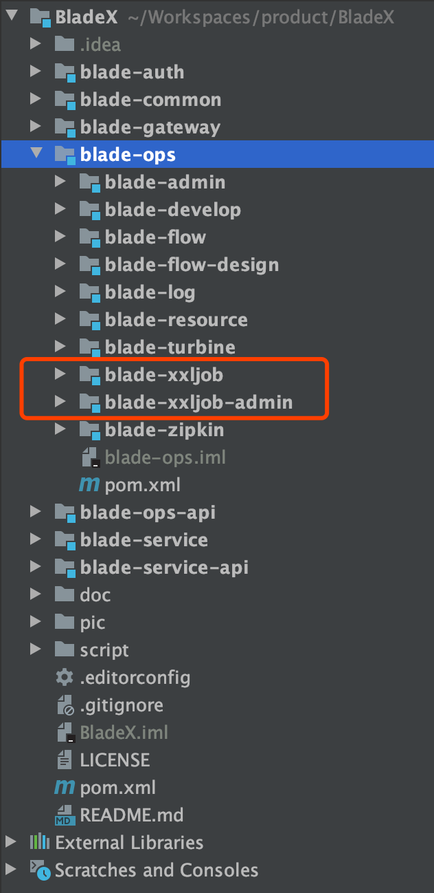
* 其中`blade-xxljob`是基于BladeX平台开发的定时任务逻辑工程`blade-xxljob-admin`是xxljob官方中间件后台，集成进了BladeX

## 开启xxljob任务调度中心
* 新建数据库并执行对应sql文件
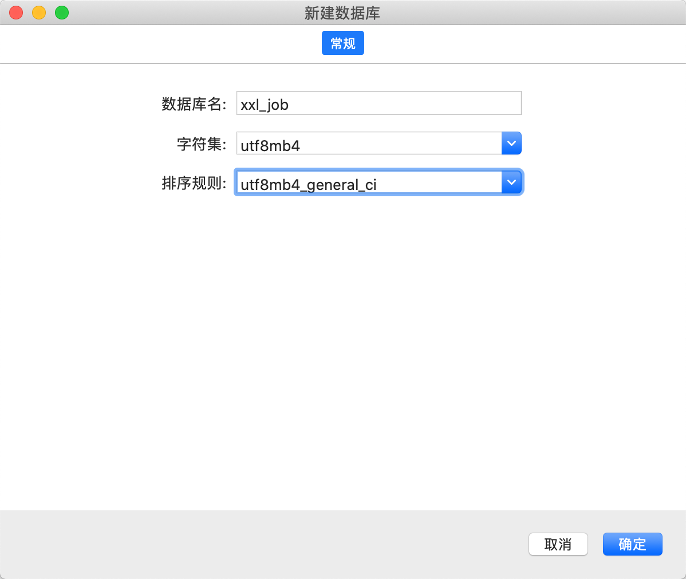
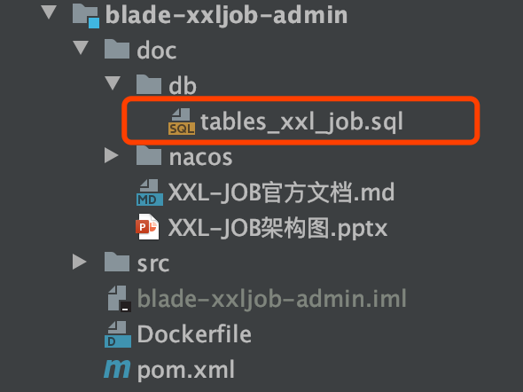
* 新建配置文件至nacos
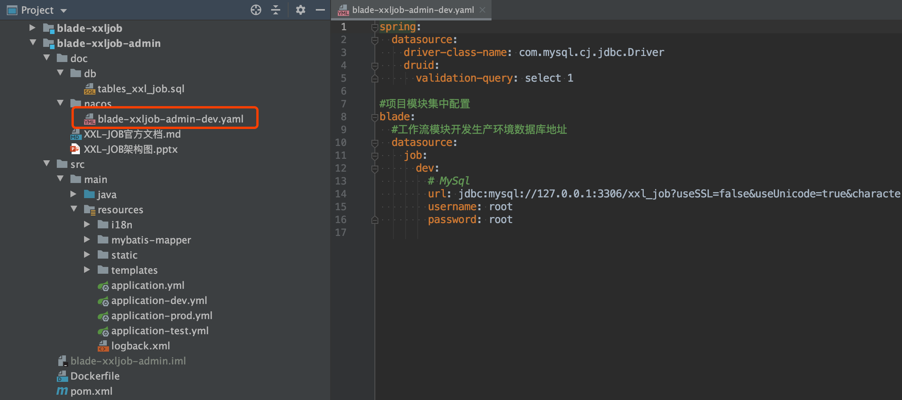
* 修改配置
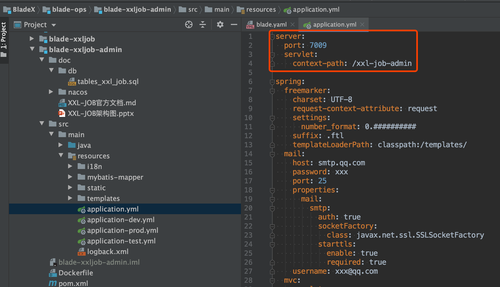
* 启动`blade-xxljob-admin`
 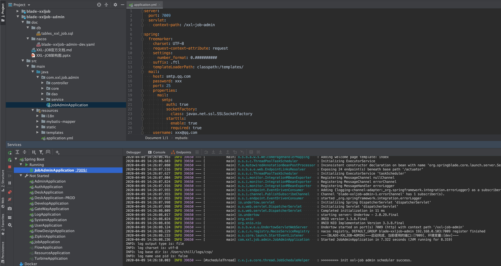
* 访问 : [http://localhost:7009/xxl-job-admin](http://localhost:7009/xxl-job-admin)
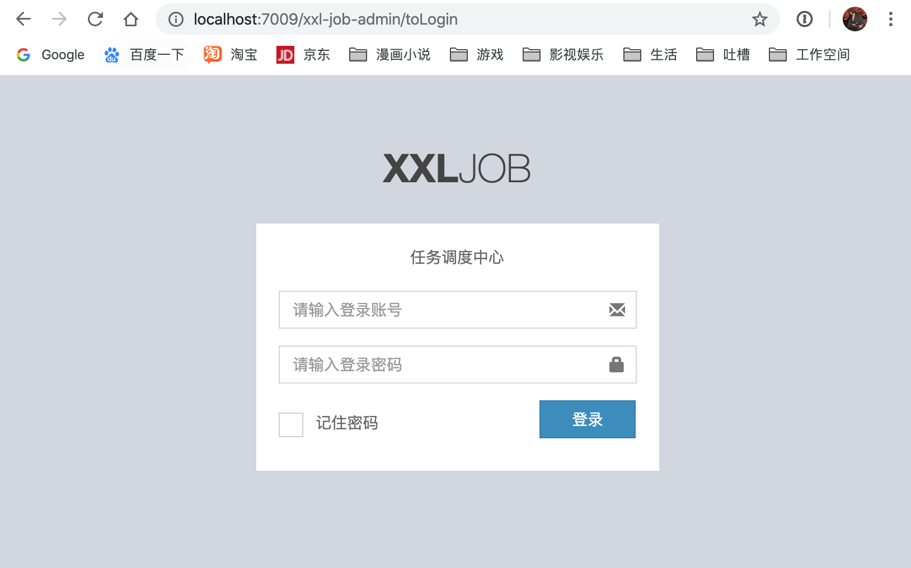
* 默认账号密码为：[admin] [123456] 
* 登录成功后界面如下
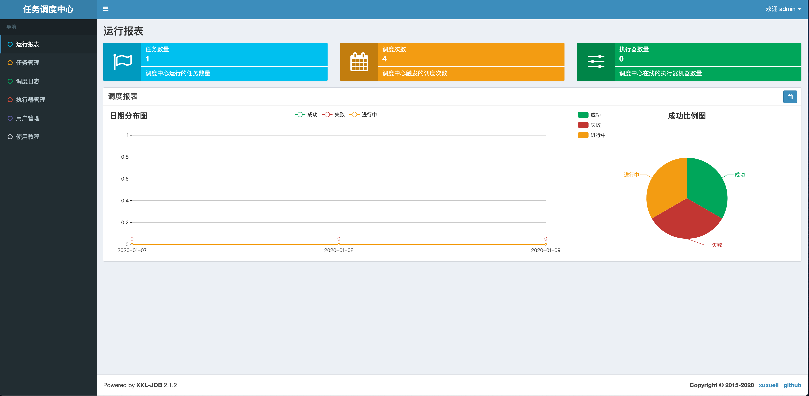

## 接入xxljob客户端
* 启动`blade-xxljob`
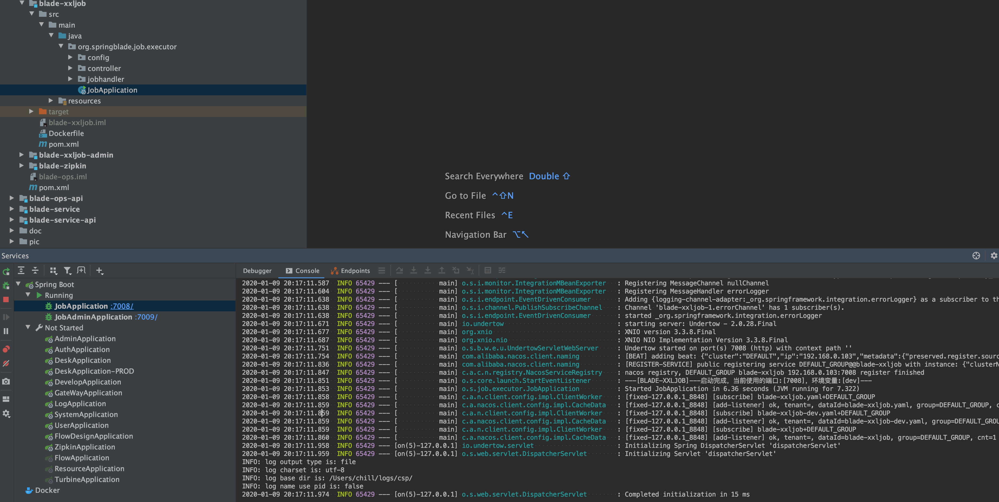
* 打开调度中心的`执行器管理`，可以看到我们的`blade-xxljob`已经注册成功
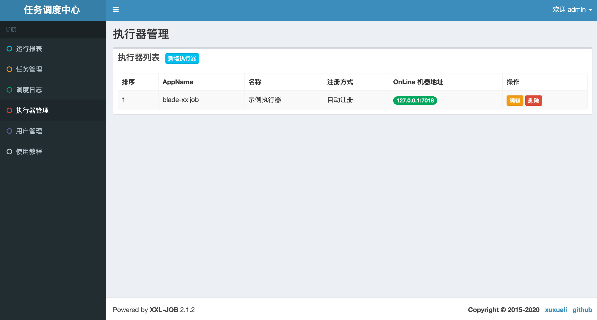
* 除此之外，如果我们有多个xxljob客户端，启动后都可以进行手动注册的方式注册到调度中心
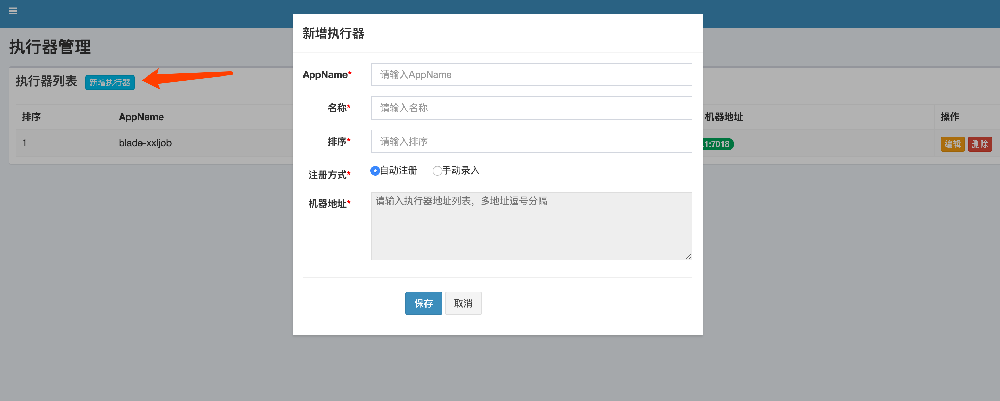
* 打开任务管理，我们可以看到，已经有了对应的处理器，当然如果有多个任务，可以进行多次新增
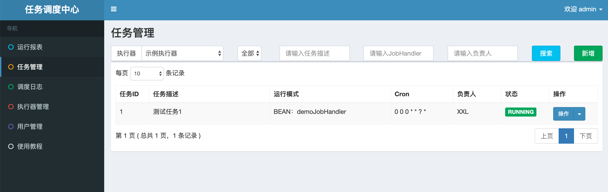
* `demoJobHandler`对应代码如下
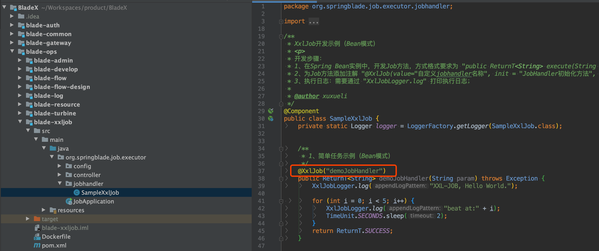
* 进行手动执行一次任务
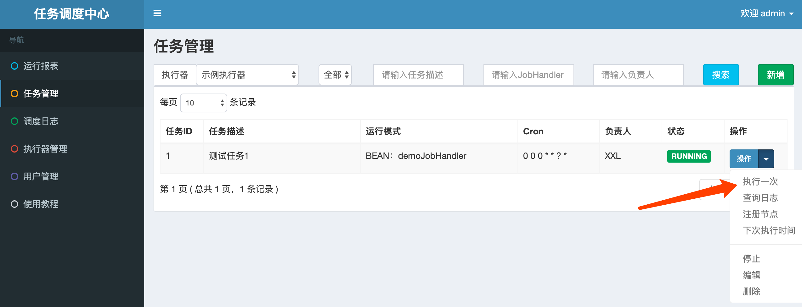
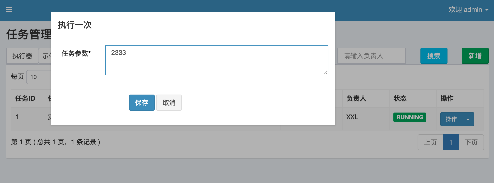
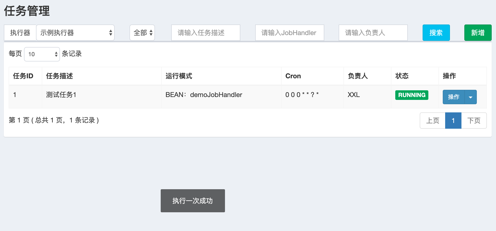
* 打开调度日志，看到刚刚的操作执行成功，blade-xxljob控制台也打印出了对应的日志
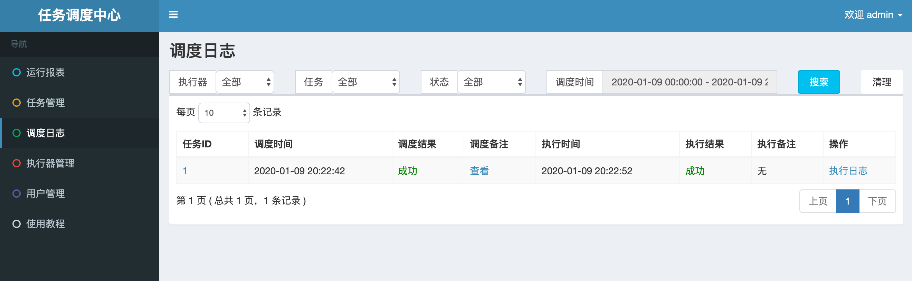
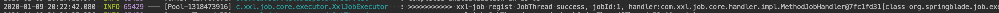
* 再次调用，并打上断点，可以看到正确进入的断点并且获取到到任务参数相匹配，说明任务执行成功
 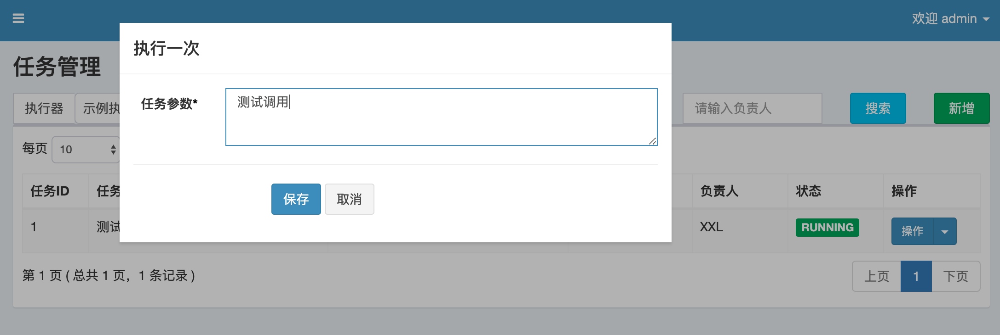
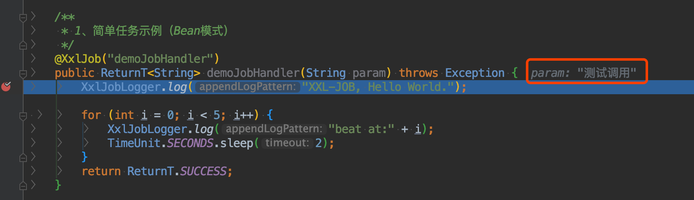

## 后记
* xxljob作为一个轻量级的分布式调度平台，非常适合SpringCloud接入使用
* demo已经接入完毕，后续的操作就需要大家认真阅读官方文档，并且动手操作试验了！～

