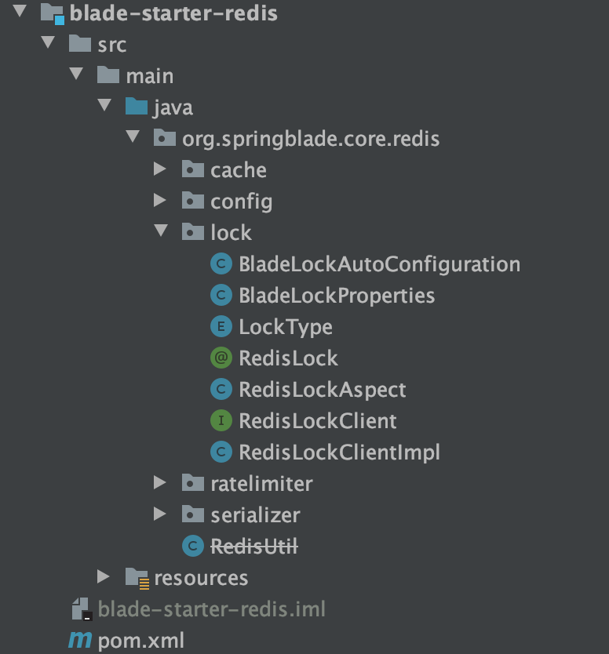
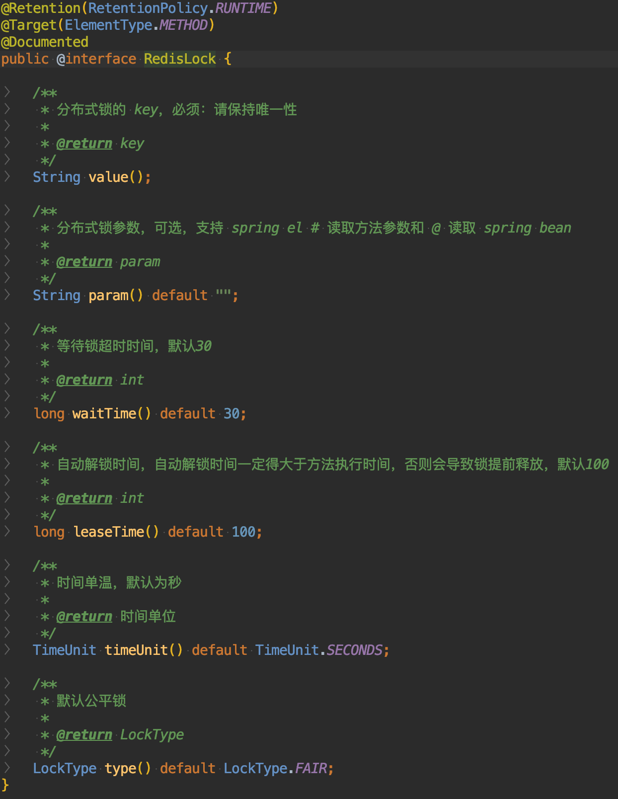
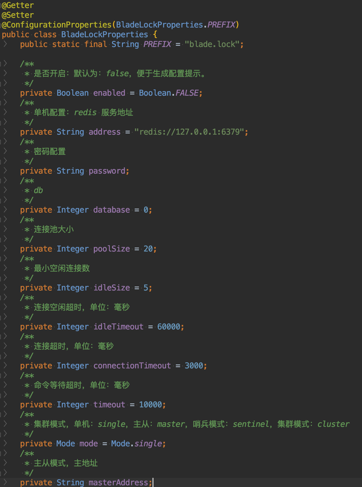
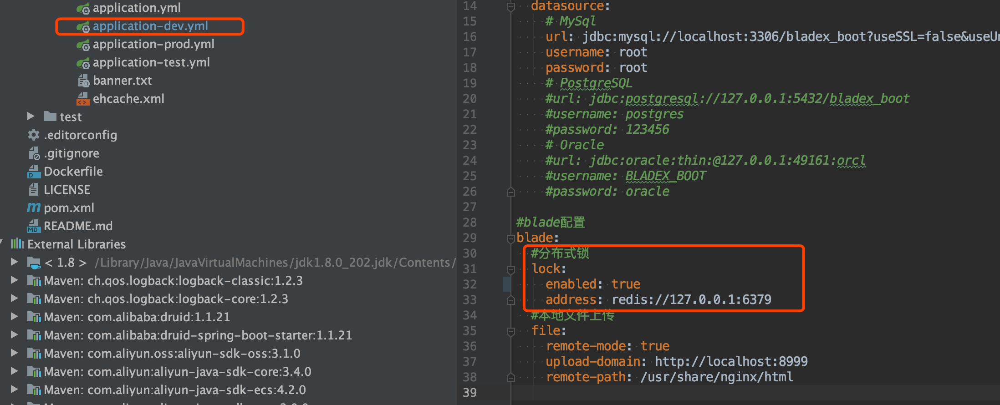
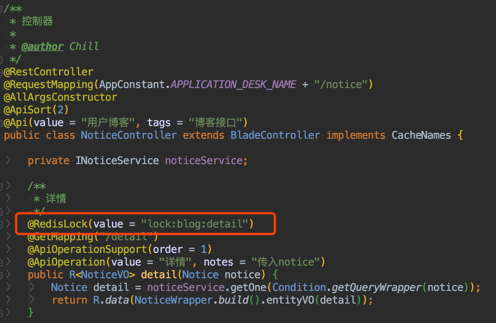
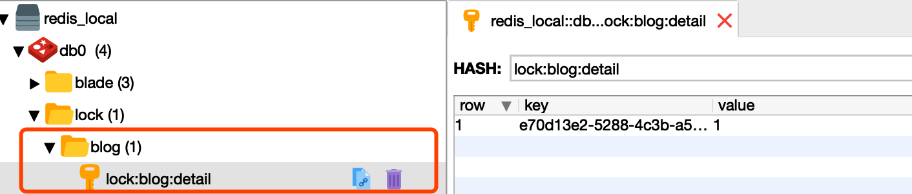
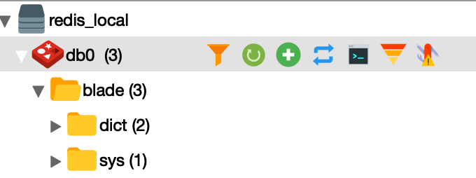

## 简介
* 为了防止分布式系统中的多个进程之间相互干扰，我们需要一种分布式协调技术来对这些进程进行调度。而这个分布式协调技术的核心就是来实现这个**分布式锁**。
* 下面我们主要讲解BladeX自带的分布式锁，并且如何进行使用

## 配置
* redis分布式锁基于`redisson`实现，具体位置在`BladeX-Tool`的`blade-starter-redis`的`lock`包内

* 使用时只需关注`@RedisLock`即可，代码如下

* 配置如下，大家可以在配置文件自行配置

* 分布式锁默认为关闭，目前以BladeX-Boot为例进行分布式锁的配置与使用，更多配置请参考`BladeLockProperties`

## 使用
* 在业务代码加入对应注解

* 打上断点并调用，可以看到redis已经多出了我们配置的key

* 调用完毕后，发现redis对应的key已被删除

* 这样一来，在某些高并发的场景，便可以保证多个进程之间不会互相干扰。但是切记线上版本务必部署高可用的redis，否则并发压力大会对系统产生很大的影响

## 后记
* redisson有很多惊艳的功能带我们发觉，后续BladeX将陆续更新他的特性
