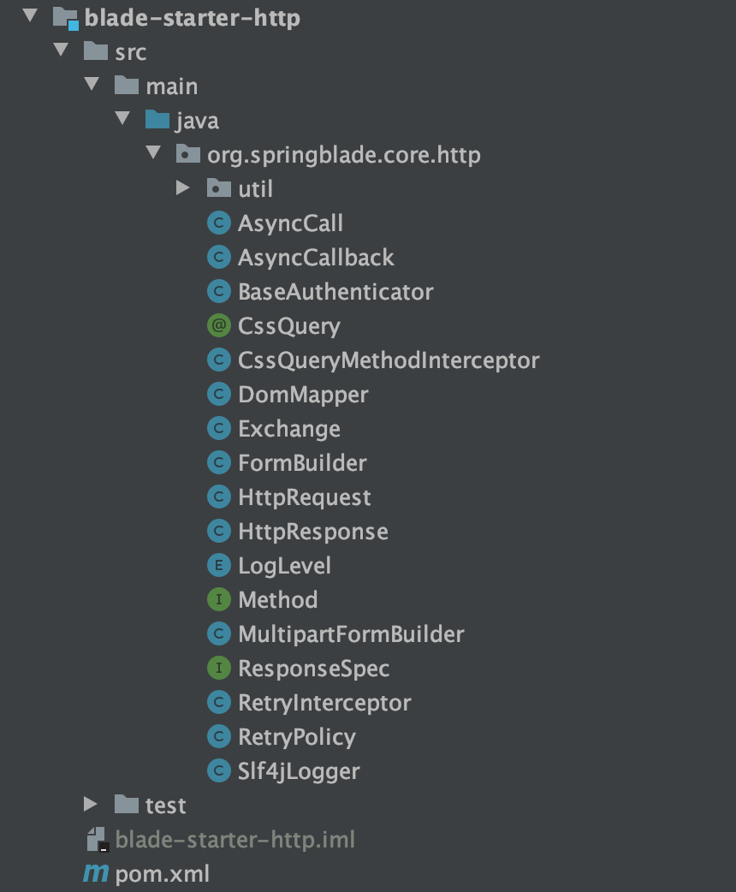
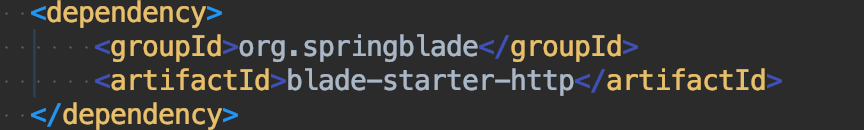
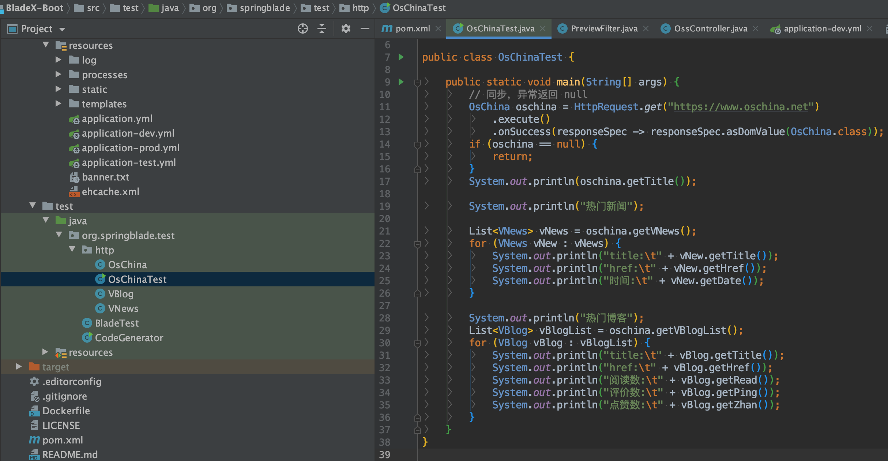
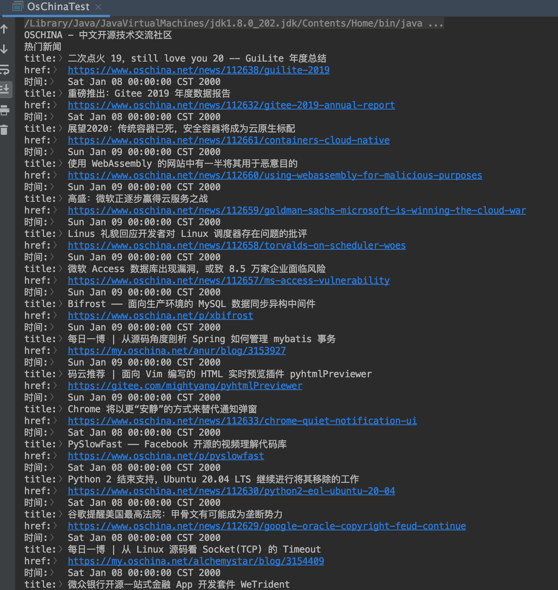
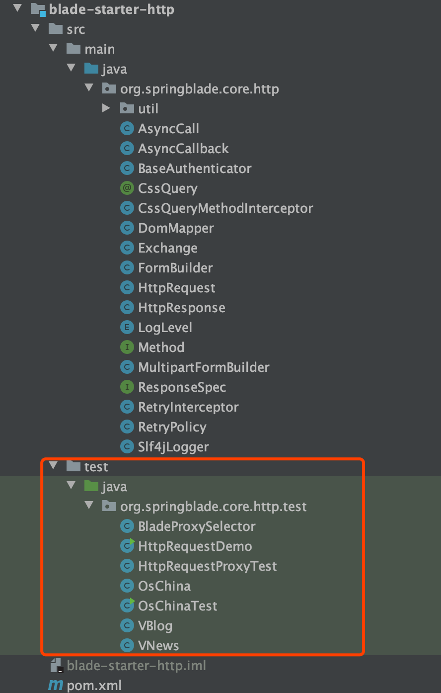

## 简介
* 在很多情况下，后端也需要实时调用restApi
* 这时候就需要一个高性能、灵活的http工具来进行调用获取接口数据
* 但是市面上封装好的http工具往往会有很多其他的依赖，引入后令人觉得非常冗余
* 这时我们便推出了自己的http工具，非常轻量级，依赖也很少，只有`okhttp3`和`jsoup`
* 下面我们就来实际操作一下把～

## 如何使用
* 我们将这个模块封装在BladeX-Tool 的`blade-starter-http`，具体目录如下

* 以BladeX-Boot为例，引入依赖

* 找到单元测试并运行

* 结果如下

* 更多使用方法请看`blade-starter-http`的单元测试

## 配置SSL

~~~java
InputStream isTrustCa = HttpRequestTest.class.getResourceAsStream("/cert/ca.jks");
InputStream isSelfCert = HttpRequestTest.class.getResourceAsStream("/cert/outgoing.CertwithKey.pkcs12");

KeyStore selfCert = KeyStore.getInstance("pkcs12");
selfCert.load(isSelfCert, "password".toCharArray());
KeyManagerFactory kmf = KeyManagerFactory.getInstance("sunx509");
kmf.init(selfCert, "password".toCharArray());
KeyStore caCert = KeyStore.getInstance("jks");
caCert.load(isTrustCa, "caPassword".toCharArray());
TrustManagerFactory tmf = TrustManagerFactory.getInstance("sunx509");
tmf.init(caCert);
SSLContext sc = SSLContext.getInstance("TLS");

TrustManager[] trustManagers = tmf.getTrustManagers();
X509TrustManager trustManager = (X509TrustManager) trustManagers[0];
sc.init(kmf.getKeyManagers(), trustManagers, (SecureRandom) null);

// 1. 全局配置证书
OkHttpClient.Builder builder = new OkHttpClient.Builder()
	.sslSocketFactory(sc.getSocketFactory(), trustManager)
	.hostnameVerifier(TrustAllHostNames.INSTANCE);
HttpRequest.setHttpClient(builder.build());

// 2. 单次请求配置证书
HttpRequest.get("https://123.xxx")
	.useConsoleLog(LogLevel.BODY)
	.sslSocketFactory(sc.getSocketFactory(), trustManager)
	.disableSslValidation()
	.execute()
	.asString();
~~~

## 后记
* http模块的api非常简介明了，看单元测试的代码相信大家便可以学会
* 后续如何使用请大家参考demo～
