## 简介

* Apache ShardingSphere 是一款分布式的数据库生态系统， 可以将任意数据库转换为分布式数据库，并通过数据分片、弹性伸缩、加密等能力对原有数据库进行增强。
* Apache ShardingSphere 设计哲学为 Database Plus，旨在构建异构数据库上层的标准和生态。 它关注如何充分合理地利用数据库的计算和存储能力，而并非实现一个全新的数据库。 它站在数据库的上层视角，关注它们之间的协作多于数据库自身。
* 官方网站：https://shardingsphere.apache.org/index_zh.html
* 官方文档：https://shardingsphere.apache.org/document/current/cn/overview/

## 产品功能

| 特性       | 定义                                                         |
| :--------- | :----------------------------------------------------------- |
| 数据分片   | 数据分片，是应对海量数据存储与计算的有效手段。ShardingSphere 基于底层数据库提供分布式数据库解决方案，可以水平扩展计算和存储。 |
| 分布式事务 | 事务能力，是保障数据库完整、安全的关键技术，也是数据库的核心技术。基于 XA 和 BASE 的混合事务引擎，ShardingSphere 提供在独立数据库上的分布式事务功能，保证跨数据源的数据安全。 |
| 读写分离   | 读写分离，是应对高压力业务访问的手段。基于对 SQL 语义理解及对底层数据库拓扑感知能力，ShardingSphere 提供灵活的读写流量拆分和读流量负载均衡。 |
| 高可用     | 高可用，是对数据存储计算平台的基本要求。ShardingSphere 提供基于原生或 Kubernetes 环境下数据库集群的分布式高可用能力。 |
| 数据迁移   | 数据迁移，是打通数据生态的关键能力。ShardingSphere 提供跨数据源的数据迁移能力，并可支持重分片扩展。 |
| 联邦查询   | 联邦查询，是面对复杂数据环境下利用数据的有效手段。ShardingSphere 提供跨数据源的复杂查询分析能力，实现跨源的数据关联与聚合。 |
| 数据加密   | 数据加密，是保证数据安全的基本手段。ShardingSphere 提供完整、透明、安全、低成本的数据加密解决方案。 |
| 影子库     | 在全链路压测场景下，ShardingSphere 支持不同工作负载下的数据隔离，避免测试数据污染生产环境。 |

## 快速集成

1. 打开BladeX-Biz工程，找到example目录下的blade-sharding-jdbc工程

   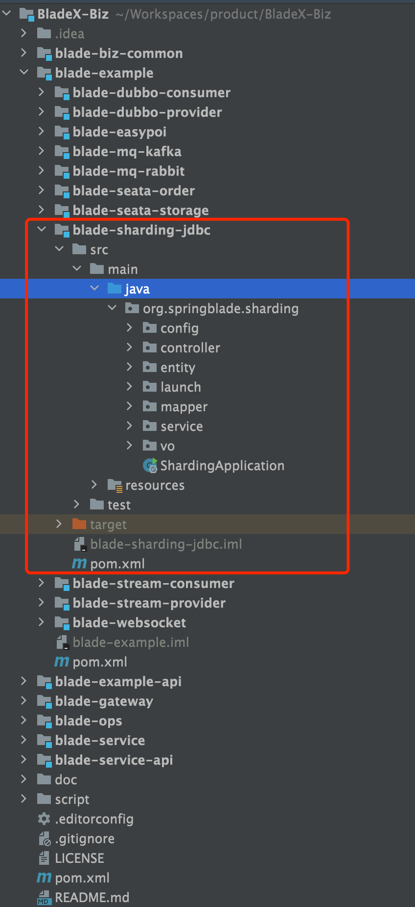

2. 打开resources内的配置文件，分别是`分表不分库`，`分库不分表`，`分库分表`三种，每项配置都有注释说明，文档便不再赘述，主要讲解操作流程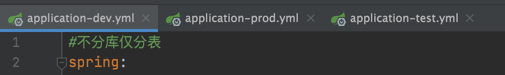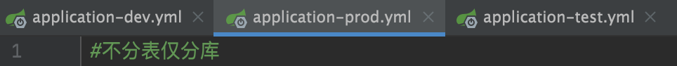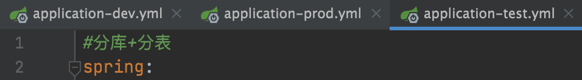

3. 修改好对应测试的数据库连接，上面是动态数据源，下面是sharding数据源，我们将两者整合在一起使用

   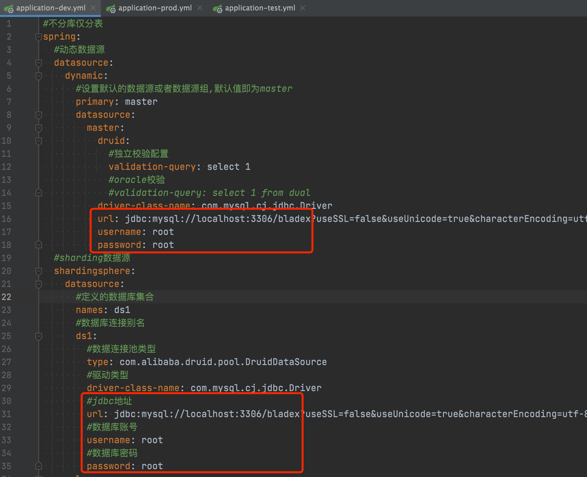

4. 如配置所示，在测试库增加blade_notice_1与blade_notice_2两张表，结构与blade_notice一致

   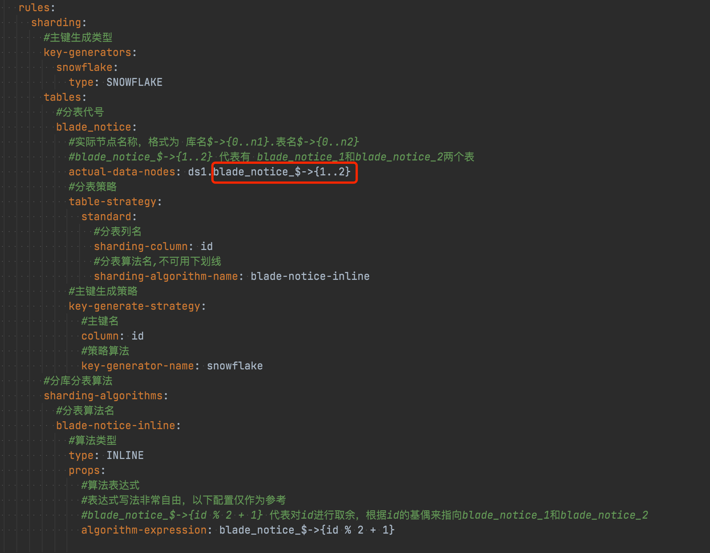

   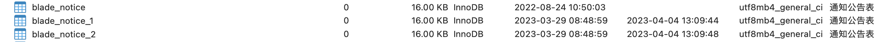

5. 启动服务，注意cloud模式需要把Gateway也一起启动

   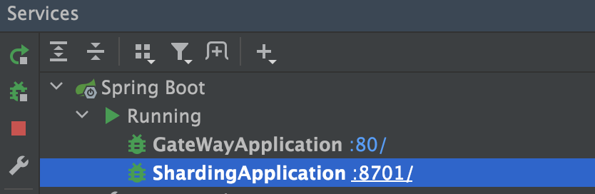

6. 我们主要测试如下3个API，前两个用了DS("sharding")，则说明会使用sharding-jdbc的分表功能，第三个没有，则默认使用了动态数据源的master数据源

   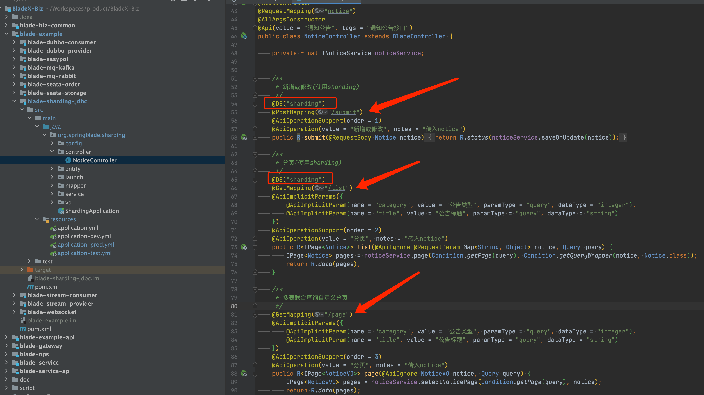

7. 获取token并调用接口, 连续调用10次，title从测试1～测试10，其中`save`方法为不分表，`submit`方法为分表（如何获取token请见文档5.1章节）

   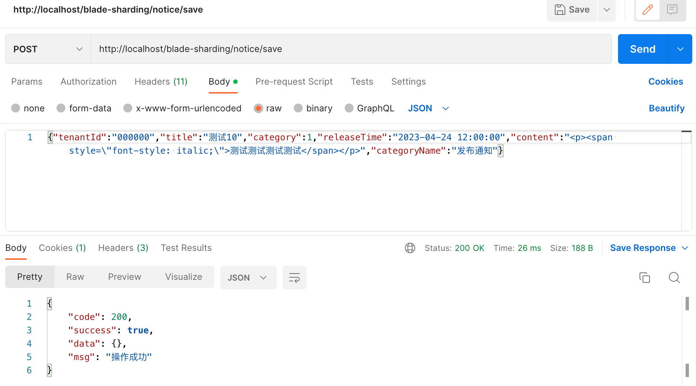

   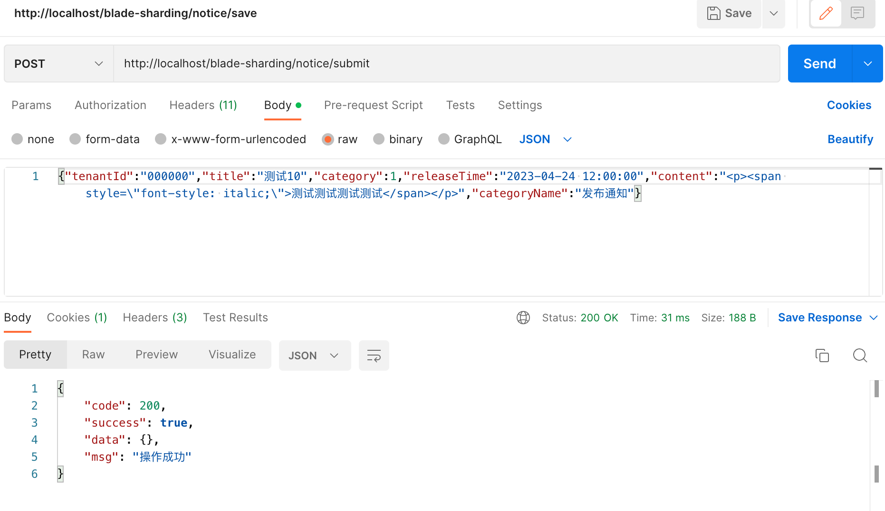

8.  因为没有分表，所以10条数据都正常入到blade_notice表了

   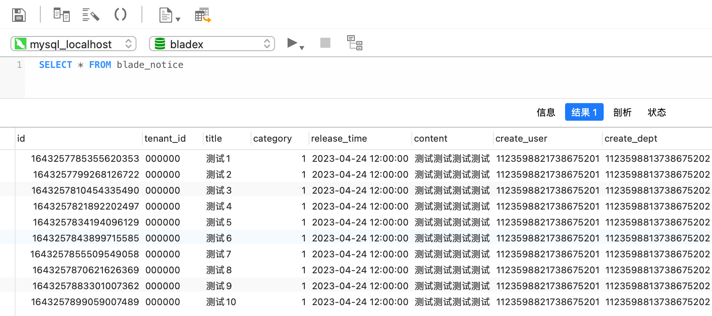

9. blade_notice_1表为对id取余，偶数入库，查看发现无误

   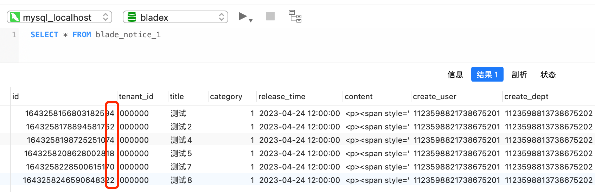

10. blade_notice_2为基数入库，查看发现无误

    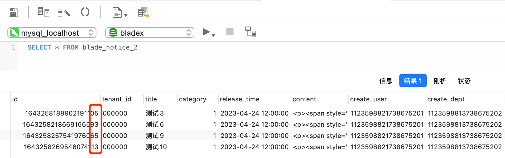

11. 调用list接口，同样用sharding进行标注，发现返回数据是通过自动整合了，把分表的数据放在一起返回，无需操心

    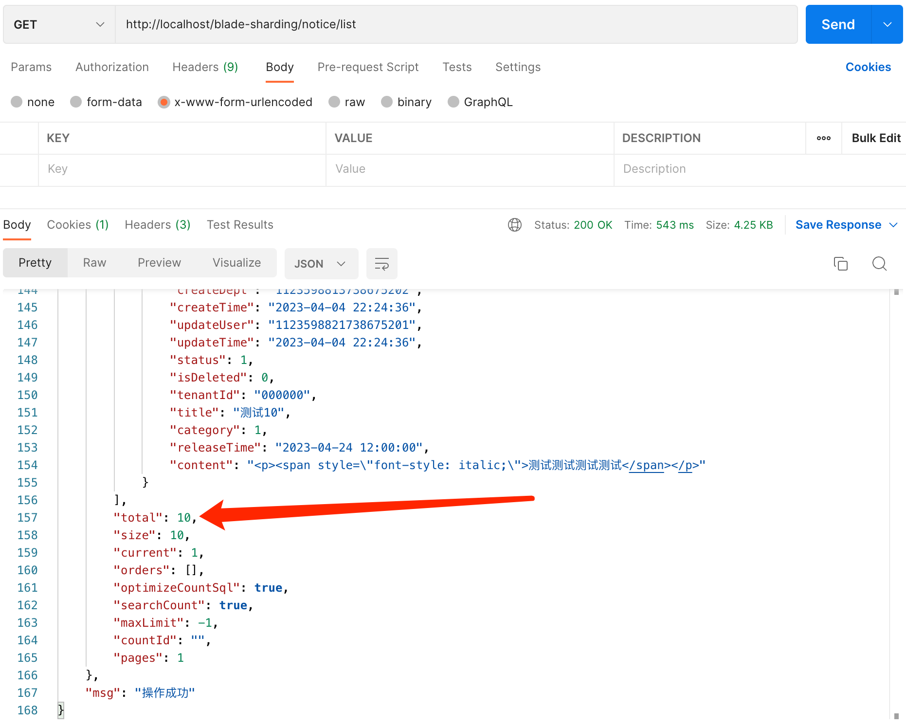

12. 自此，sharding集成演示完毕，大家若想进一步使用，一定要仔细看官方文档哦，官方写的非常详细值得一看。