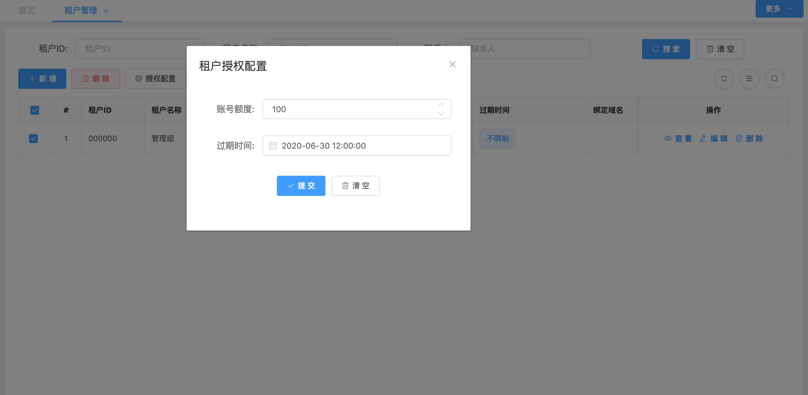
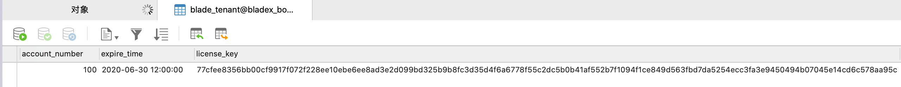

## 多租户授权保护机制
1. 开启blade.tenant.license=true，具体配置如下
~~~yaml
#blade配置
blade:
  #多租户配置
  tenant:
    #多租户授权保护
    license: true
~~~
2. 在后端进行租户授权配置，查看数据库，可以看到数据库对应的字段已经填入了加密后的信息

3. 这样一来，如果需要私有部署到客户的服务器，有试用期的话，也不用担心客户打开数据库修改时间字段直接越权延长了使用时间或账号限制
