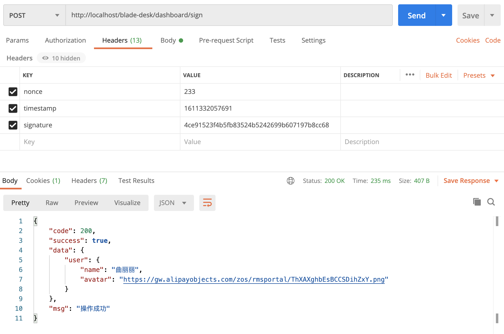
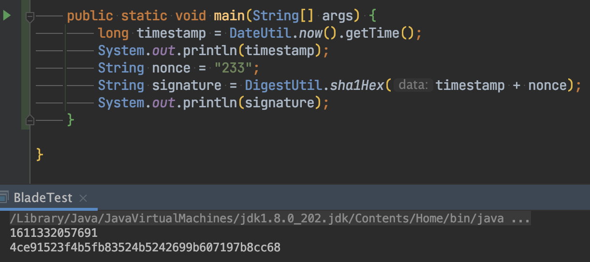
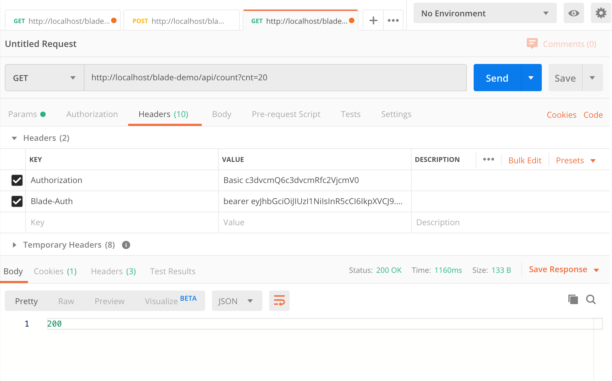
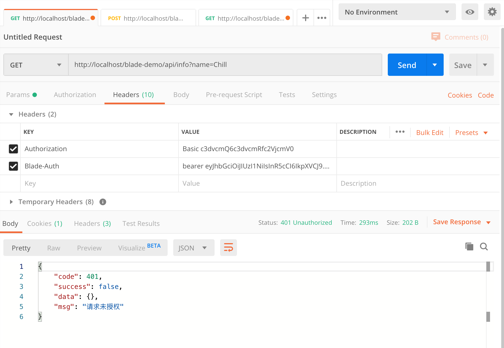
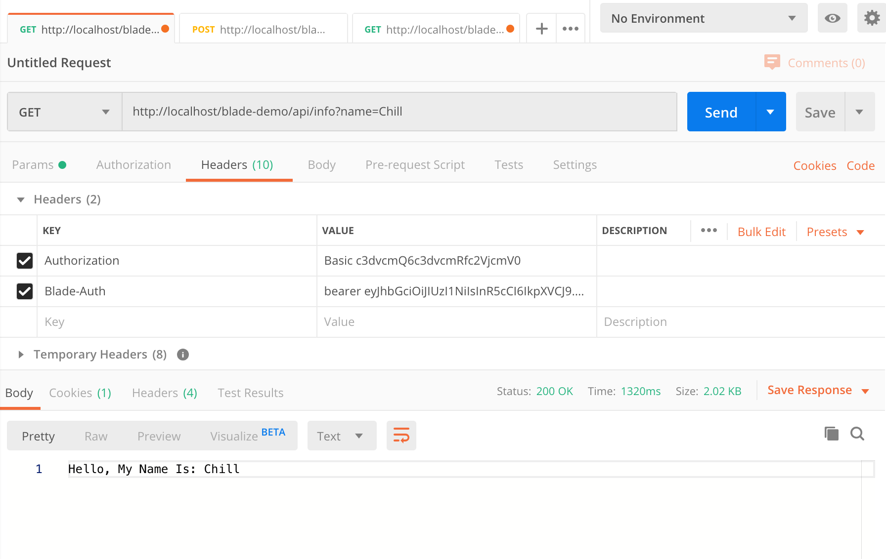
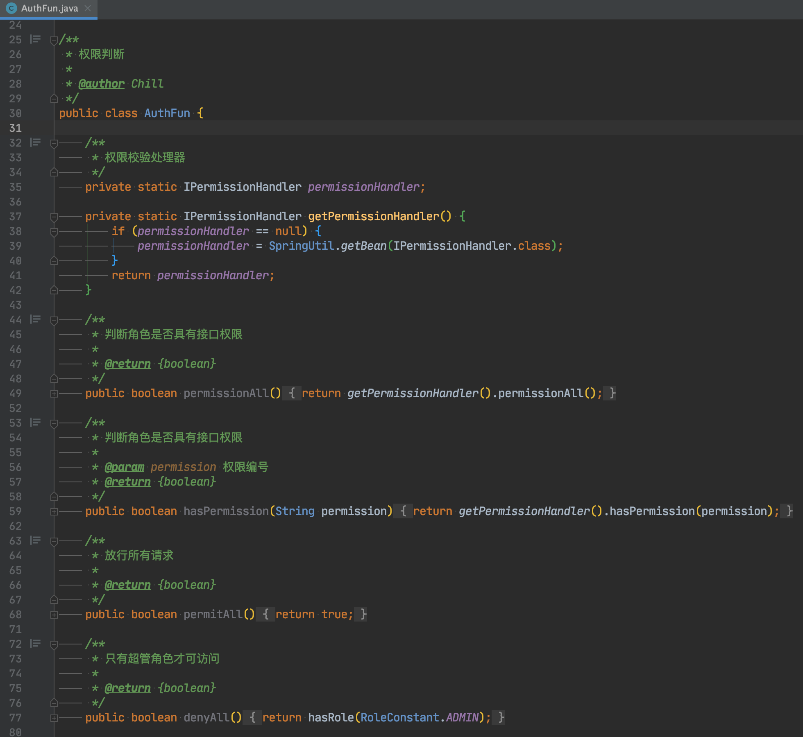

## 前言
* 若只有API放行，那么对于一些复杂的场景，肯定是不够的，我们需要更强大的认证功能
* 经过较长的实践，BladeX实现了一套属于自己的安全配置，支持注解与配置两种方式
* 话不多说，我们来看一下具体的使用方法

## 注解申明
~~~java
@RestController
@AllArgsConstructor
@PreAuth("hasAuth()")
@RequestMapping("/blade-chat/weixin")
public class ApiScopeController extends BladeController {

   private final IWeixinService weixinService;

   @GetMapping("/user-info")
   public UserInfo userInfo() {
      return weixinService.userInfo();
   }

   @PostMapping("/send-message")
   public R<Message> sendMessage() {
      return weixinService.sendMessage();
   }

}
~~~

~~~java
@RestController
@AllArgsConstructor
@RequestMapping("/blade-desk/dashboard")
public class DashboardController extends BladeController {

   private final IDashboardService dashboardService;

   @PreAuth("hasTimeAuth(9, 17)")
   @PostMapping("/upload")
   public UserInfo upload() {
      return dashboardService.upload();
   }

   @PreAuth("hasAnyRole('administrator', 'admin', 'user')")
   @PostMapping("/submit")
   public R submit() {
      return dashboardService.submit();
   }

}
~~~

## 配置文件申明
~~~yaml
#blade配置
blade:
  #安全框架配置
  secure:
    #放行路径配置
    skip-url:
      - /blade-test
    #授权认证配置
    auth:
      - method: ALL
        pattern: /blade-chat/weixin
        #需要Token通过校验
        expression: "hasAuth()"
      - method: POST
        pattern: /blade-desk/dashboard/upload
        #需要在 [9:00-17:00] 之间调用
        expression: "hasTimeAuth(9, 17)"
      - method: POST
        pattern: /blade-desk/dashboard/submit
        #需要拥有 administrator或 admin 或 user 角色
        expression: "hasAnyRole('administrator', 'admin', 'user')"
    #基础认证配置
    basic:
      - method: ALL
        pattern: /blade-desk/dashboard/info
        username: "blade"
        password: "blade"
    #动态签名认证配置
    sign:
      - method: ALL
        pattern: /blade-desk/dashboard/sign
        crypto: "sha1"
~~~

注意⚠️：
* 配置中的 blade-chat、blade-desk只有在boot版本才需要加，cloud版本的blade-chat实则为注册在nacos的服务名，gateway转发需要带上，但实际controller并没有
* 所以cloud版本无需加上blade-chat、blade-desk

## 代码配置申明
~~~java
@Configuration
public class BladeConfiguration {

   @Bean
   public SecureRegistry secureRegistry() {
      // 创建认证类
      SecureRegistry secureRegistry = new SecureRegistry();
      // 认证放行配置
      secureRegistry.setEnabled(true);
      secureRegistry.excludePathPatterns("/blade-test/**");
      // 认证鉴权配置
      secureRegistry
         .addAuthPattern(HttpMethod.ALL, "/blade-chat/weixin/**", "hasAuth()")
         .addAuthPattern(HttpMethod.POST, "/blade-desk/dashboard/upload", "hasTimeAuth(9, 17)")
         .addAuthPattern(HttpMethod.POST, "/blade-desk/dashboard/submit", "hasAnyRole('administrator', 'admin', 'user')");
      // 基础认证配置
         secureRegistry.addBasicPattern(HttpMethod.POST, "/blade-desk/dashboard/info", "blade", "blade");
      // 签名认证配置
         secureRegistry.addSignPattern(HttpMethod.POST, "/blade-desk/dashboard/sign", "sha1");
      // 返回认证类
      return secureRegistry;
   }

}
~~~

注意⚠️：
* sign配置的crypto为加密规则，有sha1与md5两种，也可以自己拓展源码定义
* 调用接口需要定义timestamp、nonce、signature三个字段放到请求头
* timestamp必须为时间戳，为了接口安全，后端鉴权只会放行10秒内时间戳
* signature为timestamp和nonce字符串相加后进行加密的值
* 后端获取到这三个数字后，也会根据加密规则对timestamp+nonce进行加密
* 最后将后端的加密串与请求的加密串进行比对，如果相等，则鉴权成功
* 具体调用如下，下图为sha1加密

## 认证实战
1. 鉴权配置注解名称为 `@PreAuth` ，在需要进行鉴权配置的方法加上 `@PreAuth` 注解，并在注解内写入相关的鉴权方法，具体逻辑可以看（org.springblade.core.secure.auth.AuthFun）
2. 为了可以起到对比的作用，对 `count` 进行权限放行（只要通过Token认证就可调用API）。
~~~java
@GetMapping("count")
@PreAuth("permitAll()")
public Integer count(Integer cnt) {
   return cnt * 10;
}
~~~
3. 对 `info`进行权限判断，调用方需要拥有`test`的角色权限才可以调用
~~~java
@GetMapping("info")
@PreAuth("hasRole('test')")
public String info(String name) {
   return "Hello, My Name Is: " + name;
}
~~~
4. 调用 `/api/count` 发现请求成功。

5. 调用 `/api/info` 发现返回了 `请求未授权`，因为我们的`admin`账号没有分配`test`角色

6. 尝试改回`admin`权限
~~~java
@GetMapping("info")
@PreAuth("hasRole('administrator')")
public String info(String name) {
   return "Hello, My Name Is: " + name;
}
~~~
7. 调用 `/api/info` 发现请求成功。

## 后记
* Secure 框架进行了两层 API 鉴权。
* 第一层校验请求携带的Token是否合法，不需要Token校验的可通过配置放行。
* 第二层校验`PreAuth`配置的逻辑是否符合，若不符合也返回`请求未授权`。
* 注解 `@PreAuth`支持类层级和方法层级，放到类层级则对该类的所有方法进行鉴权。
* 注解 `@PreAuth`还支持 Spring el 表达式，可拓展性非常高，更多功能等您挖掘~
* Spring el 文档地址：[https://docs.spring.io/spring/docs/5.1.6.RELEASE/spring-framework-reference/core.html#expressions](https://docs.spring.io/spring/docs/5.1.6.RELEASE/spring-framework-reference/core.html#expressions)
* PreAuth的逻辑封装：org.springblade.core.secure.auth.AuthFun

