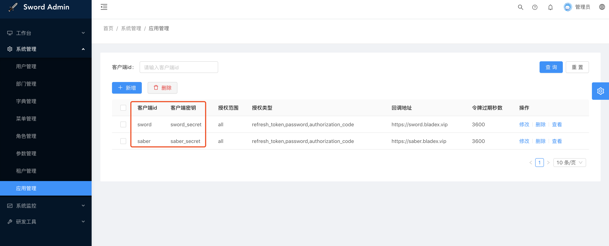
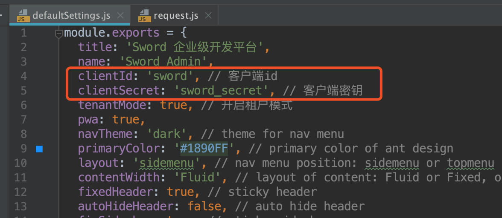
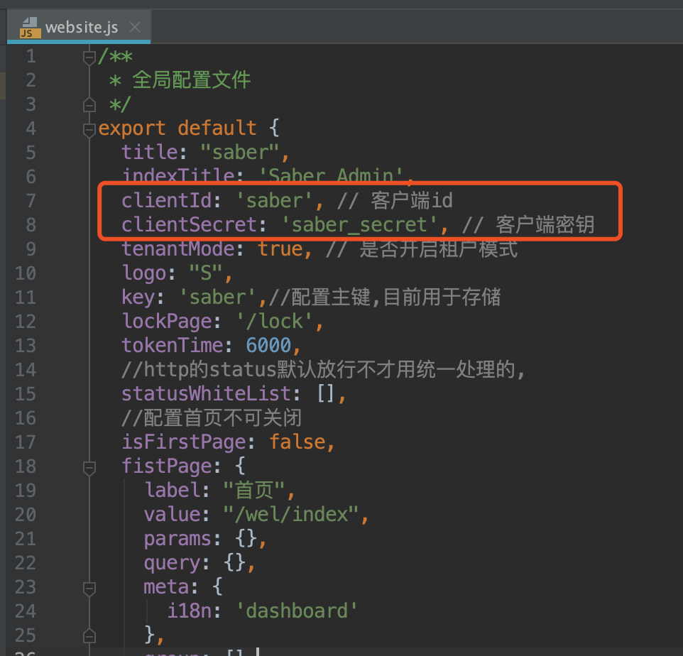
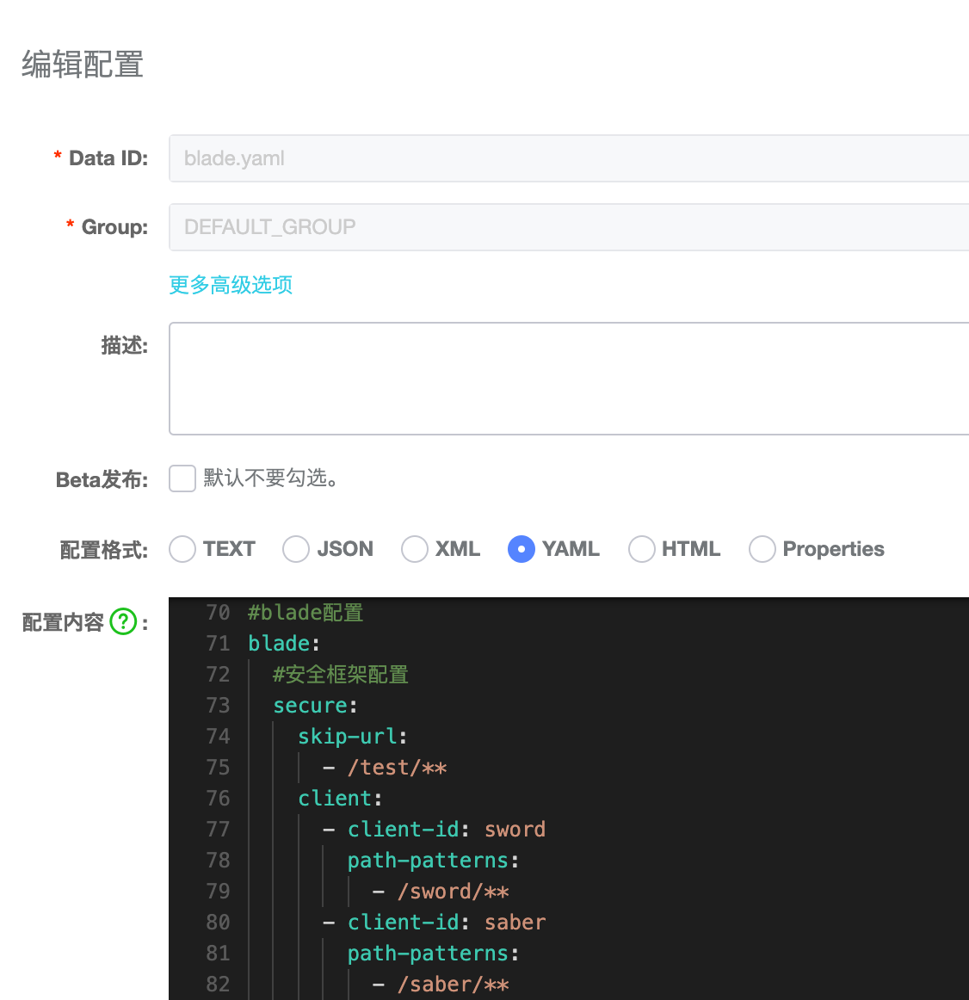
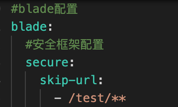
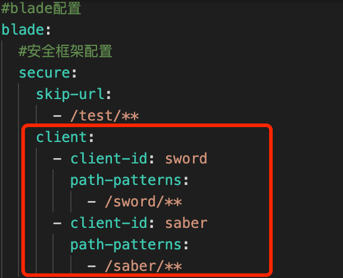

## 多终端认证是什么
* 一个中大型系统，往往会有多个子系统。很多子系统之间的资源是相互隔离的，无法互相访问
* 比如在前端门户网站登录的用户，获取到的token是无法直接访问后端管理系统的资源的
* 支持对多个子系统进行校验认证的，资源隔离的系统，称之为多终端认证系统

## 如何使用多终端认证
### 一、拼接出客户端请求头
* 进入后端管理->应用管理，查看列表，主要关注`客户端id`和`客户端密钥`

* 我们将两者以冒号分割，并且转成base64串
* 例如`sword:sword_secret`最终转换的base64串则为`c3dvcmQ6c3dvcmRfc2VjcmV0`
* 将base64串作为值放到请求头中，请求头的key值为`Authorization`，调用接口
* 除此之外所有接口本身还需要`Blade-Auth`请求头，值为从token接口中获取

### 二、配置客户端信息
* sword系统的defaultSettings.js中如下配置

* saber系统的website.js中如下配置

### 三、配置资源规则
* 在nacos或者工程本地的yml中增加如下配置

* 配置讲解：下图配置代表对资源路径为 /test/** 的所有请求进行放行，不进行token认证

* 下图配置代表指定资源路径 /sword/** 的所有请求只能由clientId为sword申请到的token才可以访问

* 第二个配置saber配置同理，这样一来便可实现同一个系统下的不同子系统，配置客户端的资源访问权限。
