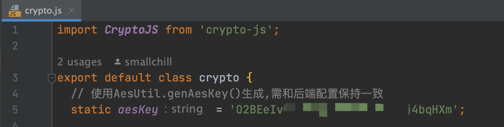
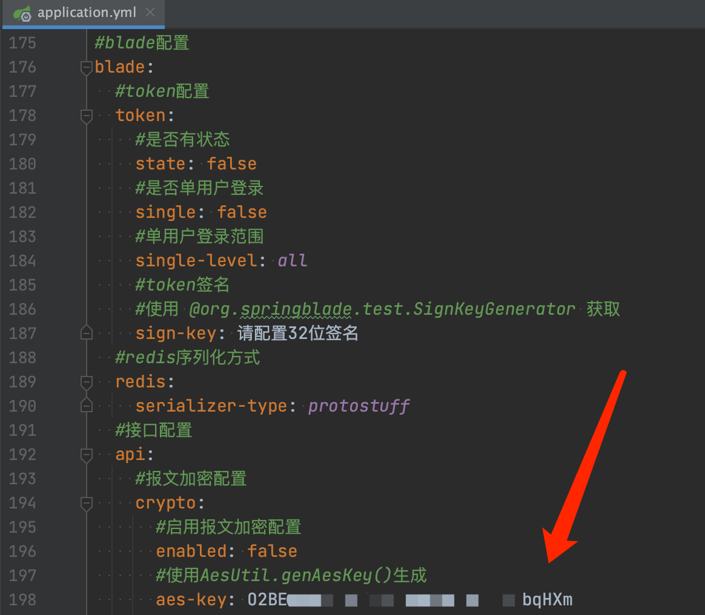
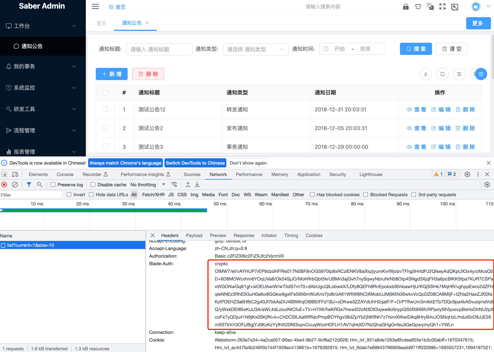
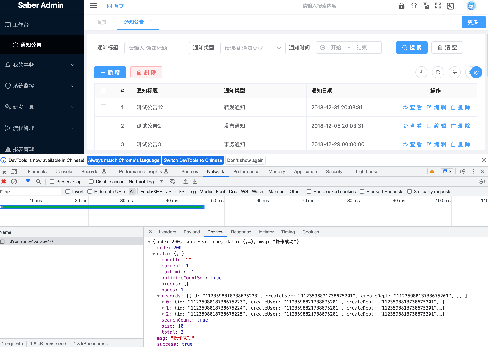

## 前言

* 随着对系统安全性要求的逐步提高，单纯的jwt传输已经无法满足外部对于“安全”的定义
* 需要对jwt加密传输但又不影响系统整体功能使用的需求迫在眉睫
* BladeX经过巧妙设计，以极小的改动，支持了jwt的加密传输并且不影响现有的任何业务代码


## 令牌调用流程

1. 前端通过api调用时，会将Token放入header传递给后端
2. 后端在执行接口之前，获取请求的header并对Token进行解析
3. 若解析校验失败或者Token过期，则拒绝接口访问
4. 若解析校验成功，则进入接口逻辑，并且可获取Token解析后的关键字段


## 实现加密思路

##### 在不影响整体流程的前提下，我们进行了下述 <span style="color:red">红字 </span> 部分的操作，可插拔的形式，完全不影响，改动也非常小

1. 前端通过api调用时，<span style="color:red">先对Token进行可解密的Aes加密</span>，将<span style="color:red">加密后</span>的Token放入header传递给后端
2. 后端在执行接口之前，获取请求的header并对Token进行解析，<span style="color:red">若判断为加密Token，则先进行解密</span>
3. <span style="color:red">将解密后获取的原版Token往下传递</span>，若解析校验失败或者Token过期，则拒绝接口访问
4. 若解析校验成功，则进入接口逻辑，并且可获取Token解析后的关键字段


## 开始对接

1. 前端找到需要进行加密传输的接口，加上 `cryptoToken: true` 的配置，具体如下

   ```javascript
   export const getList = (current, size, params) => {
     return request({
       url: '/blade-desk/notice/list',
       method: 'get',
       params: {
         ...params,
         current,
         size,
       },
       cryptoToken: true,
     });
   };
   ```

2. 找到前端的crypto工具类，修改aesKey的值，<span style="color:red">注意这个值不要用bladex自带提供的，一定要自行用AesUtil.genAesKey重新获取，否则容易被别人恶意利用</span>

   

3. 找到后端的配置，将值设置为前端一致

   

4. 配置完毕，token全自动的加密解密就做好了，之前写的业务代码无需做任何变动


## 进阶配置

1. 经过上述配置之后，后端接口可以同时解析jwt和加密后的jwt，攻击者仍然可以伪造jwt进行渗透攻击

2. 为了近一步安全考虑，我们可以强制指定某些接口只接受加密jwt，如此一来，就提高了渗透攻击的难度，加强了系统的安全性

3. 强制指定可以有两种方式进行

4. 第一种是通过注解 `@PreAuth(AuthConstant.HAS_CRYPTO)` 实现，可以放在方法上也可以放在controller上

   ```java
   	@PreAuth(AuthConstant.HAS_CRYPTO)
   	@GetMapping("/detail")
   	@ApiOperationSupport(order = 1)
   	@ApiOperation(value = "详情", notes = "传入notice")
   	public R<NoticeVO> detail(Notice notice) {
   		Notice detail = noticeService.getOne(Condition.getQueryWrapper(notice));
   		return R.data(NoticeWrapper.build().entityVO(detail));
   	}
   ```

5. 第二种是通过配置文件解决，具体如下

   ```yaml
   #blade配置
   blade:
     #安全框架配置
     secure:
       #授权认证配置
       auth:
         - method: ALL
           pattern: /blade-desk/notice/**
           expression: "hasCrypto()"
   ```

6. 以上两种方式选其一即可

7. 配置好之后，我们实际操作看下network的参数，可以看到token传输已加密并且返回了正确的数据

   

   


## 后记

* Token加密完美收官，后续若想进行请求参数的加密解密功能，请阅读后续的 `5.9 API报文加密` 章节
