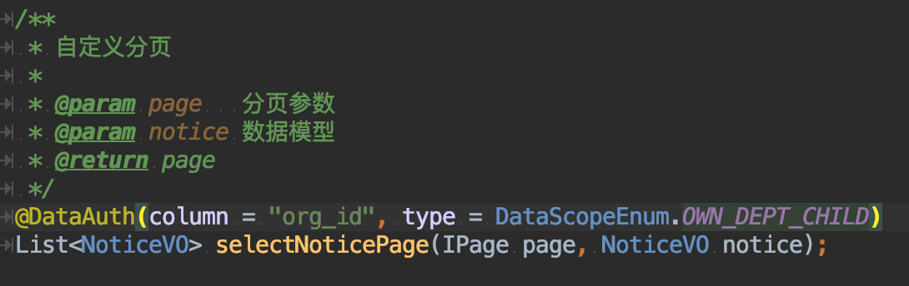
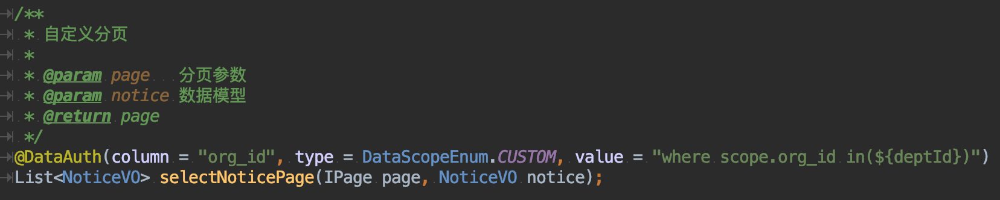
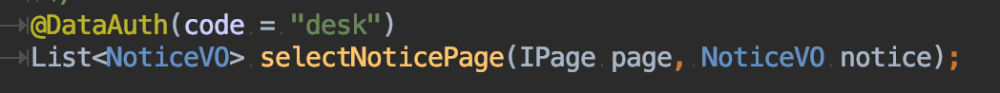
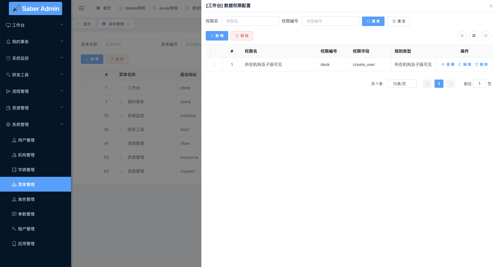
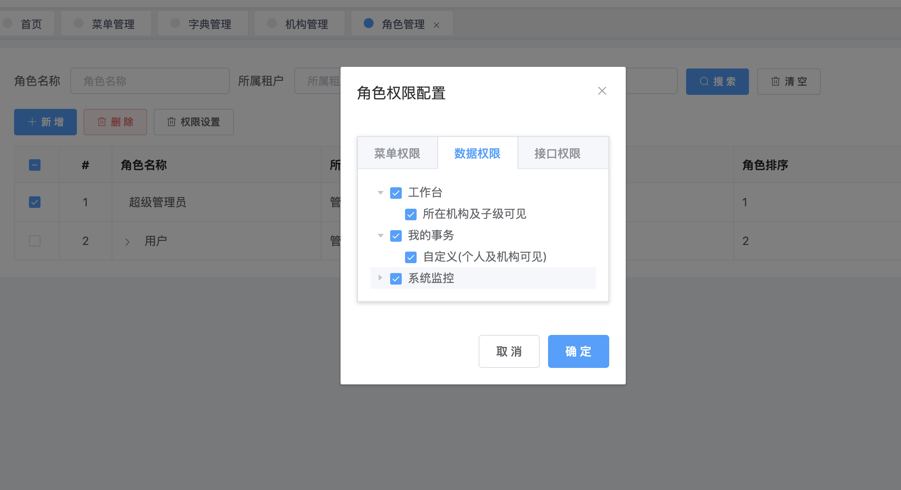
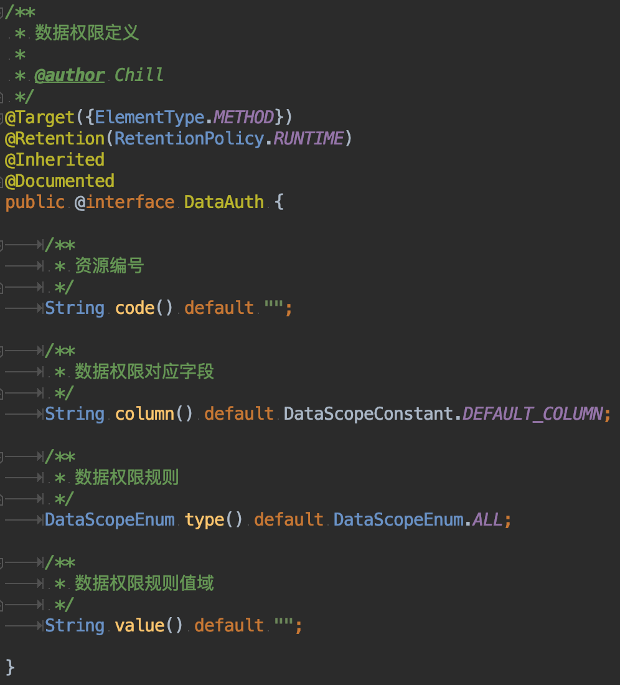
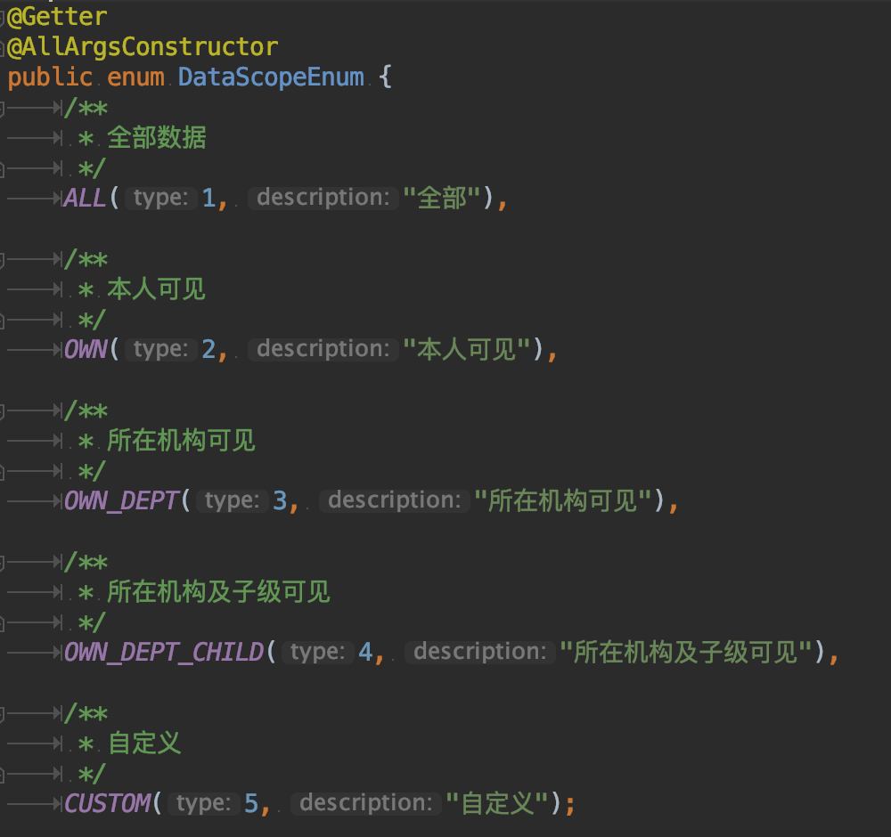
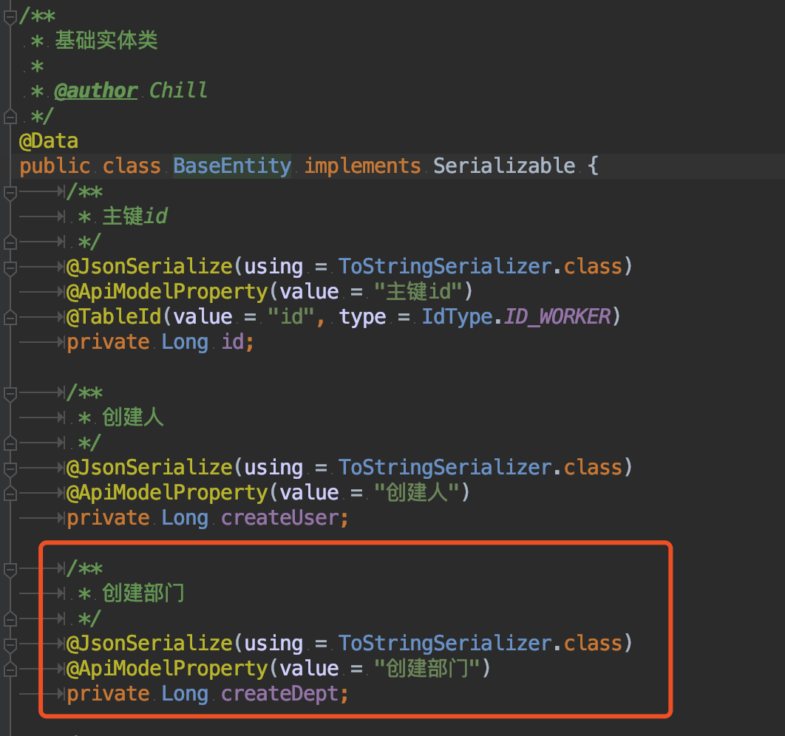
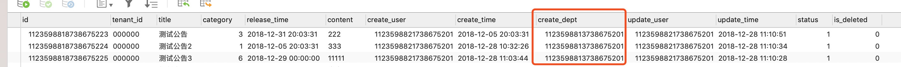
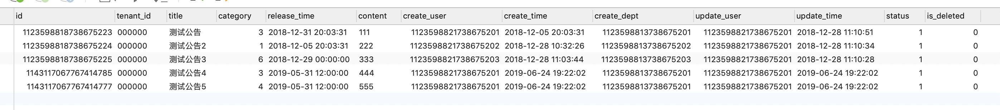

## 前言
* 我们知道，一般的系统都离不开权限模块，它是支撑整个系统运行的基础模块。而根据项目类型和需求的不同，权限模块的设计更是大相径庭。但不管怎么变，权限模块从大的方面来说，可以分为三种大的类型：**功能权限**、**接口权限**、**数据权限**。
* 功能权限：也就是我们最熟悉的菜单、按钮权限。可以配置各个角色能看到的菜单、按钮从而从最表层分配好权限
* 接口权限：顾名思义，配置不同角色调用接口的权限。有些敏感接口，是只能有固定的一些角色才能调用，普通角色是不能调用的。这种情况需要有一个明确的系统来控制对应的访问权限
* 数据权限：是大家最为需求也是最广为谈资的一个设计理念。我们需要控制不同的角色、机构人员有查看不同数据范围的权限。如果你动手去设计数据权限，当你去各大平台、百度、谷歌查找设计思路的时候，你会发现很难找到有用的资料，很多设计思路局限性非常大。
* BladeX解决了这一类疑难问题，提供三种方式来实现数据权限，大家可以根据不同场景选择对应的方案。
( **注意⚠️ 超管账号不受数据权限影响，大家后续测试请使用其他账号** )
1.提供代码层配置@DataAuth注解达到脱离数据库的全固定配置方式

2.提供代码层配置@DataAuth注解配置**数据权限资源编码**来达到依赖数据库的半自动配置方式

3.提供web界面在线配置，达到数据权限自动、动态生效的目的

## 注解说明
* 数据权限的核心注解为@DataAuth，我们来看一下他的构成

* 纯注解我们只需要关注下面三个字段即可，当中的数据权限规则枚举类我们来看下构成

* 可以看到，目前的数据权限类型一共有五种，前面四种都是不需要自定义写sql的，只有选择了CUSTOM类型，才需要定义注解的value属性
* 注解默认过滤的字段名为create_dept，如果有修改，则需要定义对应的字段名

## 准备工作
* 因为涉及到数据权限字段，现在我们需要先升级系统至2.0.4.RELEASE以上，执行数据库脚本确保数据库和基础实体类有create_dept这个字段

* 为了测试方便，我们修改下create_user，create_dept对应的一些数据

* 准备好了之后，我们开始学习如何开发数据权限
