## 纯注解配置
* 如果是纯注解配置，那么是不通过数据库的，相当于是离线配置。
* 我们只需要关注column、type、value这三个字段。
* `column`：需要过滤的数据库字段
* `type`：数据权限过滤的类型
* `value`：当数据权限类型为自定义的时候，配置的sql条件语句

### 所在机构可见
1. 配置DataAuth注解，因为默认字段就是create_dept，所以无需配置column
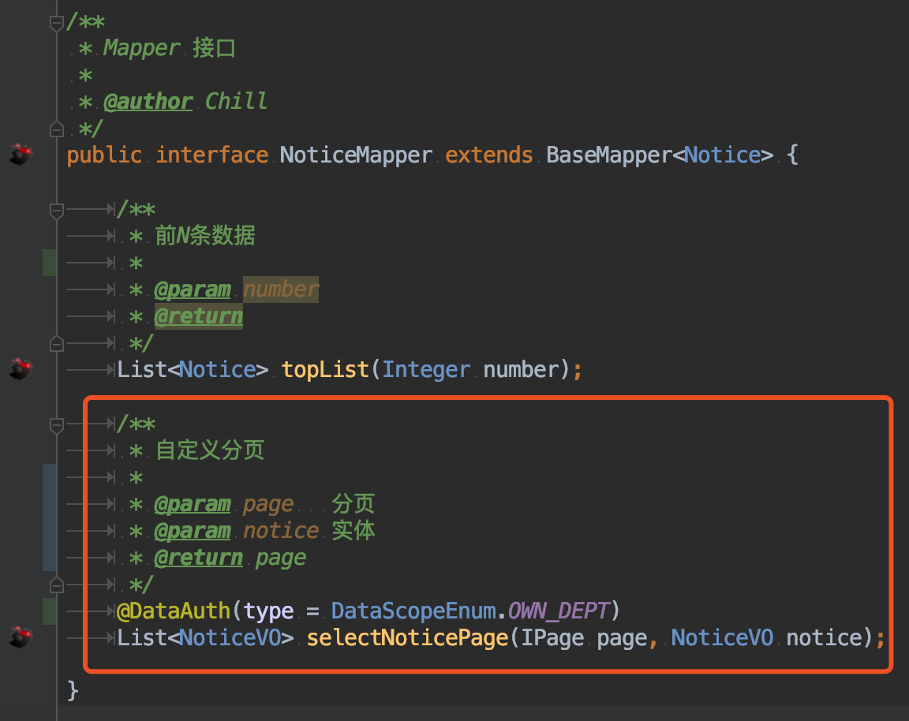
2. postman调用接口获取token
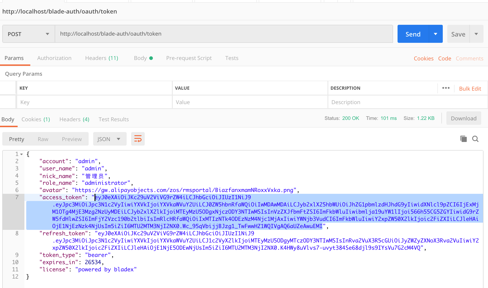
3. 将token传入header并调用对应接口
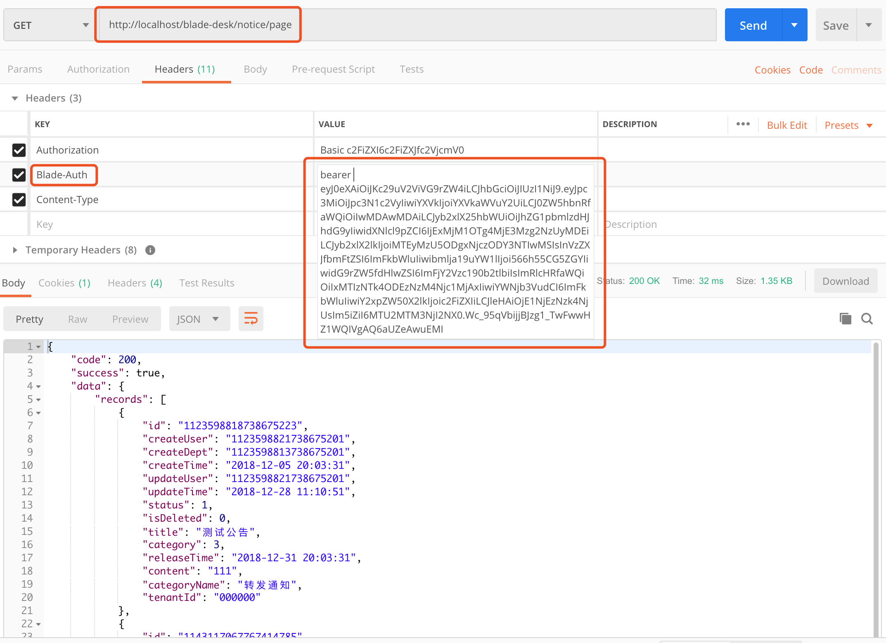
4. 查看具体返回数据
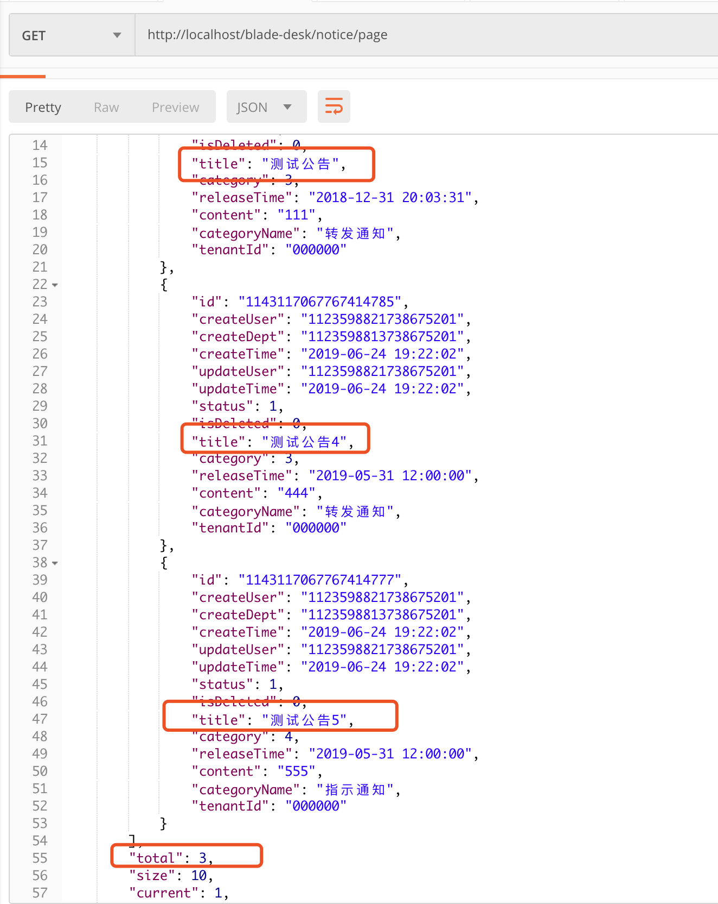
5. 查看控制台sql打印
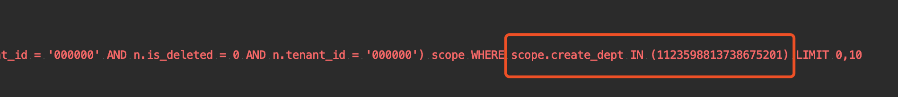
6. 核对数据库数据，发现一致
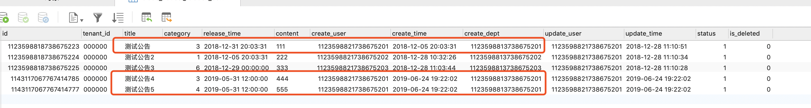

### 所在机构及子集可见
1. 配置DataAuth注解，因为默认字段就是create_dept，所以无需配置column
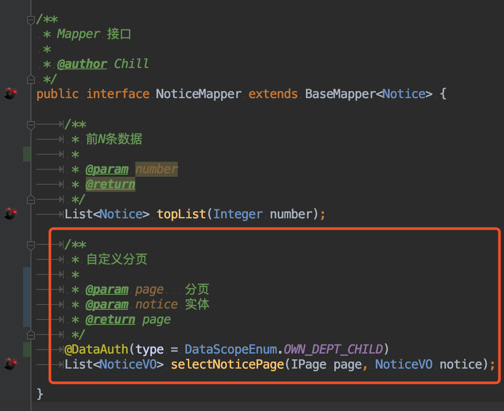
2. 重启工程再次调用接口，发现返回了5条
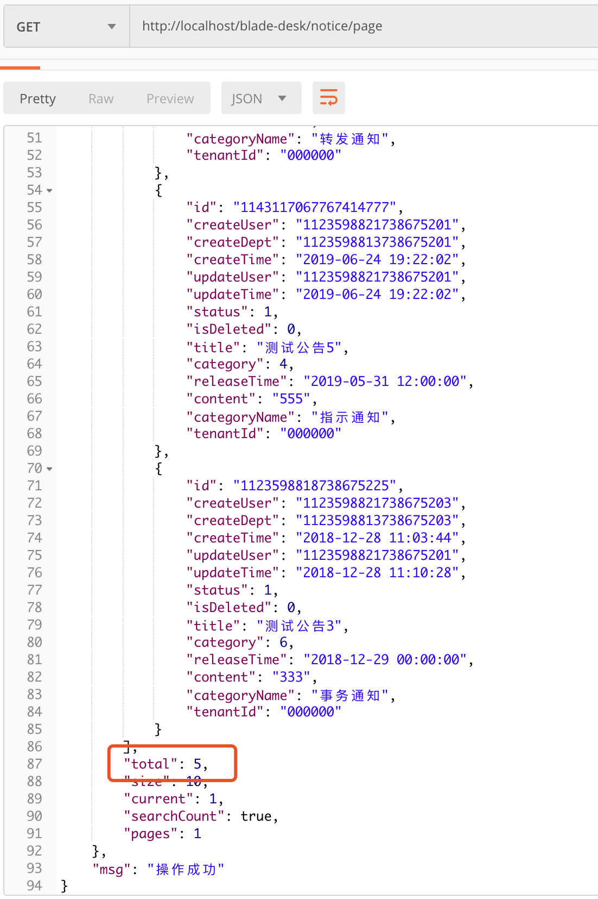
3. 查看控制台sql打印
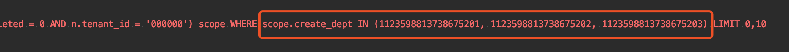
4. 查看部门表对应数据，可以看到，也是正确的
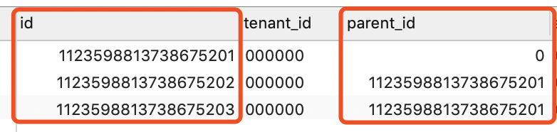

### 个人可见
1. 配置DataAuth注解，由于创建人字段为create_user，不是默认，所以需要指定
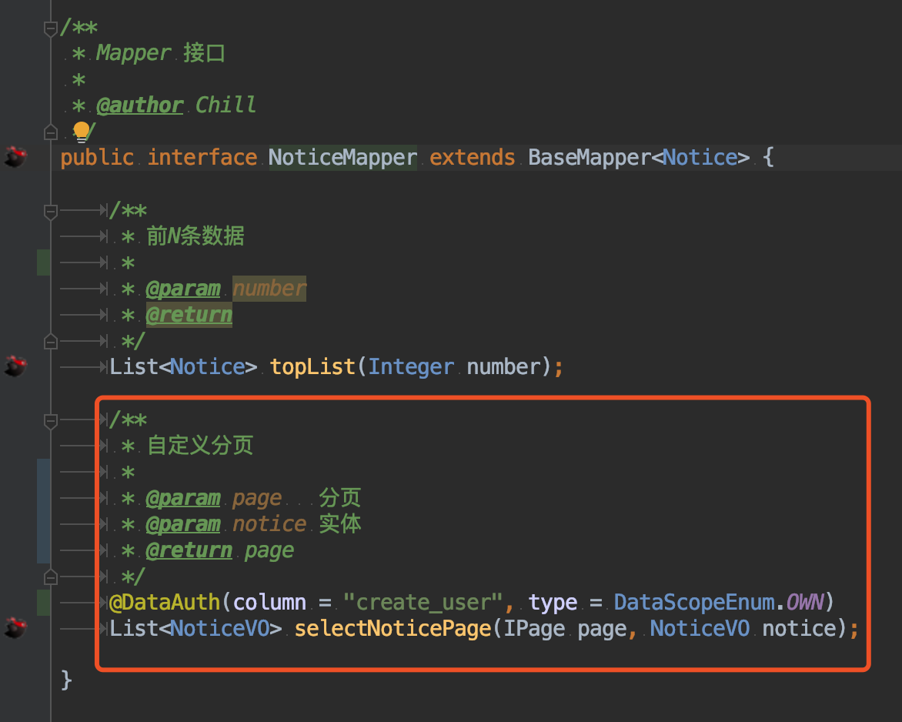
2. 重启工程再次调用接口，发现返回了3条
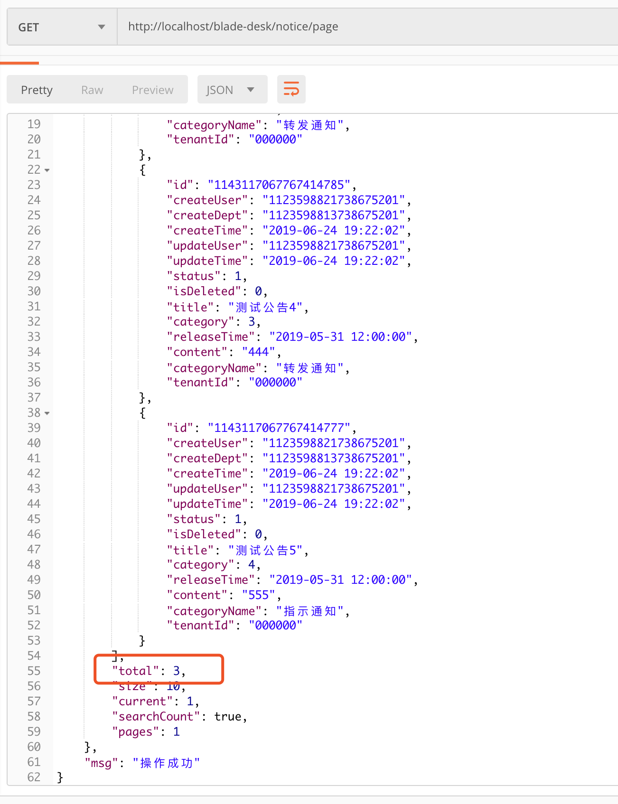
3. 查看控制台sql打印
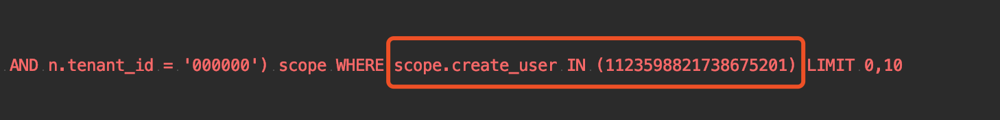
4. 可以看到，筛选字段名变为了create_user，与我们预想一致

### 自定义配置
1. 配置DataAuth注解，配置自定义sql
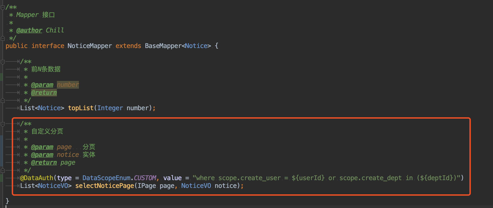
2. 在这个配置的sql里我使用里占位符`${userId}`，没错，这么写在底层就可以直接获取到当前登录用户的deptId字段，除此之外我们还可以用更多的参数，比如`${deptId}`、`${roleId}`、`${tenantId}`、`${account}`、`${userName}`等等
3. 这些参数可以参考BladeUser类，他的所有字段我们都是可以根据占位符来获得的。
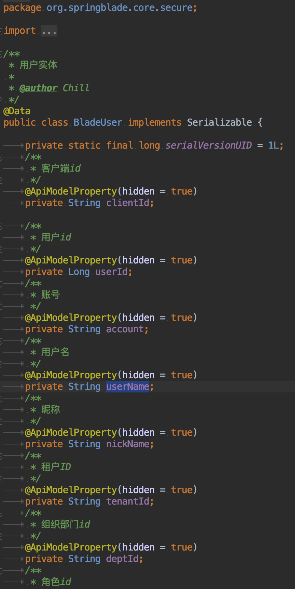
4. 重启工程再次调用接口,发现返回了3条
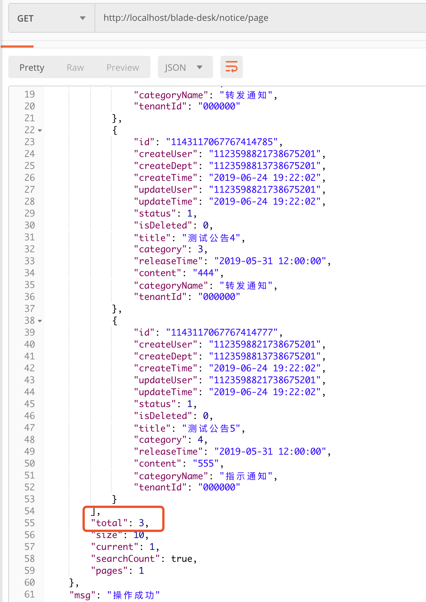
5. 查看控制台sql打印
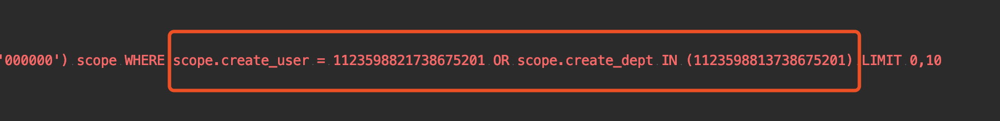
6. 我们可以看到，自定义sql以及占位符都生效，达到了我们的预期～

## 注
* 纯注解配置，如果对于灵活性要求不是特别大的话，其实可以满足绝大多数场景了
* 下一节，我们来看下基于web全自动配置
