## web可视化动态配置
* 数据权限动态配置需要依赖数据库，所以我们需要前往web端进行配置
* 配置逻辑与纯注解配置一致，其实就是把注解配置拓展，并做成了web可视化
* 下面我们来打开web工程，进行操作把～

### Web配置
1. 打开saber，进入`数据权限`，点击`通知公告`模块的`数据权限`按钮
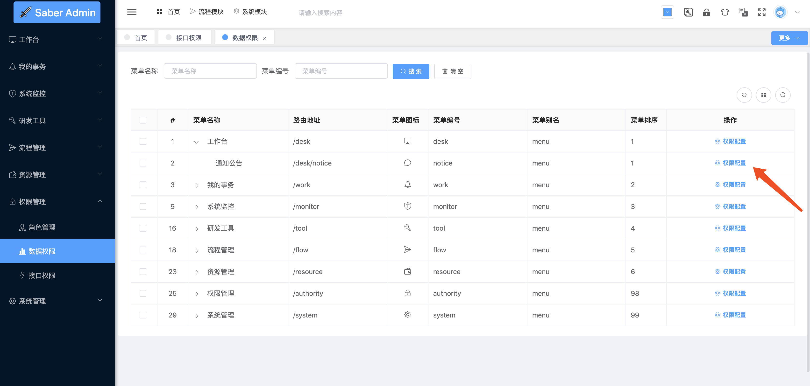
2. 在弹层点击新增按钮
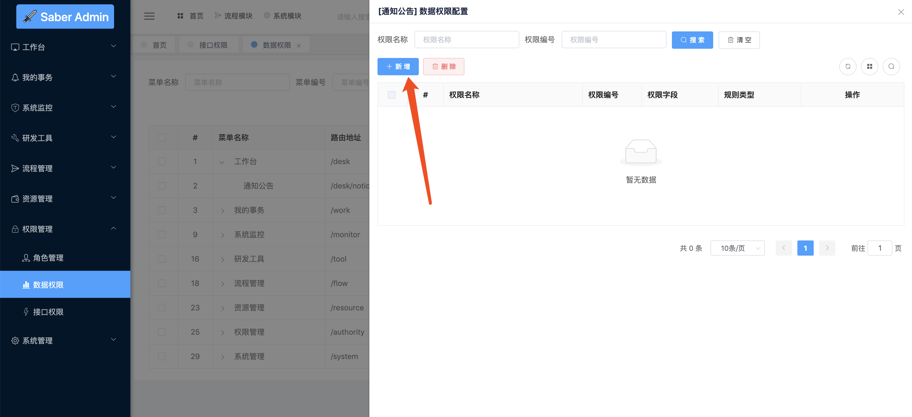
3. 填入对应的参数
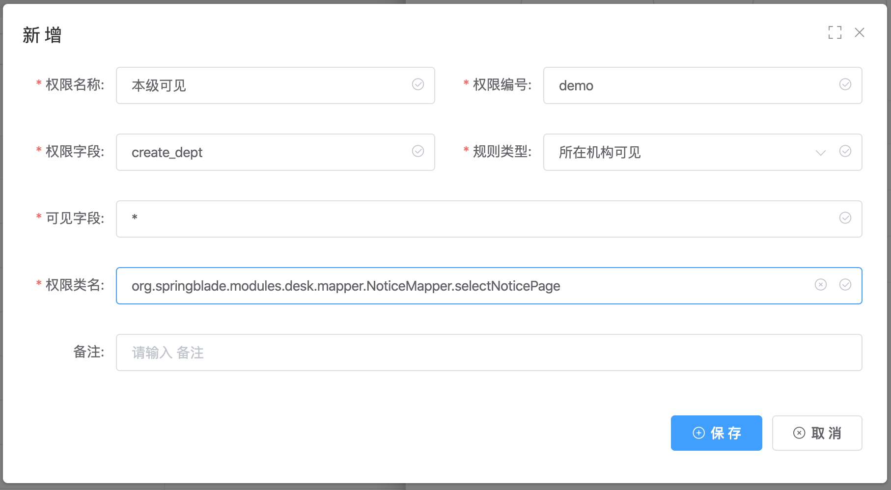
4. 参数中的`可见字段`代表数据权限最终返回的字段集合，如果是全部则填`*`, 如果只需要id和name两个字段，则填 `id, name`
5. 参数中的`权限类名`字段,之所以可以实现自动配置，就是因为我们指定了Mapper层对应执行的方法。所以我们对应的路径需要指定正确，不能出错。
6. 还有一点需要注意的是，若分页、列表方法不是自己写的mapper，而是采用的mybatis-plus自动生成的方法，没有自定义的方法名，那这个路径应该如何写？
7. 其实很简单，我们跟踪下代码，可以看到，自带的page方法，其实是调用了BaseMapper里的selectPage方法
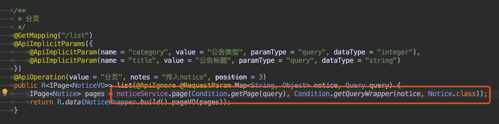
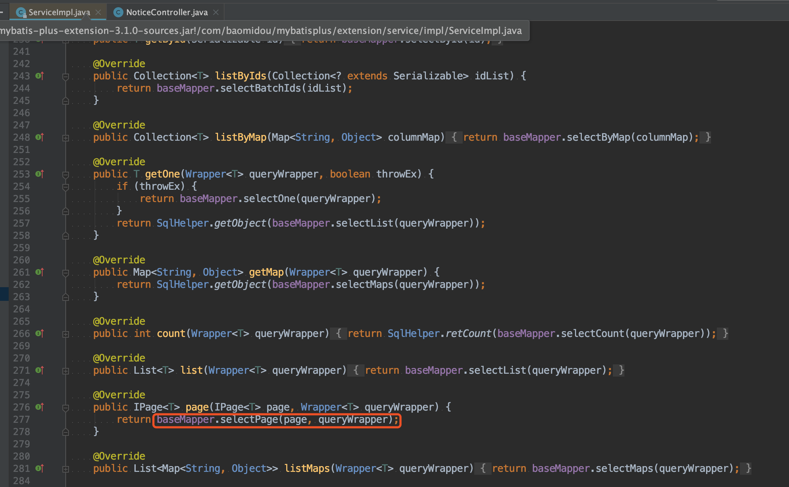
8. 所以我们如果需要配置自动生成的mapper方法，只需要把刚刚的`org.springblade.modules.desk.mapper.NoticeMapper.selectNoticePage` 改成`org.springblade.modules.desk.mapper.NoticeMapper.selectPage`即可
⚠️ **注：boot版本有`modules`分包，而cloud没有，所以大家需要根据选择不同的架构来配置地址，注意不要配置错。另外如果两个架构都有运行，需要在后一个运行之前先把redis缓存清空**
9. 确认无误后，保存配置，可以看到在通知公告模块下，多了一条数据权限的配置
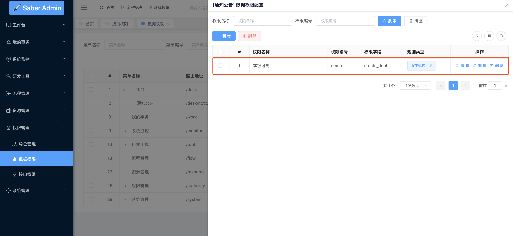
10. 那么下面，我们就需要对其分配权限了，打开`角色管理`的`权限配置`进行分配
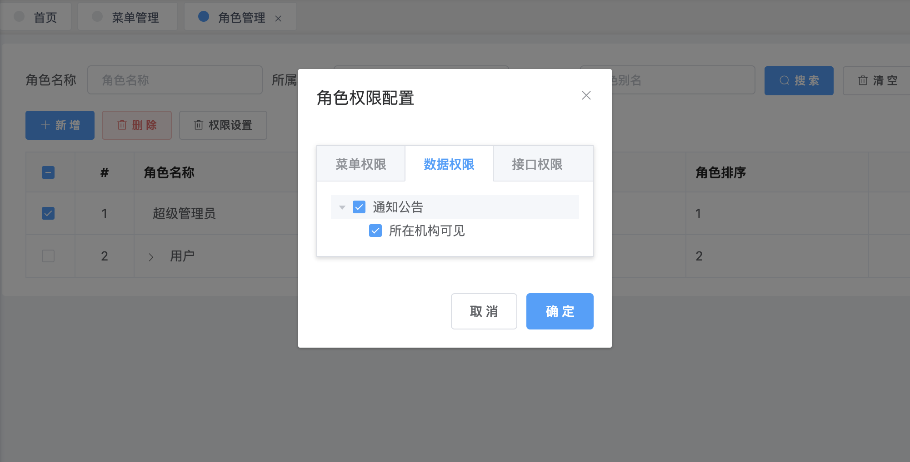
11. 这里有一点需要注意，我们之前在菜单模块下进行了数据权限规则的新增，在角色权限配置的时候，可以看到归类在了对应的菜单下。这一点仅仅只是分类的作用，并没有实质性的影响。比如我可以配置生效的方法是`org.springblade.modules.desk.mapper.NoticeMapper.selectNoticePage` ，却把它放在了工作流的菜单分类下。实际生效的还是通知公告对应的这个方法，而不会对工作流菜单下的方法产生影响。

### 接口调用
1. 删掉上一章的DataAuth注解
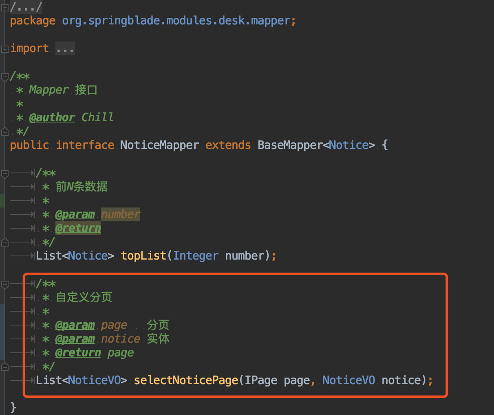
2. 重启工程并调用postman，可以看到返回了3条数据
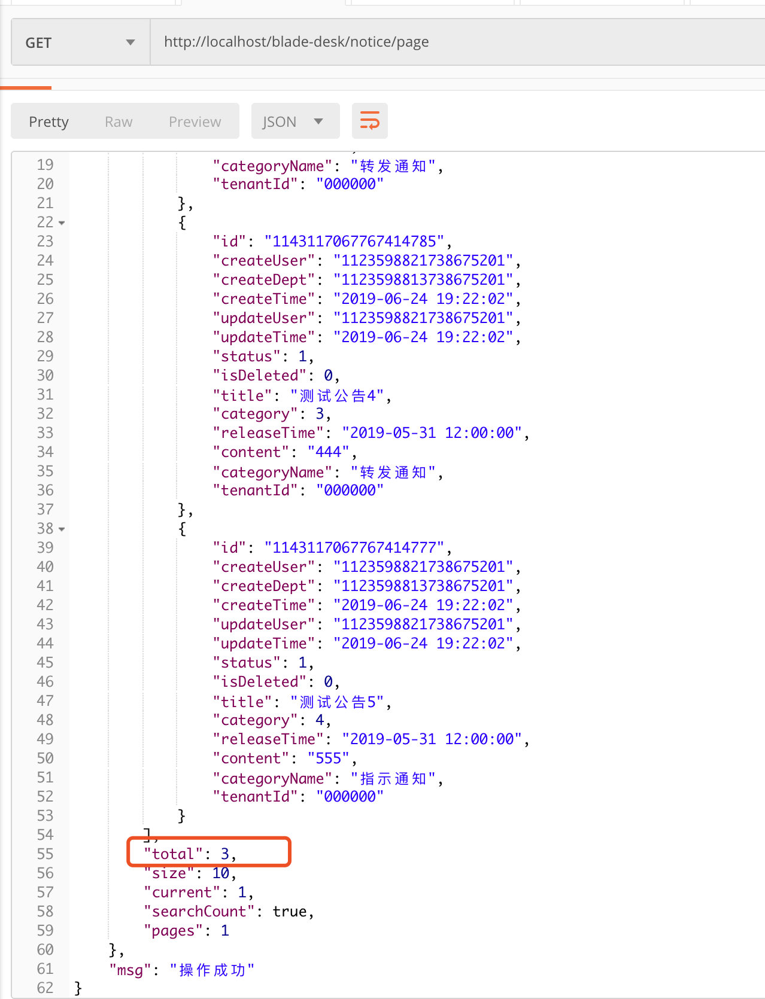
3. 查看控制台发现sql过滤条件生成成功
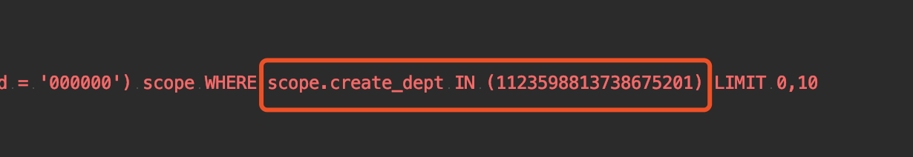
4. 修改刚刚的规则，改为自定义并填入自定义sql
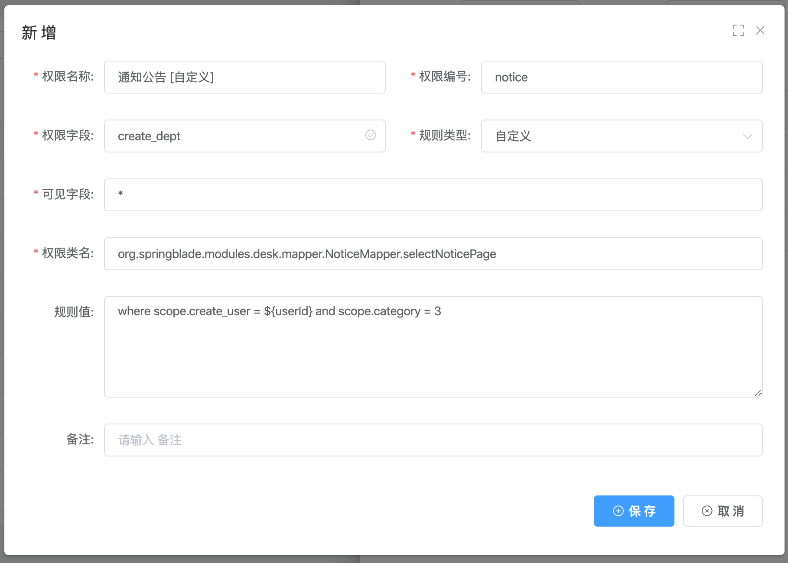
5. 无需重启工程，直接再次调用postman，发现这回返回了两条数据
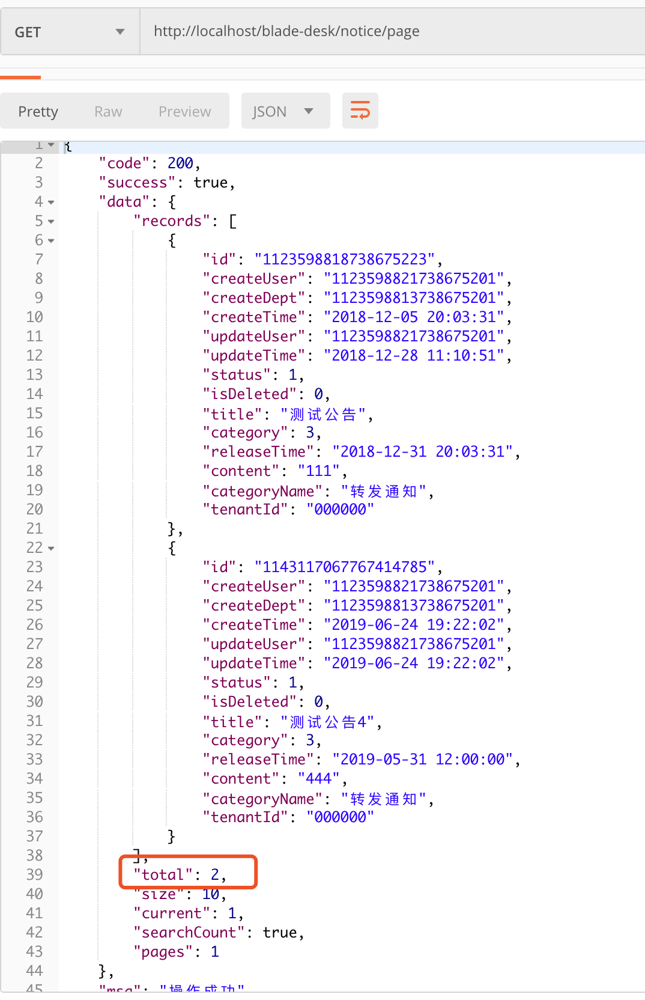
6. 控制台的sql过滤条件生成成功
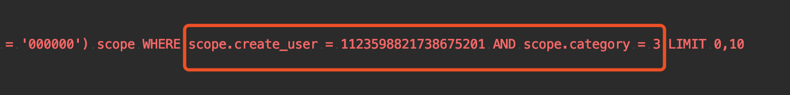
7. 此时我们将类名修改为通知功能列表页会调用的mapper方法
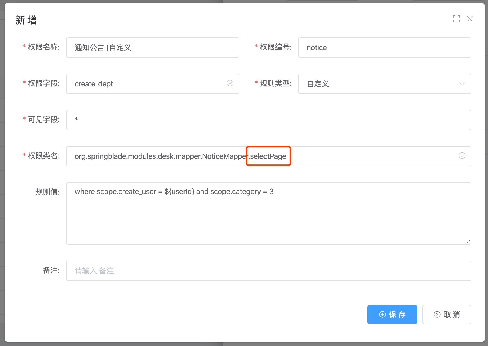
8. 不用重启，直接访问通知公告模块，发现显示了两条数据
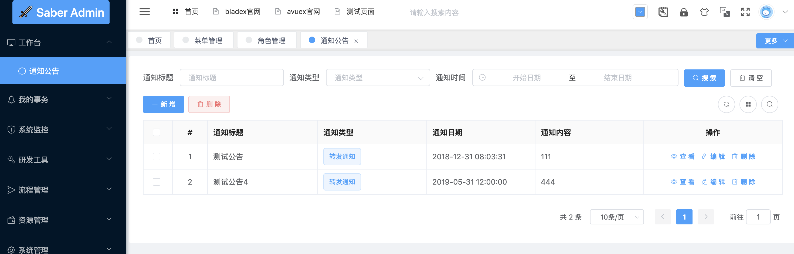
9. 控制台打印条件正确
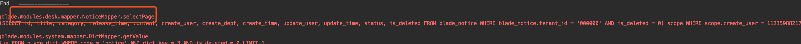
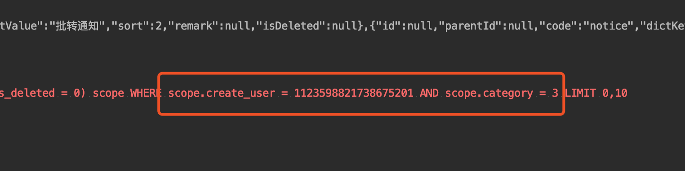

## 注
* 纯注解和web全自动的配置方式两者结合，相信可以满足绝大多数需求
* 超级管理员不受数据权限影响，只有普通的账号数据权限才会生效，这个务必记住
* 对于国内一些特别复杂的需求，无法用配置实现的话，我推荐大家直接写死在代码内，否则这是一条不归路，一旦踏上，再也无法回头～
