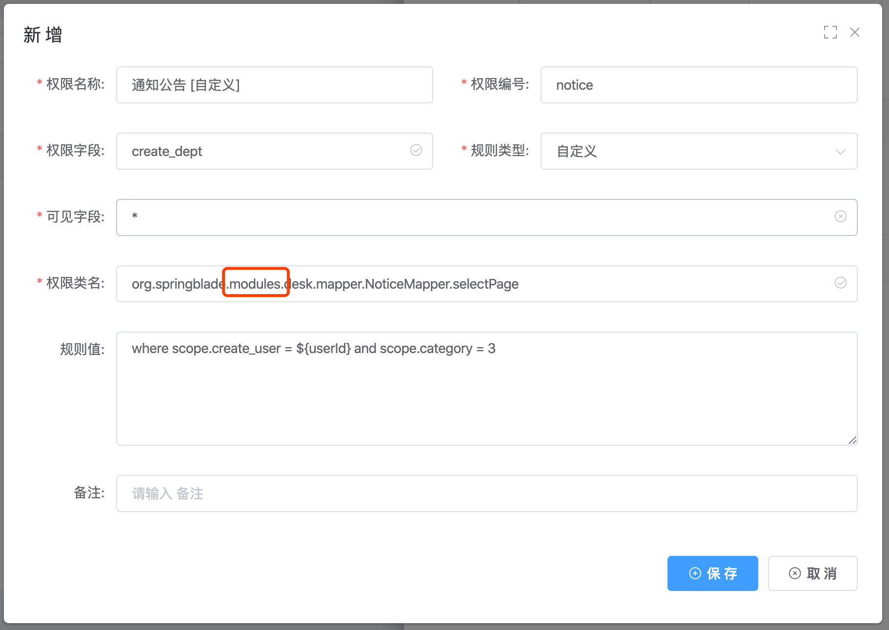
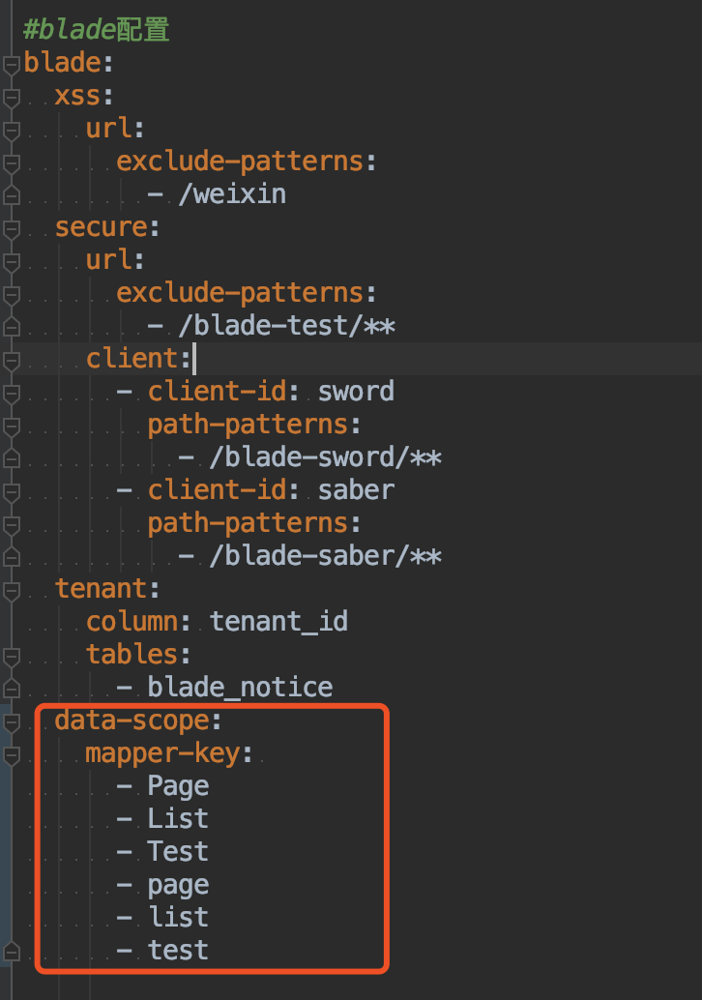

## 注意点
1. BladeX与BladeX-Boot的包名路径不一样，为了合并，Boot版本多了一个`modules`。所以当同一个库两个版本相互切换的时候，要记得将mapper的路径包名修复正确

2. 动态数据权限采用了redis缓存，为了保证系统性能，请大家在线上生产的时候务必搭建redis高可用服务
3. 为了进一步提升性能，BladeX在动态数据权限部分只扫描了包含Page、List的mapper方法，如果大家有其他的方法需要匹配，请按照如下配置

4. 如果是在cloud分布式环境使用，某些服务的数据源没有链接到核心库而是业务库，若直接调用数据权限的api会爆本地找不到表的错误。
5. 这种情况需要引入blade-scope-api依赖，这样就会进行远程调用来获取数据权限了，具体可以看：https://sns.bladex.vip/q-591.html
