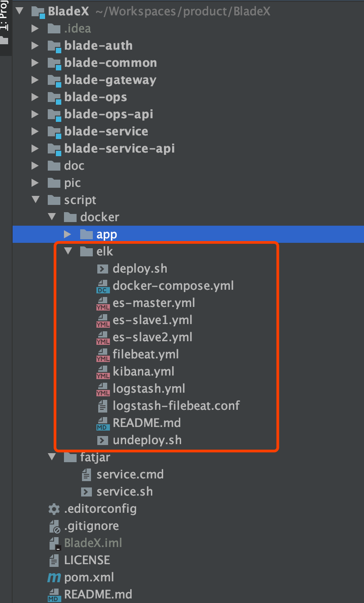
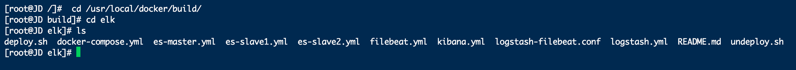
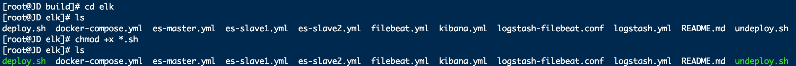
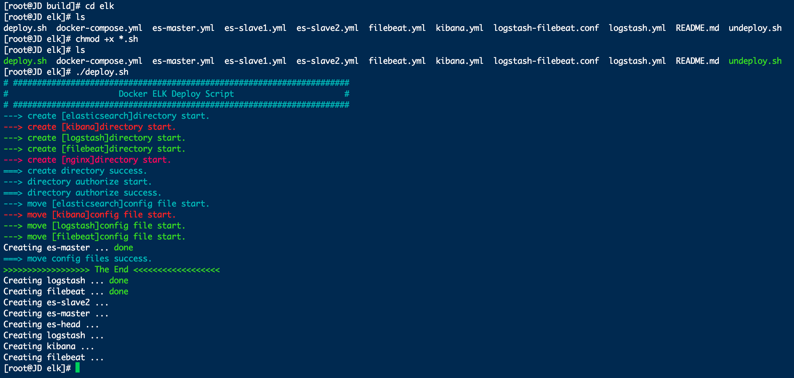
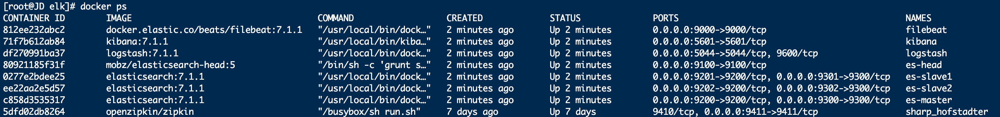
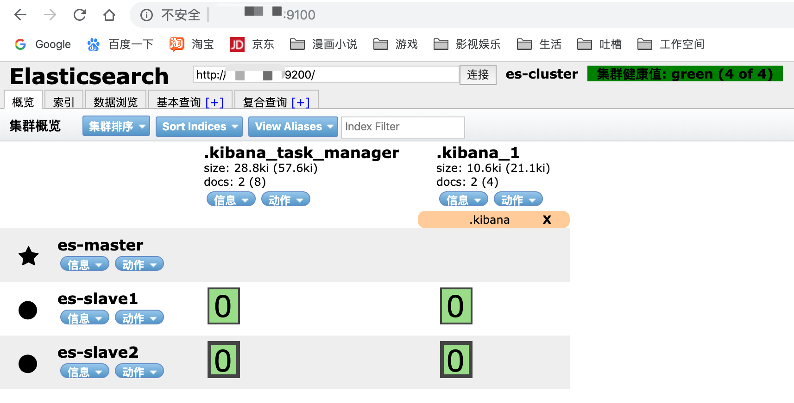

## 环境要求
* Docker
* Docker-Compose

## 注意事项
* 脚本启动报错：$'\r': command not found
* 如何解决：修改编码、赋予可执行权限
* 脚本启动报错：max virtual memory areas vm.max\_map\_count \[65530\] is too low, increase to at least \[262144\]（elasticsearch用户拥有的内存权限太小，至少需要262144）
* 如何解决：
~~~shell
# 修改配置sysctl.conf
[root@localhost ~]# vi /etc/sysctl.conf
# 添加下面配置：
vm.max_map_count=262144
# 重新加载：
[root@localhost ~]# sysctl -p
# 最后重新启动elasticsearch，即可启动成功。
~~~

## 开始部署
1. 进入BladeX的script文件夹，拷贝elk的脚本至服务器的任意文件夹

2. 这里我们以`/usr/local/docker/build/elk/`作为目录，上传脚本文件

3. 将`deploy.sh`以及`undeploy.sh`赋予可执行权限

4. 执行部署脚本，若没有docker镜像，脚本会自动下载并且下载完毕后进行启动
~~~
[root@localhost elk]# ./deploy.sh 
~~~

5. 将docker使用到的相关端口逐一开启

## 访问界面
1. 端口开启后，访问`http://服务器ip地址:9100`查看es集群是否成功启动

2. 访问`http://服务器ip地址:5601`查看kibana是否成功启动

3. 查看索引发现并没有数据，下一章我们将介绍进行数据对接并进行配置查询

## 结尾语
* 我们通过docker脚本非常迅速地构建出了一个elk的单机伪集群，只要服务器配置高，足以应付一半以上的应用场景
* 若需要多台服务器分布式部署，只需要简单改一下脚本，配置相互连接的ip即可
* 对于一些复杂场景，要安装各种插件的情况，推荐大家使用原生安装的方式，只要看明白一键部署脚本的配置文件，相信原生安装对大家来说不成问题～
