## 对接准备
1. 打开BladeX找到blade-common模块的LauncherServiceImpl，打开elk配置的注释
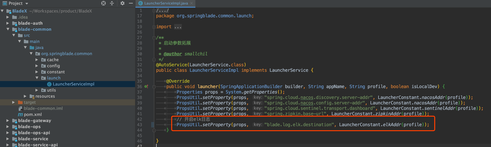
2. 配置elk地址为刚刚服务器的地址再加上9000端口，注意不要加上http前缀
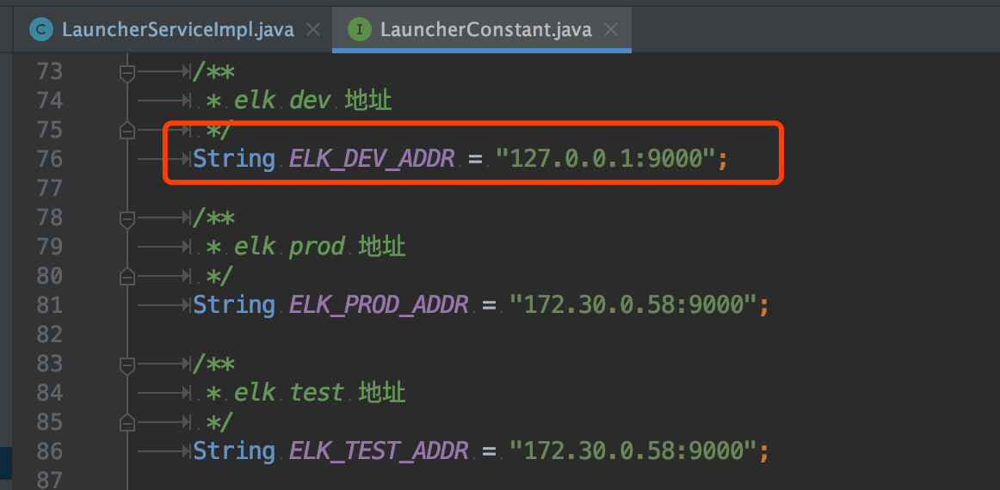
3. 可能有人会想，配置写死在代码内，每次打包都要修改不方便，怎么办？
* 这一点BladeX早已完美解决，原理和使用具体可以参考手册的这两个章节
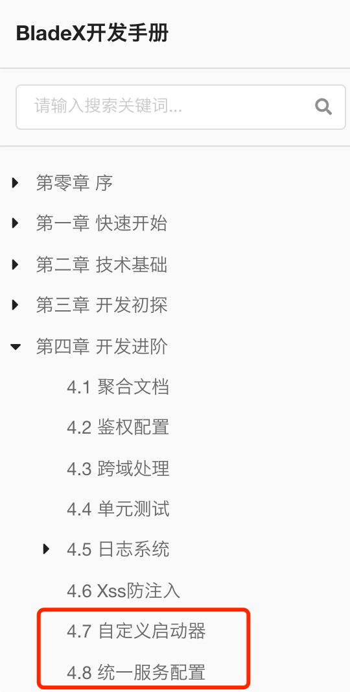
* 生产环境需要指定其他地址只需要运行如下命令即可
`java -jar app.jar --blade.log.elk.destination=192.168.0.30:9000`
* 在docker-compose的启动命令同样可以进行配置
~~~yaml
 bladex-system:
    image: "${REGISTER}/bladex-system:${TAG}"
    ports:
      - 8106:8106
      - ${ADMIN_SENTINEL_PORT}:${ADMIN_SENTINEL_PORT}
    privileged: true
    restart: always
    command:
      - --spring.profiles.active=prod
      - --spring.cloud.nacos.discovery.ip=192.168.0.80
      - --spring.cloud.nacos.discovery.port=8848
      - -Dblade.log.elk.destination=192.168.0.30:9000
    networks:
      - bladex_net
~~~

## 代码对接
1. 启动blade-system服务
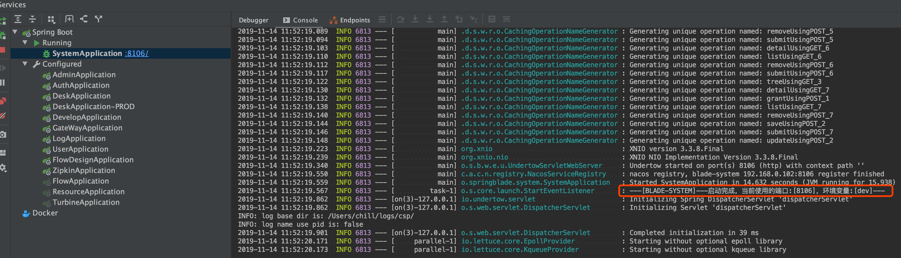
2. 再次访问kibana的索引页面，发现数据已经推送成功，可以进行索引创建了
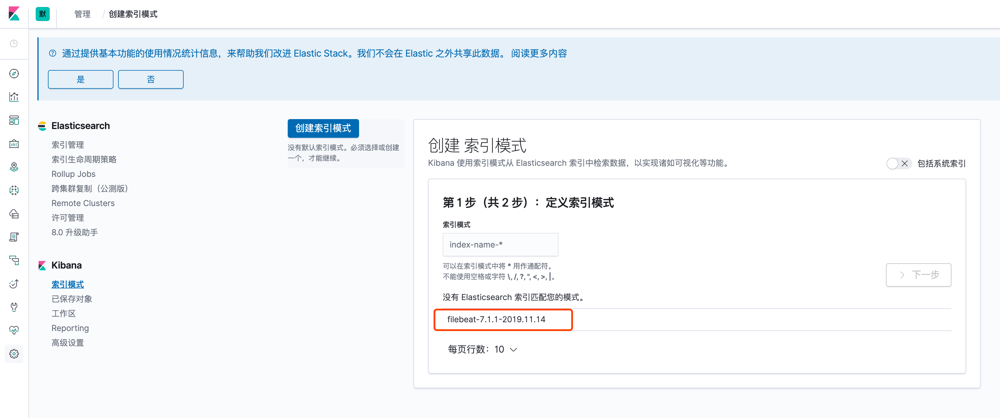
3. 输入索引匹配点击下一步
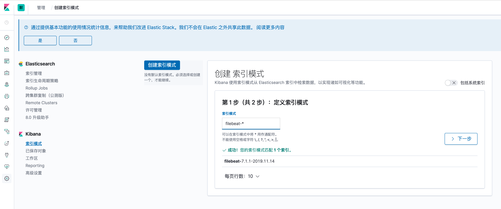
4. 选择时间筛选并创建
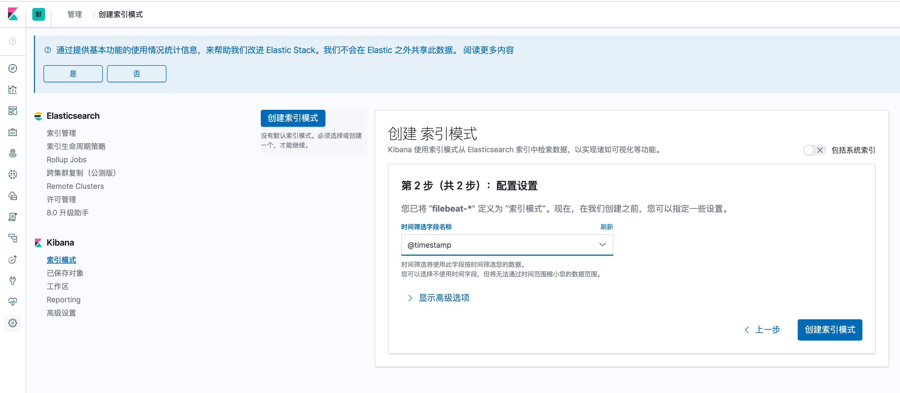
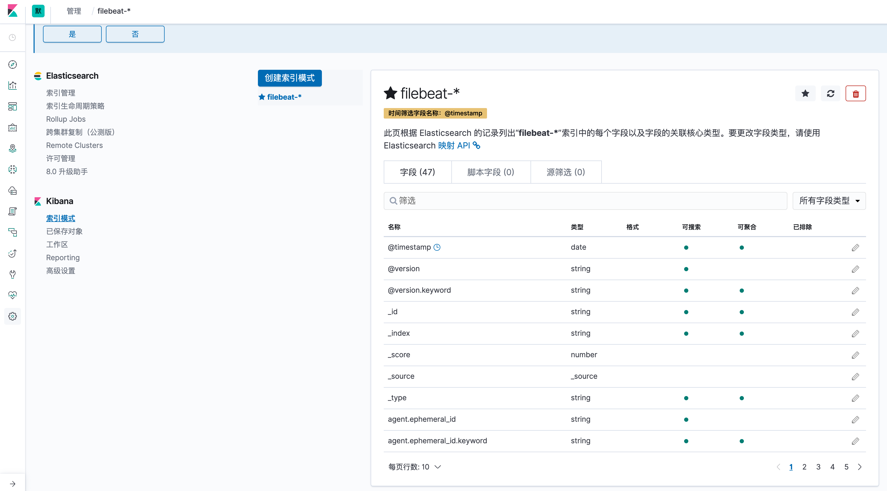
5. 这时候我们便可以进行日志查询了
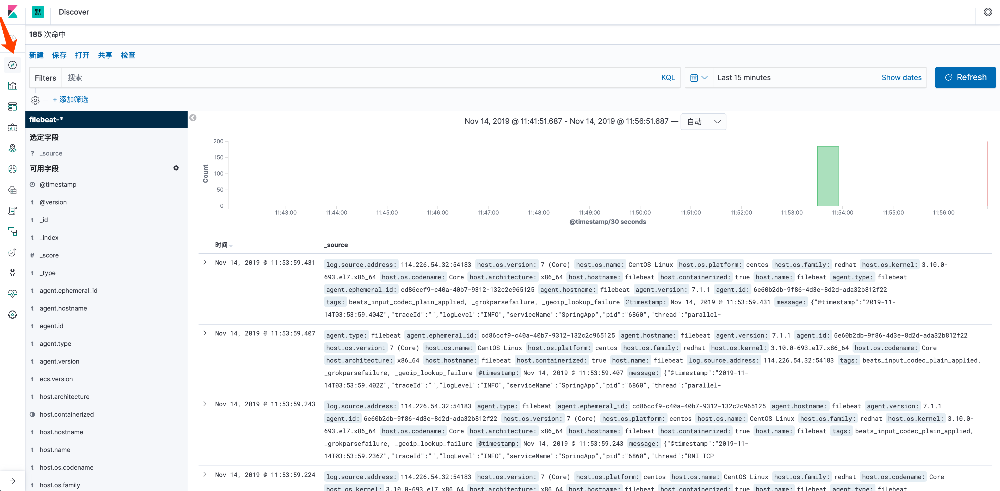

## 日志配置与查询
1. 启动基础服务，在token接口调用链内写log，并验证
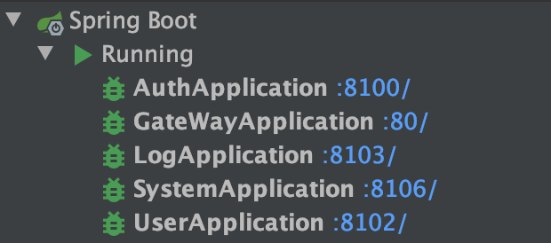
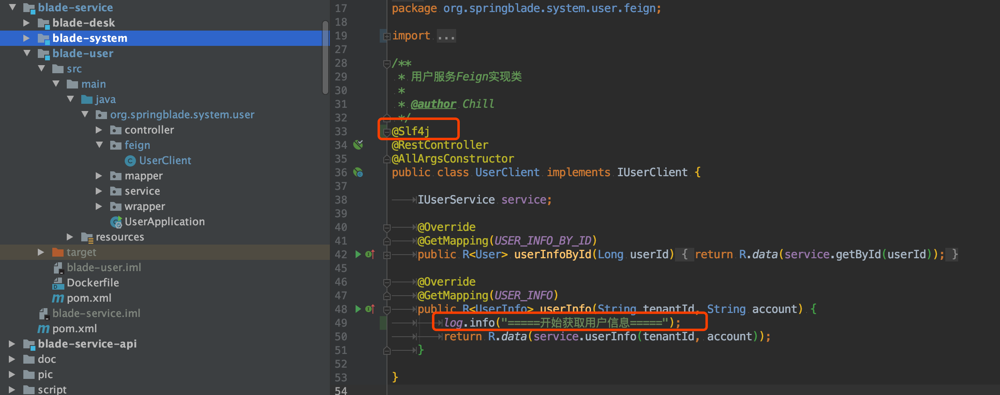
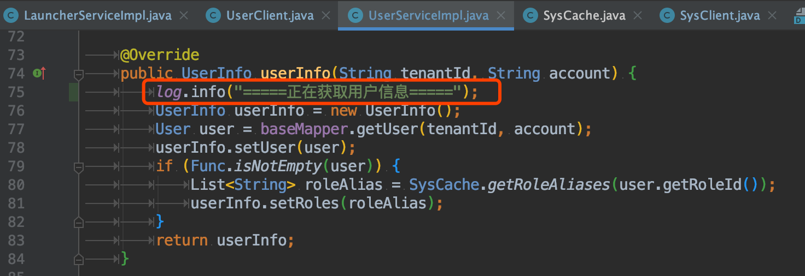
2. 使用postman调用token接口，并查看kibana收集的日志信息
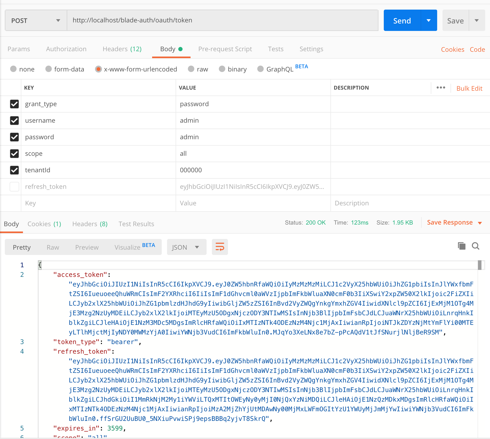
3. 查询`用户`二字，很迅速地给出了结果
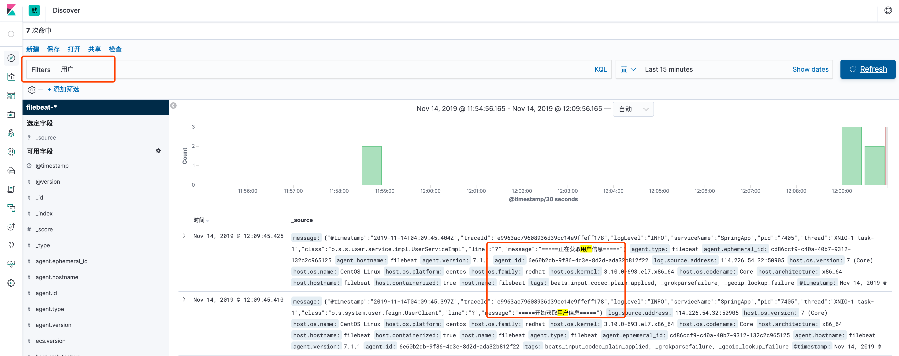
4. 点开其中一个日志，找到`traceId`
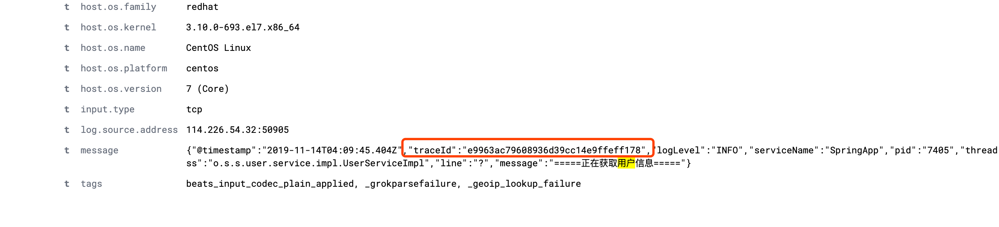
5. 复制后进行查询，发现将整个调用链的日志都查询出来了，非常便于后期的调试

## 结尾语
* 我们简单地过了一遍elk的部署、配置、对接，使用到了他的日志与索引功能
* 但是elk的能力远不止此，相信大家入门后，再结合其他的学习，会将elk作为自己的一员大将！
