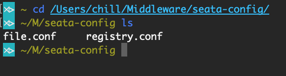
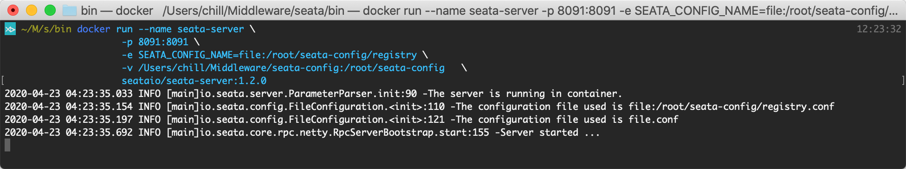
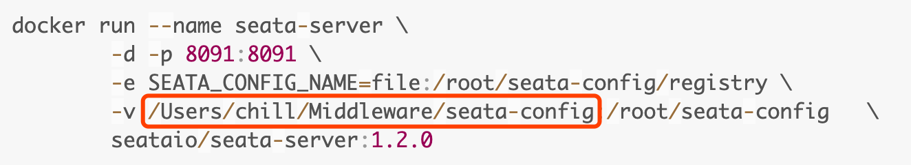
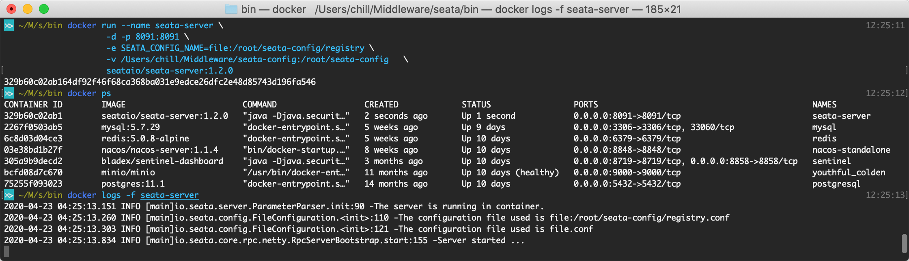

## 一键启动
1. 执行命令: `docker run --name seata-server -d -p 8091:8091 seataio/seata-server:1.4.1`
2. 执行命令查看是否启动成功: `docker ps`
3. 后续会随着版本升级而采用最新版本


## 挂载配置启动
1. 拷贝上一章节提到的`file.conf`和`registry.conf`两个文件到自行定义的文件夹内
2. 手册以`/Users/chill/Middleware/seata-config`为例    

3. 使用挂载的方式令docker内部服务可读取到外部配置，这时候我们暂时先不加`-d`的命令，直接看对应的控制台,可以看到日志输出为系统启动成功

4. 命令加上`-d`后便会在后台运行，可以直接对接微服务进行调试
5. 完整命令如下：
```
docker run --name seata-server \
        -d -p 8091:8091 \
        -e SEATA_CONFIG_NAME=file:/root/seata-config/registry \
        -v /Users/chill/Middleware/seata-config:/root/seata-config   \
        seataio/seata-server:1.4.1
```
6. 其中需要修改的部分便是如下红框的路径，修改为大家保存到自定义文件夹的路径

7. 启动成功后效果如下

8. 后续若有配置变更，大家只需要修改挂载的`file.conf`和`registry.conf`两个文件并重启服务即可


## 后记
* 可以指定外部配置文件来运行docker服务，那么也可以让docker服务链接到nacos，具体配置详见上一章
* 更多文档请前往官方查阅：[https://seata.io/zh-cn/docs/ops/deploy-by-docker.html](https://seata.io/zh-cn/docs/ops/deploy-by-docker.html)
