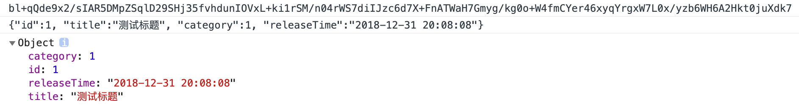
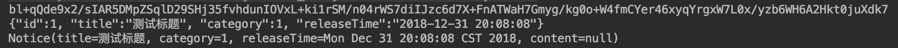

## 准备工作
1. 在使用之前，我们需要做一下准备工作，一是确定前后约定好的加密方式、加密密钥，二是进行简单的调试，查看下前端加密后传到后端，是否可以解密成功，后端返回的加密信息前端是否也可以解密成功。
2. 若可以成功，那么我们就可以进行下一步操作，进行API加密对接测试了。
3. 以AES加密方式进行测试，因为AES性能更高，在API调用方面更推荐使用AES。使用`AesUtil.genAesKey()`生成对应的密钥串：`O2BEeIv399qHQNhD6aGW8R8DEj4bqHXm`
4. 前端进行如下测试，以Saber为例
~~~javascript
import crypto from "@/util/crypto";
~~~
~~~javascript
export default class crypto {
  // 使用AesUtil.genAesKey()生成,需和后端配置保持一致
  static aesKey = "O2BEeIv399qHQNhD6aGW8R8DEj4bqHXm";

  // 使用DesUtil.genDesKey()生成,需和后端配置保持一致
  static desKey = "jMVCBsFGDQr1USHo";
  .............................................
}
~~~
~~~javascript
const encrypt = crypto.encryptAES('{"id":1, "title":"测试标题", "category":1, "releaseTime":"2018-12-31 20:08:08"}', crypto.aesKey);
const decrypt = crypto.decryptAES(encrypt, crypto.aesKey);
const notice = JSON.parse(decrypt);
console.log(encrypt);
console.log(decrypt);
console.log(notice);
~~~
5. 查看前端运行结果，准确无误（时间戳虽然较久远，但这是BladeX正式发布前夕的数据，具有纪念意义）

6. 后端进行如下测试
~~~java
public static void main(String[] args) {
   String aesKey = "O2BEeIv399qHQNhD6aGW8R8DEj4bqHXm";
   String encrypt = AesUtil.encryptToBase64("{\"id\":1, \"title\":\"测试标题\", \"category\":1, \"releaseTime\":\"2018-12-31 20:08:08\"}", aesKey);
   String decrypt = AesUtil.decryptFormBase64ToString(encrypt, aesKey);
   Notice notice = JsonUtil.parse(decrypt, Notice.class);
   System.out.println(encrypt);
   System.out.println(decrypt);
   System.out.println(notice);
}
~~~
7. 查看后端运行结果，准确无误

8. 前后端验证无误后，说明我们的加密工具类已经调试完毕，下一步就可以开始做对接配置了
