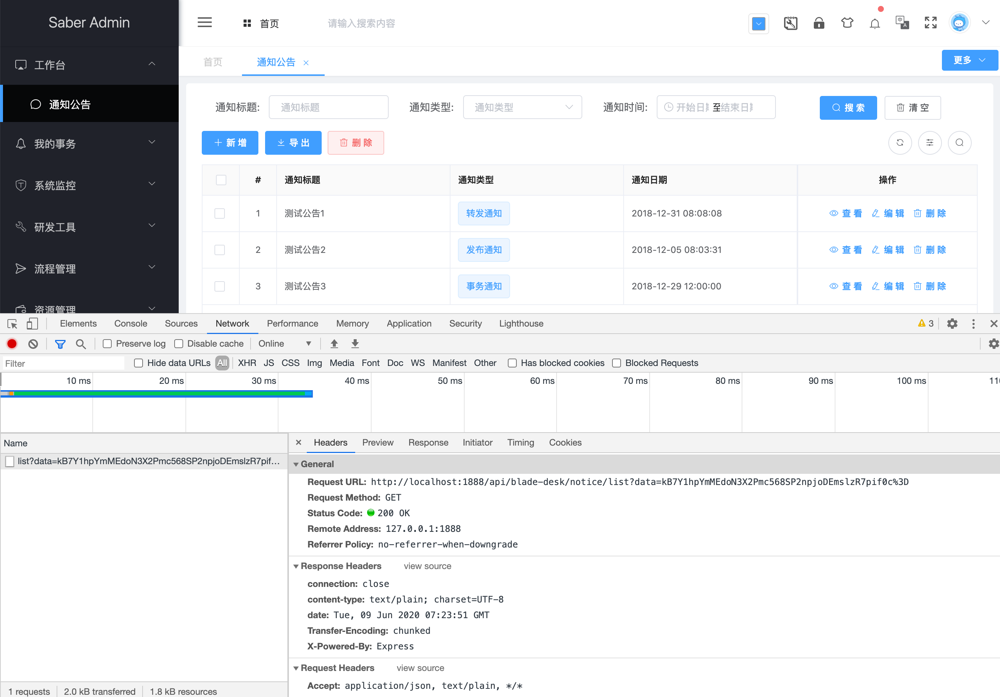
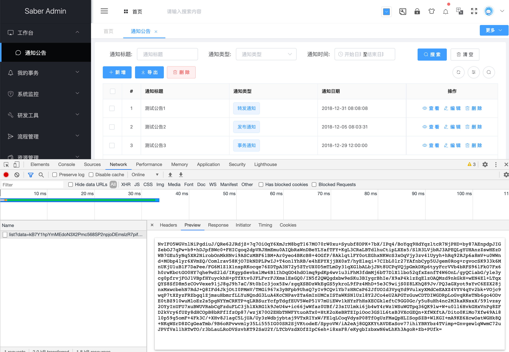
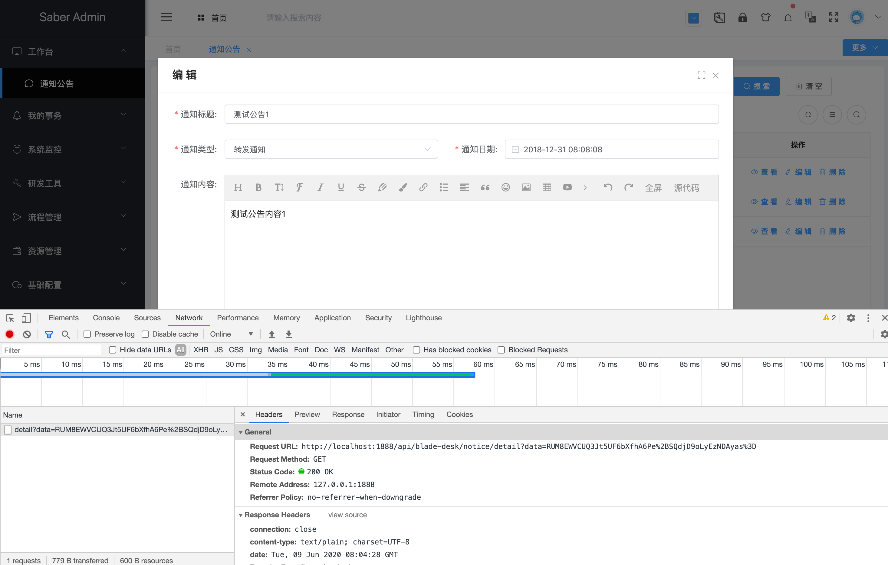
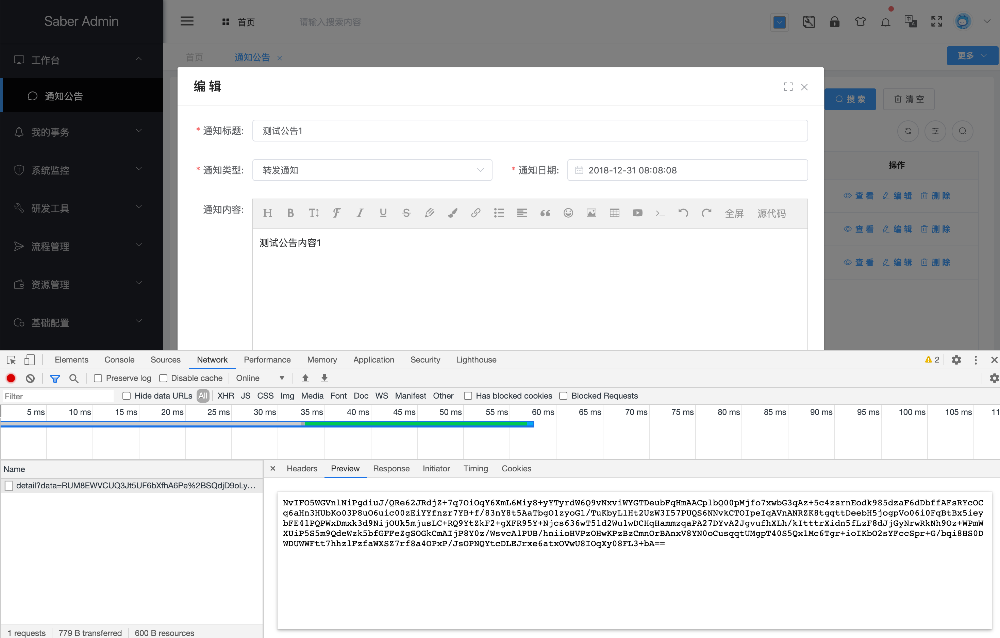

## 改造Notice模块列表功能
> 经过前面几节的介绍，相信大家已经使用熟练，那么下面我们就来着手改造notice模块，实现全加密传输
1. 我们先改造前端列表接口，由于是param传参，所以我们将其包装为一个data参数
> /api/desk/notice.js 改造前
~~~javascript
import request from '@/router/axios';

export const getList = (current, size, params) => {
  return request({
    url: '/api/blade-desk/notice/list',
    method: 'get',
    params: {
      ...params,
      current,
      size,
    }
  })
}

~~~
> /api/desk/notice.js 改造后
~~~javascript
import request from '@/router/axios';
import crypto from "@/util/crypto";

export const getList = (current, size, params) => {
  const param = {
    ...params,
    current,
    size,
  }
  const data = crypto.encryptAES(JSON.stringify(param), crypto.aesKey);
  return request({
    url: '/api/blade-desk/notice/list',
    method: 'get',
    params: {
      data
    }
  })
}

~~~
> /views/desk/notice.vue 改造前
~~~javascript
getList(page.currentPage, page.pageSize, Object.assign(values, this.query)).then(res => {
  const data = res.data.data;
  this.page.total = data.total;
  this.data = data.records;
  this.loading = false;
  this.selectionClear();
});
~~~
> /views/desk/notice.vue 改造后
~~~javascript
getList(page.currentPage, page.pageSize, Object.assign(values, this.query)).then(res => {
  const result = crypto.decryptAES(res.data, crypto.aesKey);
  const data = JSON.parse(result).data;
  this.page.total = data.total;
  this.data = data.records;
  this.loading = false;
  this.selectionClear();
});
~~~

2.其次改造后端接口，由于加密后无法使用Map接参，所以需要先用bean接参，然后再转换为map（使用map可以自动生成模糊查询）
> NoticeController 改造前
~~~java
/**
 * 分页
 */
@GetMapping("/list")
public R<IPage<NoticeVO>> list(@ApiIgnore @RequestParam Map<String, Object> notice, Query query) {
   IPage<Notice> pages = noticeService.page(Condition.getPage(query), Condition.getQueryWrapper(notice, Notice.class));
   return R.data(NoticeWrapper.build().pageVO(pages));
}
~~~
> NoticeController 改造后
~~~java
/**
 * 分页
 */
@ApiCrypto
@GetMapping("/list")
public R<IPage<NoticeVO>> list(@ApiIgnore @ApiDecryptAes Notice notice, @ApiDecryptAes Query query) {
   Map<String, Object> params = JsonUtil.readMap(JsonUtil.toJson(notice), String.class, Object.class);
   IPage<Notice> pages = noticeService.page(Condition.getPage(query), Condition.getQueryWrapper(params, Notice.class));
   return R.data(NoticeWrapper.build().pageVO(pages));
}
~~~
3. 下面我们重启服务，访问notice模块，可以看到参数、返回都加密，运行完美成功。若想了解更多，大家可以打断点进行调试

## 改造Notice模块查询功能
1. 前端查询接口，由于也是param传参，所以我们也将其包装为一个data参数
> /api/desk/notice.js 改造前
~~~javascript
import request from '@/router/axios';

export const getNotice = (id) => {
  return request({
    url: '/api/blade-desk/notice/detail',
    method: 'get',
    params: {
      id
    }
  })
}
~~~
> /api/desk/notice.js 改造后
~~~javascript
import request from '@/router/axios';
import crypto from "@/util/crypto";

export const getNotice = (id) => {
  const param = {
    id
  }
  const data = crypto.encryptAES(JSON.stringify(param), crypto.aesKey);
  return request({
    url: '/api/blade-desk/notice/detail',
    method: 'get',
    params: {
      data
    }
  })
}
~~~

> /views/desk/notice.vue 改造前
~~~javascript
beforeOpen(done, type) {
  if (["edit", "view"].includes(type)) {
    getNotice(this.form.id).then(res => {
      this.form = res.data.data;
    });
  }
  done();
},
~~~
> /views/desk/notice.vue 改造后
~~~javascript
beforeOpen(done, type) {
  if (["edit", "view"].includes(type)) {
    getNotice(this.form.id).then(res => {
      const result = crypto.decryptAES(res.data, crypto.aesKey);
      const data = JSON.parse(result).data;
      this.form = data.data;
    });
  }
  done();
},
~~~
2. 改造后端详情接口
> NoticeController 改造前
~~~java
/**
 * 详情
 */
@GetMapping("/detail")
public R<NoticeVO> detail(Notice notice) {
   Notice detail = noticeService.getOne(Condition.getQueryWrapper(notice));
   return R.data(NoticeWrapper.build().entityVO(detail));
}
~~~
> NoticeController 改造后
~~~java
/**
 * 详情
 */
@ApiCrypto
@GetMapping("/detail")
public R<NoticeVO> detail(@ApiDecryptAes Notice notice) {
   Notice detail = noticeService.getOne(Condition.getQueryWrapper(notice));
   return R.data(NoticeWrapper.build().entityVO(detail));
}

~~~
3. 重启服务，访问notice模块，点击一条数据查看，可以看到参数、返回都加密，运行完美成功

