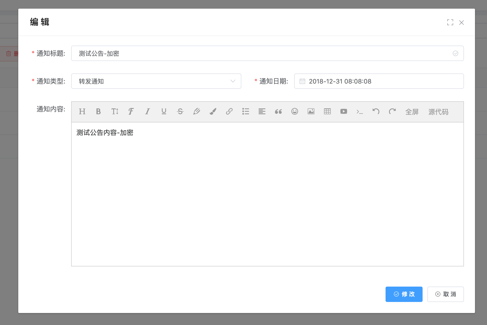
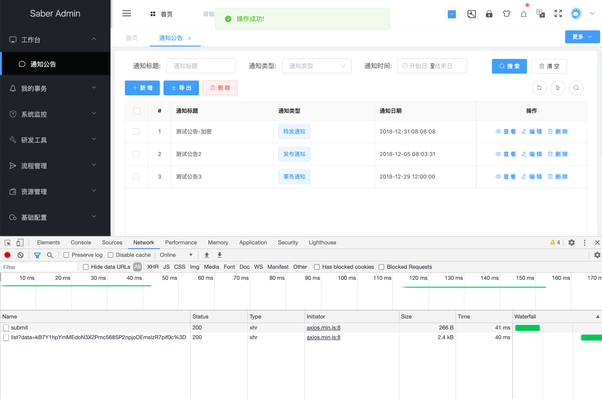
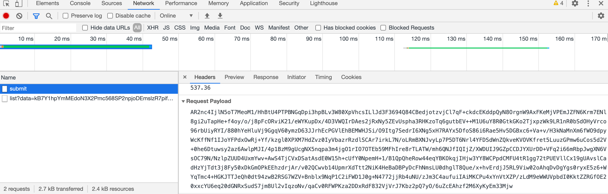
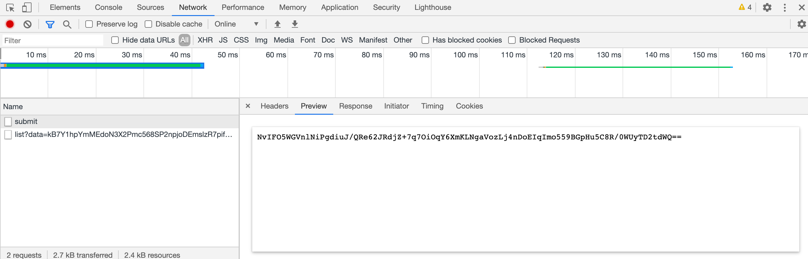

## 改造Notice模块新增修改功能
1. 改造前端接口，由于新增修改是通过body的方式传递，所以我们修改的地方与param方式不同
> /api/desk/notice.js 改造前
~~~javascript
import request from '@/router/axios';

export const add = (row) => {
  return request({
    url: '/api/blade-desk/notice/submit',
    method: 'post',
    data: row
  })
}

export const update = (row) => {
  return request({
    url: '/api/blade-desk/notice/submit',
    method: 'post',
    data: row
  })
}
~~~
> /api/desk/notice.js 改造后
~~~javascript
import request from '@/router/axios';
import crypto from "@/util/crypto";

export const add = (row) => {
  return request({
    url: '/api/blade-desk/notice/submit',
    method: 'post',
    text: true,
    data: crypto.encryptAES(JSON.stringify(row), crypto.aesKey)
  })
}

export const update = (row) => {
  return request({
    url: '/api/blade-desk/notice/submit',
    method: 'post',
    text: true,
    data: crypto.encryptAES(JSON.stringify(row), crypto.aesKey)
  })
}
~~~
> 因为notice.vue采用了异常捕获，所以正常返回无需读取数据，就不需要做修改了

2. 前端修改完毕，后端很简单，因为是body传参，只需要一个注解即可
> NoticeController 改造前
~~~java
/**
 * 新增或修改
 */
@PostMapping("/submit")
public R submit(@RequestBody Notice notice) {
   return R.status(noticeService.saveOrUpdate(notice));
}
~~~

> NoticeController 改造后
~~~java
/**
 * 新增或修改
 */
@ApiCrypto
@PostMapping("/submit")
public R submit(@RequestBody Notice notice) {
   return R.status(noticeService.saveOrUpdate(notice));
}
~~~
3. 重启服务，访问notice模块，进行新增修改操作，可以看到参数、返回都加密，运行完美成功

