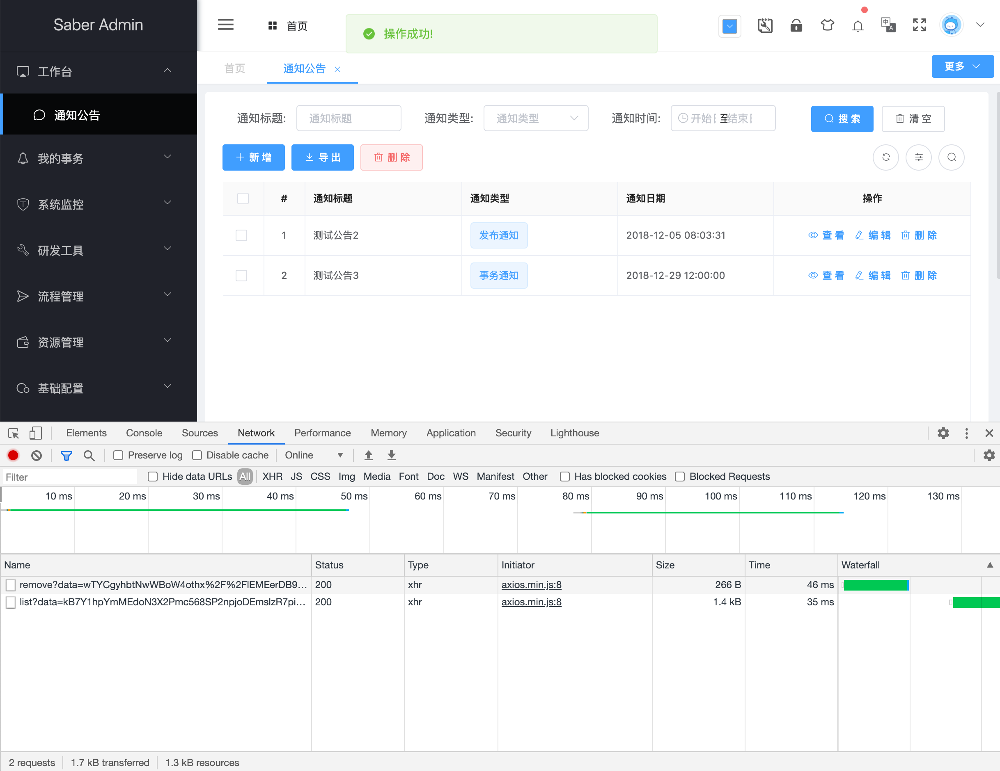
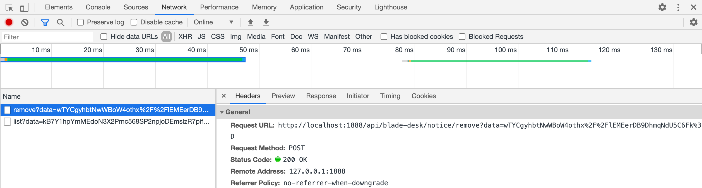
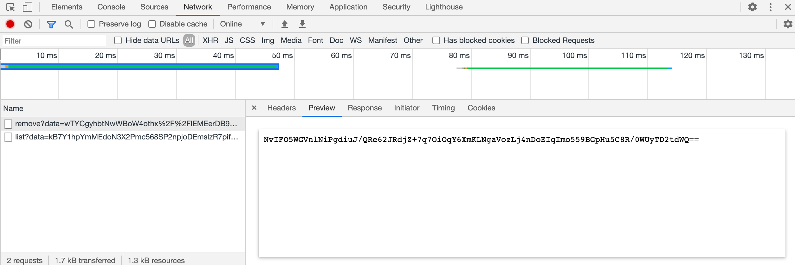

## 改造Notice模块删除功能
1. 删除功能与查询一致也是用的param，所以改造方式也基本一致
> /api/desk/notice.js 改造前
~~~javascript
import request from '@/router/axios';

export const remove = (ids) => {
  return request({
    url: '/api/blade-desk/notice/remove',
    method: 'post',
    params: {
      ids,
    }
  })
}
~~~
> /api/desk/notice.js 改造后
~~~javascript
import request from '@/router/axios';
import crypto from "@/util/crypto";

export const remove = (ids) => {
  const data = crypto.encryptAES(ids, crypto.aesKey);
  return request({
    url: '/api/blade-desk/notice/remove',
    method: 'post',
    params: {
      data,
    }
  })
}
~~~

> 因为notice.vue正常返回无需读取数据，就不需要做修改了

2. 改造后端接口

> NoticeController 改造前
~~~java
/**
 * 删除
 */
@PostMapping("/remove")
public R remove(@ApiParam(value = "主键集合") @RequestParam String ids) {
   boolean temp = noticeService.deleteLogic(Func.toLongList(ids));
   return R.status(temp);
}
~~~
> 由于加密传输的是data字段，在映射ids参数的时候，如果有`@RequestParam`注解，则会提示缺少参数，所以需要将其删掉
> NoticeController 改造后
~~~java
/**
 * 删除
 */
@ApiCrypto
@PostMapping("/remove")
public R remove(@ApiParam(value = "主键集合") @ApiDecryptAes String ids) {
   boolean temp = noticeService.deleteLogic(Func.toLongList(ids));
   return R.status(temp);
}
~~~
3. 重启服务，访问notice模块，进行删除操作，可以看到参数、返回都加密，运行完美成功

